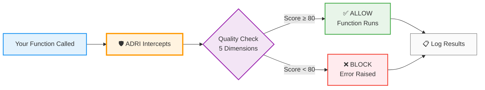

# ADRI – Agent Data Readiness Index

Protect AI workflows from bad data with one line of code.

ADRI is a small Python library that enforces data quality **before** data reaches an AI agent step. It turns data assumptions into **executable data contracts**, and applies them automatically at runtime.

No platform. No services. Runs locally in your project.

```python
from adri import adri_protected

@adri_protected(contract="customer_data", data_param="data")
def process_customers(data):
    # Your agent logic here
    return results
```

---

## What it is

ADRI provides:
- A decorator to guard a function or agent step
- A CLI for setup and inspection
- A reusable library of contract templates

---

## Install & set up

```bash
pip install adri
adri setup
```

---

## What happens when you run it

### First successful run
- ADRI inspects the input data
- Creates a data contract (stored as YAML)
- Saves local artifacts for debugging/inspection

### Subsequent runs
- Incoming data is checked against the contract
- ADRI calculates quality scores across 5 dimensions
- Based on your settings, it either:
  - allows execution, or
  - blocks execution (raises)

---

## How ADRI works (high level)



**In plain English:** ADRI sits between your code and its data, checking quality before letting data through. Good data passes, bad data gets blocked.

---

## Use it in code

```python
from adri import adri_protected
import pandas as pd

@adri_protected(contract="customer_data", data_param="customer_data")
def analyze_customers(customer_data):
    """Your AI agent logic."""
    print(f"Analyzing {len(customer_data)} customers")
    return {"status": "complete"}

# First run with good data
customers = pd.DataFrame({
    "id": [1, 2, 3],
    "email": ["user1@example.com", "user2@example.com", "user3@example.com"],
    "signup_date": ["2024-01-01", "2024-01-02", "2024-01-03"]
})

analyze_customers(customers)  # ✅ Runs, auto-generates contract
```

**What happened:**
1. Function executed successfully
2. ADRI analyzed the data structure
3. Generated a YAML contract under your project
4. Future runs validate against that contract

**Future runs with bad data:**
```python
bad_customers = pd.DataFrame({
    "id": [1, 2, None],  # Missing ID
    "email": ["user1@example.com", "invalid-email", "user3@example.com"],  # Bad email
    # Missing signup_date column
})

analyze_customers(bad_customers)  # ❌ Raises exception with quality report
```

---

## Quick links

- **[Quickstart](QUICKSTART.md)** – 2-minute integration
- **[Getting started](docs/GETTING_STARTED.md)** – tutorial
- **[How it works](docs/HOW_IT_WORKS.md)** – quality dimensions explained
- **[Data contracts](docs/DATA_CONTRACTS.md)** – concept + examples
- **[Contracts library](docs/CONTRACTS_LIBRARY.md)** – reusable templates
- **[Framework patterns](docs/FRAMEWORK_PATTERNS.md)** – LangChain, CrewAI, AutoGen, etc.
- **[CLI reference](docs/CLI_REFERENCE.md)** – CLI commands
- **[FAQ](docs/FAQ.md)** – common questions
- **[Examples](examples/)** – real-world examples

## Protection modes

```python
# Raise mode (default) - blocks bad data by raising an exception
@adri_protected(contract="data", data_param="data", on_failure="raise")

# Warn mode - logs warning but continues execution
@adri_protected(contract="data", data_param="data", on_failure="warn")

# Continue mode - silently continues
@adri_protected(contract="data", data_param="data", on_failure="continue")
```

## Contract templates (start fast)

ADRI includes reusable contract templates for common domains and AI workflows.

### Business domains
- **[Customer Service](ADRI/contracts/domains/customer_service_contract.yaml)**
- **[E-commerce Orders](ADRI/contracts/domains/ecommerce_order_contract.yaml)**
- **[Financial Transactions](ADRI/contracts/domains/financial_transaction_contract.yaml)**
- **[Healthcare Patients](ADRI/contracts/domains/healthcare_patient_contract.yaml)**
- **[Marketing Campaigns](ADRI/contracts/domains/marketing_campaign_contract.yaml)**

### AI frameworks
- **[LangChain Inputs](ADRI/contracts/frameworks/langchain_chain_input_contract.yaml)**
- **[CrewAI Task Context](ADRI/contracts/frameworks/crewai_task_context_contract.yaml)**
- **[LlamaIndex Documents](ADRI/contracts/frameworks/llamaindex_document_contract.yaml)**
- **[AutoGen Messages](ADRI/contracts/frameworks/autogen_message_contract.yaml)**

### Generic templates
- **[API Responses](ADRI/contracts/templates/api_response_template.yaml)**
- **[Time Series](ADRI/contracts/templates/time_series_template.yaml)**
- **[Key-Value](ADRI/contracts/templates/key_value_template.yaml)**
- **[Nested JSON](ADRI/contracts/templates/nested_json_template.yaml)**

## Contributing

- Star the project: https://github.com/adri-standard/adri
- Share feedback/requests in Discussions: https://github.com/adri-standard/adri/discussions
- Contribute new contracts and examples: [CONTRIBUTING.md](CONTRIBUTING.md)

## License

Apache 2.0. See [LICENSE](LICENSE).

---

One line of code. Local enforcement. Reliable agents.
