# ADRI - Agent Data Readiness Index

**AI agents break on bad data. ADRI fixes that with one decorator.**

```python
from adri import adri_protected

@adri_protected(standard="customer_data", data_param="data")
def process_customers(data):
    # Your agent logic here
    return results
```

Auto-validates data quality. Works with any framework. 2 minutes to integrate.

---

## How ADRI Works

```mermaid
flowchart LR
    A[Your Function Called] --> B[🛡️ ADRI Intercepts]
    B --> C{Quality Check<br/>5 Dimensions}
    C -->|Score ≥ 80| D[✅ ALLOW<br/>Function Runs]
    C -->|Score < 80| E[❌ BLOCK<br/>Error Raised]
    D --> F[📋 Log Results]
    E --> F

    style A fill:#e3f2fd,stroke:#2196f3,stroke-width:2px
    style B fill:#fff3e0,stroke:#ff9800,stroke-width:3px
    style C fill:#f3e5f5,stroke:#9c27b0,stroke-width:2px
    style D fill:#e8f5e9,stroke:#4caf50,stroke-width:2px
    style E fill:#ffebee,stroke:#f44336,stroke-width:2px
    style F fill:#fafafa,stroke:#757575,stroke-width:1px
```



**In plain English:** ADRI sits between your code and its data, checking quality before letting data through. Good data passes, bad data gets blocked.

---

## What is ADRI?

ADRI is **the missing data layer for AI agents**. It protects your AI agent workflows from bad data by:

- **Auto-validating data quality** across 5 dimensions (validity, completeness, consistency, accuracy, timeliness)
- **Auto-generating quality standards** on first successful run - no manual configuration
- **Blocking or warning** on quality failures based on your preference
- **Logging insights locally** for debugging and development

**Framework agnostic**: Works with LangChain, CrewAI, AutoGen, LlamaIndex, Haystack, Semantic Kernel, and any Python function.

## Why ADRI?

AI agents are powerful, but fragile. One malformed field or missing value can crash your entire workflow. Traditional validation is tedious - you write dozens of `if` statements, manually check types, and hope you caught everything.

**ADRI learns what good data looks like** and enforces it automatically. Add one decorator, run with good data once, and you're protected.

## Complete Example

```python
from adri import adri_protected
import pandas as pd

@adri_protected(standard="customer_data", data_param="customer_data")
def analyze_customers(customer_data):
    """Your AI agent logic."""
    print(f"Analyzing {len(customer_data)} customers")
    return {"status": "complete"}

# First run with good data
customers = pd.DataFrame({
    "id": [1, 2, 3],
    "email": ["user1@example.com", "user2@example.com", "user3@example.com"],
    "signup_date": ["2024-01-01", "2024-01-02", "2024-01-03"]
})

analyze_customers(customers)  # ✅ Runs, auto-generates standard
```

**What happened:**
1. Function executed successfully
2. ADRI analyzed the data structure
3. Generated quality standard in `ADRI/dev/standards/customer_data.yaml`
4. Future runs validate against this standard

**Future runs with bad data:**
```python
bad_customers = pd.DataFrame({
    "id": [1, 2, None],  # Missing ID
    "email": ["user1@example.com", "invalid-email", "user3@example.com"],  # Bad email
    # Missing signup_date column
})

analyze_customers(bad_customers)  # ❌ Raises exception with quality report
```

## Installation

```bash
pip install adri
```

**Requirements**: Python 3.10+

## Quick Links

- **[Quickstart Guide](QUICKSTART.md)** - 2-minute integration guide
- **[Getting Started](docs/GETTING_STARTED.md)** - Detailed 10-minute tutorial
- **[How It Works](docs/HOW_IT_WORKS.md)** - Five quality dimensions explained
- **[Framework Patterns](docs/FRAMEWORK_PATTERNS.md)** - LangChain, CrewAI, AutoGen examples
- **[CLI Reference](docs/CLI_REFERENCE.md)** - Command-line tools
- **[FAQ](docs/FAQ.md)** - Common questions
- **[Examples](examples/)** - Real-world examples

## Features

### 🎯 One Decorator, Complete Protection

```python
@adri_protected(standard="your_data", data_param="data")
def your_function(data):
    return results
```

### 🤖 Framework Agnostic

Works with any AI agent framework:
- LangChain & LangGraph
- CrewAI
- AutoGen
- LlamaIndex
- Haystack
- Semantic Kernel
- Generic Python

### 📊 Five Quality Dimensions

ADRI validates:
1. **Validity** - Data types and formats
2. **Completeness** - Required fields present
3. **Consistency** - Cross-field relationships
4. **Accuracy** - Value ranges and patterns
5. **Timeliness** - Data freshness

### 🔄 Auto-Generation

No manual configuration. ADRI learns from your data:
- Runs successfully with good data → generates standard
- Future runs → validates against standard
- Customize generated standards as needed

### 🛡️ Protection Modes

```python
# Raise mode (default) - raises exception
@adri_protected(standard="data", data_param="data", on_failure="raise")

# Warn mode - logs warning, continues
@adri_protected(standard="data", data_param="data", on_failure="warn")

# Continue mode - silently continues
@adri_protected(standard="data", data_param="data", on_failure="continue")
```

### 🔧 CLI Tools

```bash
adri setup                                      # Initialize ADRI
adri generate-standard data.json                # Generate standard
adri assess data.csv --standard my_standard     # Assess data quality
adri list-standards                             # List standards
adri validate-standard my_standard.yaml         # Validate standard
```

### 📝 Local Logging

Developer-friendly insights during development:
- Quality scores and assessments
- Dimension-specific failures
- Auto-generated standards
- Stored in `ADRI/dev/logs/`

## 📚 Browse Standards Library

**13 production-ready standards for common use cases** - Copy, use, or customize for your needs.

### Business Domains
- **[Customer Service](adri/standards/domains/customer_service_standard.yaml)** - Support tickets, interactions
- **[E-commerce Orders](adri/standards/domains/ecommerce_order_standard.yaml)** - Order processing, fulfillment  
- **[Financial Transactions](adri/standards/domains/financial_transaction_standard.yaml)** - Payments, accounting
- **[Healthcare Patients](adri/standards/domains/healthcare_patient_standard.yaml)** - EHR systems, patient records
- **[Marketing Campaigns](adri/standards/domains/marketing_campaign_standard.yaml)** - Campaign tracking, ROI

### AI Frameworks
- **[LangChain Chains](adri/standards/frameworks/langchain_chain_input_standard.yaml)** - Chain input validation
- **[CrewAI Tasks](adri/standards/frameworks/crewai_task_context_standard.yaml)** - Multi-agent task context
- **[LlamaIndex Documents](adri/standards/frameworks/llamaindex_document_standard.yaml)** - RAG document structure
- **[AutoGen Messages](adri/standards/frameworks/autogen_message_standard.yaml)** - Agent message validation

### Generic Templates
- **[API Responses](adri/standards/templates/api_response_template.yaml)** - REST API response structure
- **[Time Series](adri/standards/templates/time_series_template.yaml)** - Metrics, sensor data
- **[Key-Value Pairs](adri/standards/templates/key_value_template.yaml)** - Configuration, settings
- **[Nested JSON](adri/standards/templates/nested_json_template.yaml)** - Hierarchical structures

**[📖 Full Standards Library Documentation](docs/STANDARDS_LIBRARY.md)** - Complete catalog with usage examples, contribution guide, and customization instructions.

## Common Use Cases

### API Data Validation
```python
@adri_protected(standard="api_response", data_param="response")
def process_api_data(response):
    return transform(response)
```
**What it protects**: API response data structure  
**Sample data**: [examples/data/api_response.json](examples/data/api_response.json)  
**Use when**: Validating third-party API responses before processing

### Multi-Agent Workflows
```python
@adri_protected(standard="crew_context", data_param="context")
def crew_task(context):
    return crew.kickoff(context)
```
**What it protects**: Agent communication context  
**Sample data**: [examples/data/crew_context.json](examples/data/crew_context.json)  
**Use when**: Coordinating multi-agent workflows (CrewAI, AutoGen, custom)

### RAG Pipelines
```python
@adri_protected(standard="documents", data_param="docs")
def index_documents(docs):
    return index.insert(docs)
```
**What it protects**: Document structure before indexing  
**Sample data**: [examples/data/rag_documents.json](examples/data/rag_documents.json)  
**Use when**: Validating documents before vector store indexing (LlamaIndex, Haystack)

> **Note**: ADRI validates data structure, not content. For RAG, it ensures each document has required fields (id, text, metadata) and correct types, preventing indexing failures from malformed data.

## Enterprise: Production-Grade Agent Reliability

**The Problem**: 80% of agent failures are data-related, not model-related. Current tools (LangSmith, W&B, Prometheus) log prompts and tokens—but ignore data quality, lineage, and reproducibility.

**The Reality**: As agent workflows scale beyond prototypes, they fail due to:
- No shared definition of "good data"
- Missing data provenance and lineage
- Non-reproducible workflow behavior
- Engineers spending more time on data scaffolding than agent logic

**The Solution**: Verodat Enterprise is the missing **data reliability layer** for AI agents.

Open-source ADRI provides local data quality validation. **Verodat Enterprise** adds production infrastructure:

- **Centralized Telemetry** - Send assessments to Verodat cloud, monitor quality across all agents
- **Full Workflow Replay** - Deterministic replays with complete data state (not just prompts)
- **Data Supply Manager** - Orchestrated, validated, compliant data feeds for production agents
- **Compliance & Audit** - Immutable data lineage and provenance for regulatory requirements
- **Team Collaboration** - Share standards, monitor drift, coordinate across Agent + Data + Compliance teams

**Impact**: One decorator + one config → from prototype to auditable, reproducible, production-grade workflows.

See [FAQ](docs/FAQ.md#enterprise) for details or [contact Verodat](https://verodat.com) for enterprise trials.

## Development

```bash
# Clone repository
git clone https://github.com/adri-standard/adri.git
cd adri

# Install in development mode
pip install -e .

# Run tests
pytest

# Run linters
flake8 src/
black src/
```

See [CONTRIBUTING.md](CONTRIBUTING.md) for contribution guidelines.

## License

Apache 2.0 License. See [LICENSE](LICENSE) for details.

## Community & Support

### Get Help
- 💬 **[GitHub Discussions](https://github.com/adri-standard/adri/discussions)** - Ask questions, share use cases
- 🐛 **[GitHub Issues](https://github.com/adri-standard/adri/issues)** - Report bugs, request features  
- 📚 **[Documentation](docs/)** - Comprehensive guides and tutorials

### Connect with the Team
- 👤 **[Thomas Russell](https://linkedin.com/in/thomas-verodat/)** - Founder (updates & engagement)
- 🦋 **[@thomas-ds.bsky.social](https://bsky.app/profile/thomas-ds.bsky.social)** - Real-time updates on Bluesky
- 🏢 **[Verodat](https://linkedin.com/company/verodat/)** - Company behind ADRI

### Support This Project
- ⭐ **[Star on GitHub](https://github.com/adri-standard/adri)** - Help others discover ADRI
- 🗣️ **Share**: Post about ADRI with #ADRI #AIAgents
- 🤝 **Contribute**: See [CONTRIBUTING.md](CONTRIBUTING.md)

---

**One decorator. Any framework. Reliable agents.**

Built with ❤️ by [Thomas Russell](https://linkedin.com/in/thomas-verodat/) at [Verodat](https://verodat.com)
