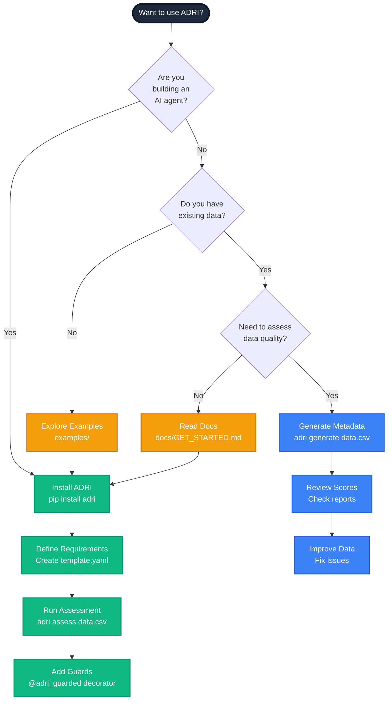
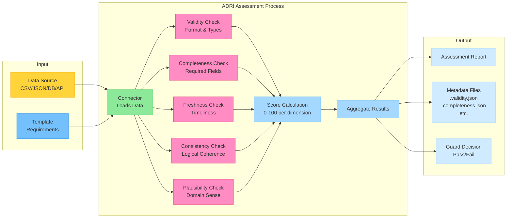
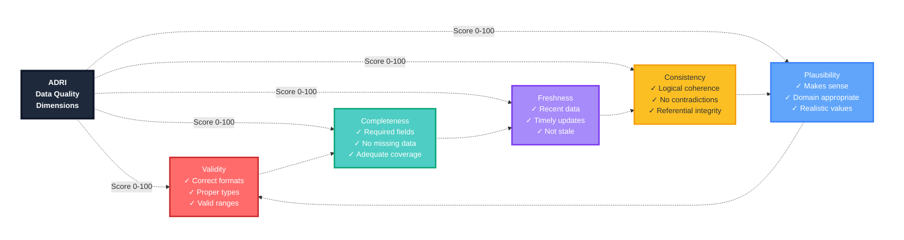

# Getting Started with ADRI

## What is ADRI?

The Agent Data Readiness Index (ADRI) helps you ensure your AI agents are working with reliable data. Think of it as a "health check" for your data sources that:

- Prevents your agents from making decisions based on flawed data
- Gives you confidence in your agent workflows
- Helps you communicate data quality requirements to data providers
- Protects AI systems from unreliable data inputs

## Choose Your Path



## Quick Installation

```bash
pip install adri
```

## 5-Minute Assessment Example

Let's check a sample dataset. Here's how ADRI works:



Now let's run an assessment:

```python
from adri import DataSourceAssessor

# Create an assessor
assessor = DataSourceAssessor()

# Analyze a data file
report = assessor.assess_file("customer_data.csv")

# See the results
print(f"Overall score: {report.overall_score}/100")
print(f"Readiness level: {report.readiness_level}")

# Get specific dimension scores
for dimension, results in report.dimension_results.items():
    print(f"{dimension}: {results['score']}/20")

# View key findings
for finding in report.summary_findings[:5]:
    print(f"- {finding}")

# Save the report
report.save_json("customer_data_assessment.json")
```

## Understanding Your Results

Your assessment gives you:

1. **Overall score** (0-100): How ready your data is for agent use
2. **Readiness level**: Plain-language assessment (e.g., "Proficient - Suitable for most production agent uses")
3. **Dimension scores**: Breakdown across 5 key reliability areas
4. **Findings**: Specific insights about your data
5. **Recommendations**: Actions to improve reliability

### The Five Dimensions



### Readiness Levels

| Score Range | Level | Description |
|-------------|-------|-------------|
| 80-100 | Advanced | Ready for critical agentic applications |
| 60-79 | Proficient | Suitable for most production agent uses |
| 40-59 | Basic | Requires caution in agent applications |
| 20-39 | Limited | Significant agent blindness risk |
| 0-19 | Inadequate | Not recommended for agentic use |

## Visualizing Results

ADRI makes it easy to visualize your assessment results:

```python
# Generate a radar chart
report.generate_radar_chart("data_readiness_radar.png")

# Create an HTML report with detailed findings
report.save_html("data_readiness_report.html")
```

## Protecting Your Agent with Guards

Add safeguards to your agent workflows to ensure they only process sufficiently reliable data:

```python
from adri import adri_guarded

# Apply a guard that requires an overall score of at least 70
# and a plausibility score of at least 15
@adri_guarded(min_score=70, dimensions={"plausibility": 15})
def process_data(data_source):
    # Your agent workflow here
    results = analyze_with_agent(data_source)
    return results

# Use the protected function
try:
    results = process_data("customer_data.csv")
    print("Success! Data was reliable enough for processing.")
except Exception as e:
    print(f"Data reliability guard prevented processing: {e}")
```

### Framework-Specific Guards

ADRI provides integrations for popular agent frameworks:

#### LangChain Example

```python
from adri.integrations.langchain import create_adri_tool
from langchain.agents import initialize_agent, AgentType
from langchain.llms import OpenAI

# Create ADRI tool with reliability requirements
adri_tool = create_adri_tool(min_score=70)

# Create an agent with the ADRI tool
llm = OpenAI(temperature=0)
agent = initialize_agent(
    [adri_tool], 
    llm, 
    agent=AgentType.ZERO_SHOT_REACT_DESCRIPTION
)

# Use the agent to assess data quality
result = agent.run("Assess the quality of customer_data.csv")
```

## Next Steps

- Learn about the [five dimensions](./UNDERSTANDING_DIMENSIONS.md) of data reliability
- Explore configuration options in the [API reference](./API_REFERENCE.md#configuration)
- See how to [enhance your data sources](./ENHANCING_DATA_SOURCES.md) with explicit metadata
- Check out [framework integrations](./INTEGRATIONS.md) for LangChain, CrewAI, and more
- View the full [API reference](./API_REFERENCE.md) for complete details

## Purpose & Test Coverage

**Why this file exists**: Provides a quick, practical introduction to ADRI, enabling new users to install the tool and run their first data quality assessment within minutes.

**Key responsibilities**:
- Guide users through installation process
- Demonstrate basic usage with simple examples
- Show how to interpret assessment results
- Provide clear next steps for deeper exploration

**Test coverage**: Verified by tests documented in [GET_STARTED_test_coverage.md](./test_coverage/GET_STARTED_test_coverage.md)
