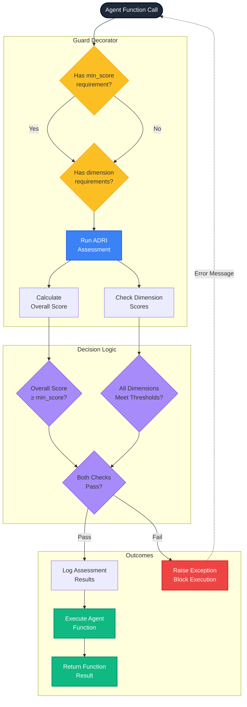

# Implementing Guards for Agent Workflows

## What Are ADRI Guards?

ADRI Guards are safeguards that protect your AI agent workflows from unreliable data. They act as a quality gate, ensuring that only data meeting specified reliability standards can be processed by your agents.

## Why Use Guards?

1. **Risk Mitigation**: Prevent agents from making decisions based on unreliable data
2. **Compliance**: Demonstrate due diligence in ensuring agent reliability
3. **Error Prevention**: Catch data reliability issues before they impact agent performance
4. **Confidence**: Gain assurance that your agents are working with sufficient data quality

## Basic Guard Implementation

The simplest way to implement a guard is using the `adri_guarded` decorator:

### Guard Mechanism Flow



### Implementation Example

```python
from adri import adri_guarded

@adri_guarded(min_score=70)
def process_customer_data(data_source, additional_params):
    # This function will only execute if the data source 
    # has an ADRI score of at least 70/100
    results = run_agent_analysis(data_source)
    return results

# Use the guarded function
try:
    results = process_customer_data("customer_data.csv", params)
    # Process results normally
except ValueError as e:
    # Handle the case where data didn't meet quality standards
    print(f"Data quality issue detected: {e}")
    # Implement fallback behavior or alert mechanisms
```

### How It Works

1. When you call the guarded function, the decorator first intercepts the call
2. It identifies the data source parameter (default name: `data_source`)
3. It runs an ADRI assessment on that data source
4. If the overall score meets or exceeds your minimum requirement, the function proceeds
5. If not, it raises a ValueError with details about the quality issues

### Customizing Parameter Names

If your function uses a different parameter name for the data source:

```python
@adri_guarded(min_score=70, data_source_param="input_file")
def analyze_transactions(input_file):
    # Function only runs if input_file meets quality standards
    # ...
```

## Dimension-Specific Guards

You can add dimension-specific requirements to ensure particular aspects of data quality:

```python
from adri import adri_guarded

# Require overall score of 70 AND plausibility score of at least 15
@adri_guarded(
    min_score=70,
    dimensions={
        "plausibility": 15,  # Require plausible data 
        "freshness": 12      # Require moderately fresh data
    }
)
def make_recommendations(data_source):
    # Function only runs if all requirements are met
    # ...
```

## Using Pre-certified Data

ADRI guards can now leverage pre-existing assessment reports to avoid redundant checks:

```python
@adri_guarded(
    min_score=70,
    dimensions={"plausibility": 15},
    use_cached_reports=True,
    max_report_age_hours=24,  # Reports older than 24 hours trigger reassessment
    verbose=True  # Optional: Print status messages during assessment
)
def process_data(data_source):
    # This function will first check for an existing report file
    # (data_source.report.json) before running a new assessment
    process_with_agent(data_source)
```

This feature enables:

1. **Faster Workflow Starts**: Pre-certified data sources don't require reassessment
2. **Data Provider Certification**: Suppliers can ship data with ADRI certification
3. **Incremental Validation**: Only reassess when data or requirements change

### Control Parameters

You can fine-tune the certification behavior with these parameters:

- **use_cached_reports** (default: True): Whether to check for existing report files
- **max_report_age_hours** (default: None): Maximum age in hours before a report is considered outdated
- **save_reports** (default: True): Whether to save new assessment reports for future use
- **verbose** (default: False): Whether to print status messages during assessment

### Data Provider Certification Process

Data providers can pre-certify their data sources before distributing them:

```python
from adri import DataSourceAssessor

# Create an assessor
assessor = DataSourceAssessor()

# Assess the data source
report = assessor.assess_file("customer_data.csv")

# Save the certification report alongside the data
report.save_json("customer_data.report.json")

print(f"Data source certified with score: {report.overall_score}/100")
print(f"Readiness level: {report.readiness_level}")
```

## Framework-Specific Guards

ADRI provides pre-built guards for popular agent frameworks:

### LangChain Integration

```python
from adri.integrations.langchain import ADRILangChainGuard
from langchain.chains import LLMChain
from langchain.llms import OpenAI

# Create your LangChain components
llm = OpenAI()
chain = LLMChain(llm=llm, prompt=my_prompt)

# Create a guard with your reliability requirements
guard = ADRILangChainGuard(
    min_score=70,
    dimensions={"plausibility": 15}
)

# Apply the guard to your chain
protected_chain = guard.wrap(chain)

# Use the protected chain (it will only process reliable data)
result = protected_chain.run(data_source="customer_data.csv")
```

### CrewAI Integration

```python
from adri.integrations.crewai import ADRICrewGuard
from crewai import Agent, Task, Crew

# Define your CrewAI components
agent1 = Agent(...)
agent2 = Agent(...)
task1 = Task(...)
task2 = Task(...)

# Create the ADRI guard
adri_guard = ADRICrewGuard(min_score=75)

# Apply the guard to your crew
crew = Crew(
    agents=[agent1, agent2],
    tasks=[task1, task2],
    guard=adri_guard
)

# The crew will only process data that meets the reliability standards
result = crew.kickoff(data_source="financial_data.csv")
```

### DSPy Integration

```python
from adri.integrations.dspy import ADRIDSPyGuard
import dspy

# Define your DSPy pipeline
class MyPipeline(dspy.Module):
    def __init__(self):
        # ...
        
    def forward(self, data_source):
        # Pipeline implementation
        return results

# Create a pipeline instance
pipeline = MyPipeline()

# Apply the ADRI guard
guarded_pipeline = ADRIDSPyGuard(
    min_score=80,
    dimensions={"validity": 16, "consistency": 16}
).wrap(pipeline)

# Use the protected pipeline
result = guarded_pipeline("market_data.csv")
```

## Advanced Guard Configuration

### Custom Assessor Configuration

You can customize the assessment process used by guards:

```python
from adri import adri_guarded, DataSourceAssessor

# Create a custom assessor with specific configuration
custom_assessor = DataSourceAssessor(config={
    "dimension_weights": {
        "validity": 2.0,      # Double weight for validity
        "completeness": 0.5,  # Half weight for completeness
        "freshness": 1.0,     # Standard weight
        "consistency": 1.0,   # Standard weight
        "plausibility": 1.5   # 1.5x weight for plausibility
    }
})

# Use the custom assessor in your guard
@adri_guarded(min_score=70, assessor=custom_assessor)
def analyze_data(data_source):
    # Function only runs if data meets custom-weighted standards
    # ...
```

### Guard Chains

You can chain multiple guards with different configurations:

```python
@adri_guarded(min_score=50)  # Basic quality check
@adri_guarded(min_score=15, dimensions={"freshness": 15})  # Specific freshness check
def time_sensitive_analysis(data_source):
    # Function requires both overall quality AND fresh data
    # ...
```

## Best Practices

1. **Set Appropriate Thresholds**: Start with conservative thresholds and adjust based on your specific needs

2. **Implement Fallbacks**: Always have a plan for when data doesn't meet quality standards:
   ```python
   try:
       results = guarded_function("data.csv")
   except ValueError as e:
       # Log the issue
       logging.error(f"Data quality issue: {e}")
       # Use fallback data or method
       results = fallback_method()
   ```

3. **Pre-certify Critical Data**: Have data suppliers certify their data sources before distribution:
   ```python
   # Data supplier workflow
   assessor = DataSourceAssessor()
   report = assessor.assess_file("critical_data.csv")
   
   if report.overall_score >= 80:  # Supplier's quality threshold
       report.save_json("critical_data.report.json")
       print("Data certified for distribution")
   else:
       print("Data failed certification - needs improvement")
   ```

3. **Layer Your Guards**: Apply broad guards at the workflow level and specific guards for critical operations:
   ```python
   @adri_guarded(min_score=60)  # Basic overall check
   def workflow(data_source):
       # General processing...
       
       if needs_critical_operation:
           # Add a stricter check for critical operations
           if check_critical_quality(data_source):
               do_critical_operation()
   ```

4. **Monitor and Adapt**: Track when guards are triggered and adjust thresholds based on real-world performance

5. **Provide Clear Feedback**: When guards block processing, ensure the error messages help diagnose and fix the issues

## Error Handling

When a guard blocks processing, the error message contains valuable diagnostic information:

```
ValueError: Data quality insufficient for agent use. 
ADRI Score: 58.5/100 (Required: 70/100)
Readiness Level: Basic - Requires caution in agent applications
Top Issues: [Validity] No explicit format definitions found in schema, 
[Completeness] No explicit distinction between missing values and nulls, 
[Freshness] No timestamp information available
```

Use this information to:
1. Diagnose specific quality issues
2. Prioritize improvements to the data source
3. Provide feedback to data providers

## Conclusion

ADRI guards provide an essential layer of protection for agent workflows. By implementing appropriate guards, you ensure that your agents only process data of sufficient quality, resulting in more reliable and trustworthy AI systems.

For more advanced scenarios, explore the [API Reference](./API_REFERENCE.md) for complete details on guard implementation options.

## Purpose & Test Coverage

**Why this file exists**: Provides comprehensive guidance on implementing data quality guards to protect AI agent workflows from unreliable data inputs.

**Key responsibilities**:
- Explain the concept and importance of data quality guards
- Demonstrate basic and advanced guard implementation patterns
- Show framework-specific integrations (LangChain, CrewAI, DSPy)
- Guide best practices for error handling and fallback strategies

**Test coverage**: Verified by tests documented in [IMPLEMENTING_GUARDS_test_coverage.md](./test_coverage/IMPLEMENTING_GUARDS_test_coverage.md)
