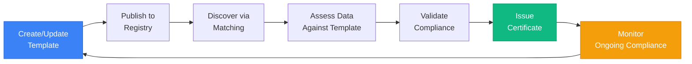

# Understanding ADRI Templates

## What is a Template?

An ADRI template is a **standardized set of data quality requirements** that defines what "good data" means for a specific use case, industry, or regulatory context. Think of it as a contract between data providers and data consumers that specifies the minimum quality standards data must meet.

## Template Anatomy

Every ADRI template consists of several key components:

### 1. **Metadata** - Who, What, When
```yaml
template:
  id: "financial-basel-iii"
  version: "1.0.0"
  name: "Basel III Data Requirements"
  authority: "Basel Committee on Banking Supervision"
  description: "Data quality requirements for Basel III compliance"
  effective_date: "2024-01-01"
```

The metadata identifies:
- **Who** created the standard (authority)
- **What** the standard is for (name, description)
- **When** it's effective (dates, versions)

### 2. **Requirements** - The Quality Bar
```yaml
requirements:
  # Overall quality threshold (0-100 scale)
  overall_minimum: 75
  
  # Specific dimension requirements (typically 85% of 20 points = 17)
  dimension_minimums:
    validity: 17      # 85% of 20
    completeness: 17  # 85% of 20
    consistency: 17   # 85% of 20
    freshness: 17     # 85% of 20
    plausibility: 17  # 85% of 20
```

Requirements define:
- **Minimum scores** for overall quality (0-100) and each dimension (0-20)
- **Required rules** that must be enforced
- **Custom validations** specific to the use case

**Note on Scoring**: In template mode, each dimension has rules with weights that sum to 20 points. The overall score is normalized to 0-100 for consistency.

### 3. **Pattern Matching** - Discovery Hints
```yaml
pattern_matching:
  required_columns:
    - transaction_id
    - amount
    - transaction_date
  
  column_synonyms:
    amount: ["value", "transaction_amount", "payment"]
    transaction_date: ["date", "trans_date", "payment_date"]
```

Pattern matching helps:
- **Auto-discover** which template fits your data
- **Map columns** intelligently (handles abbreviations, synonyms)
- **Score confidence** in the match

### 4. **Certification** - Trust Signals
```yaml
certification:
  badge: "🟢"
  level: "ADRI Gold"
  validity_period_days: 365
  renewal_requirements:
    - "Maintain minimum scores"
    - "Pass quarterly audits"
```

Certification provides:
- **Visual indicators** of compliance
- **Validity periods** for time-sensitive data
- **Renewal criteria** for ongoing compliance

## Types of Templates

### 1. **Industry Standards**
Templates that encode industry-wide requirements:
- `financial/basel-iii-v1.0.0` - Banking regulations
- `healthcare/hipaa-v2.0.0` - Healthcare privacy
- `retail/pci-dss-v3.0.0` - Payment card security

### 2. **Use Case Templates**
Templates for specific agent workflows:
- `crm/sales-pipeline-v1.0.0` - Sales opportunity data
- `inventory/stock-management-v1.0.0` - Inventory tracking
- `customer/360-view-v1.0.0` - Customer analytics

### 3. **Organizational Templates**
Custom templates for internal standards:
- `acme-corp/production-v1.0.0` - Company-specific requirements
- `team-x/ml-training-v2.0.0` - Team data standards

### 4. **Generic Templates**
Baseline templates for common scenarios:
- `general/production-v1.0.0` - Basic production readiness
- `general/development-v1.0.0` - Development environment data
- `general/archival-v1.0.0` - Long-term storage requirements

## Why Templates Matter

### 1. **Standardization**
Templates create a common language for data quality:
```python
# Without templates: Everyone defines quality differently
if my_custom_quality_check(data):
    process_data()

# With templates: Standardized quality definition
if assessor.assess_with_template(data, "production-v1.0.0").compliant:
    process_data()
```

### 2. **Portability**
Templates can be shared and reused:
- Industry consortiums publish standard templates
- Teams share templates across projects
- Open source templates for common use cases

### 3. **Evolution**
Templates version control quality standards:
```yaml
# v1.0.0 - Initial requirements
overall_minimum: 70

# v2.0.0 - Stricter requirements as capabilities improve
overall_minimum: 80
```

### 4. **Automation**
Templates enable automated quality gates:
```python
@adri_guarded(template="financial/basel-iii-v1.0.0")
def process_financial_data(data):
    # Only runs if data meets Basel III standards
    return analyze_transactions(data)
```

## Template Lifecycle



## Creating Your First Template

### Step 1: Identify Requirements
What quality standards does your data need to meet?
- Regulatory requirements?
- Business rules?
- Technical constraints?

### Step 2: Define Structure
```yaml
template:
  id: "my-use-case"
  version: "1.0.0"
  name: "My Use Case Data Requirements"
  authority: "My Organization"
  
requirements:
  overall_minimum: 70
  
  dimension_requirements:
    validity:
      minimum_score: 14
      description: "Data types must be well-defined"
```

### Step 3: Add Discovery Hints
```yaml
pattern_matching:
  required_columns:
    - customer_id
    - email
    - signup_date
  
  column_synonyms:
    customer_id: ["client_id", "user_id", "account_id"]
```

### Step 4: Test and Iterate
```python
# Test your template
template = TemplateLoader().load("my-use-case-v1.0.0.yaml")
report, evaluation = assessor.assess_with_template(data, template)

# Review gaps and adjust requirements
for gap in evaluation.gaps:
    print(f"{gap.requirement_description}: {gap.actual_value} < {gap.expected_value}")
```

## Template Best Practices

### 1. **Start Simple**
Begin with basic requirements and add complexity as needed:
```yaml
# Start here
overall_minimum: 60

# Evolve to
overall_minimum: 75
dimension_requirements:
  validity: {minimum_score: 15}
  completeness: {minimum_score: 14}
```

### 2. **Use Semantic Versioning**
- **1.0.0** → **1.0.1**: Bug fixes, clarifications
- **1.0.0** → **1.1.0**: New requirements (backward compatible)
- **1.0.0** → **2.0.0**: Breaking changes

### 3. **Document Requirements**
Always explain why a requirement exists:
```yaml
freshness:
  minimum_score: 16
  description: "Financial transactions must be near real-time for fraud detection"
```

### 4. **Provide Remediation Hints**
Help users fix issues:
```yaml
custom_rules:
  - id: "CUST-001"
    description: "Email must be valid"
    remediation_hint: "Use standard email validation or provide .validation.json file"
```

### 5. **Consider Discovery**
Make templates discoverable with good pattern matching:
```yaml
pattern_matching:
  # Include common abbreviations
  column_synonyms:
    opportunity_id: ["opp_id", "deal_id", "oppty_id"]
```

## Template vs. Raw Assessment

### Without Templates (Discovery Mode)
```python
# ADRI analyzes and generates recommendations
report = assessor.assess_file("data.csv")
# Result: Generic quality scores, no specific standards
```

### With Templates (Validation Mode)
```python
# ADRI validates against specific requirements
report, evaluation = assessor.assess_with_template("data.csv", "production-v1.0.0")
# Result: Compliance status, gaps, certification eligibility
```

## Common Questions

### Q: Do I need templates from the start?
**A:** No! Start with basic assessments, add templates as your needs grow.

### Q: Can I have multiple templates for the same data?
**A:** Yes! Data might need to meet multiple standards:
```python
# Check regulatory compliance
financial_eval = assessor.assess_with_template(data, "financial/basel-iii-v1.0.0")

# Check internal standards
internal_eval = assessor.assess_with_template(data, "acme/production-v2.0.0")
```

### Q: How do templates handle different data types?
**A:** Templates can define type-specific requirements:
```yaml
type_specific_requirements:
  csv:
    must_have_headers: true
  json:
    must_have_schema: true
  database:
    must_have_indexes: true
```

### Q: Can templates enforce business logic?
**A:** Yes, through custom rules:
```yaml
custom_rules:
  - id: "BIZ-001"
    description: "Order amount must not exceed credit limit"
    condition: "order_amount <= credit_limit"
    severity: "blocking"
```

## Summary

ADRI templates are:
- **Standards** that define data quality requirements
- **Portable** specifications that can be shared
- **Discoverable** through intelligent matching
- **Enforceable** through validation and guards
- **Evolvable** through versioning

They transform subjective "data quality" into objective, measurable standards that both humans and agents can understand and enforce.
