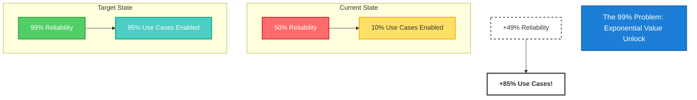
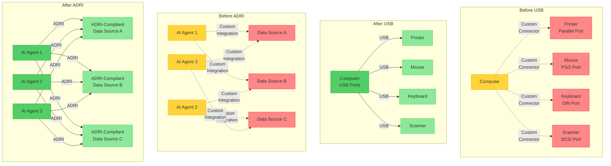
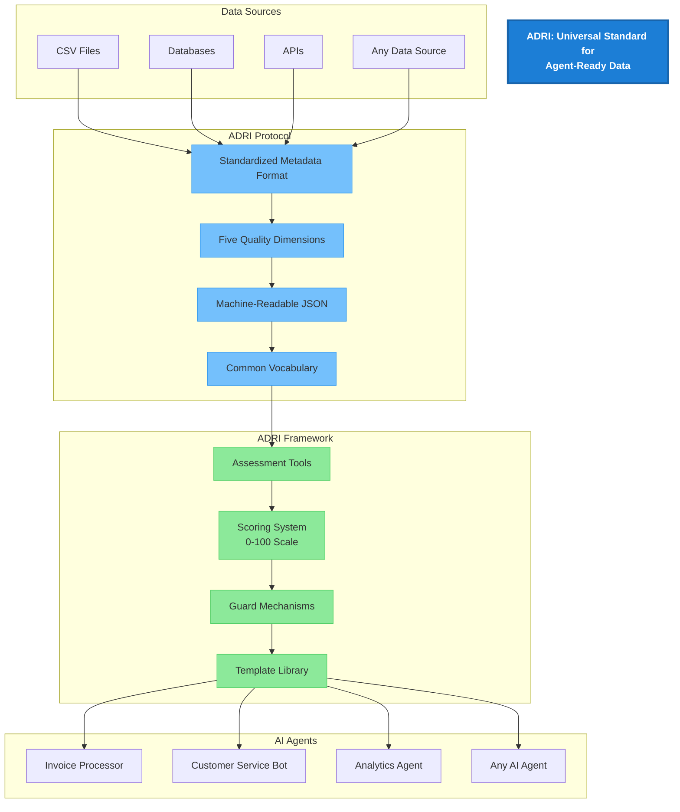
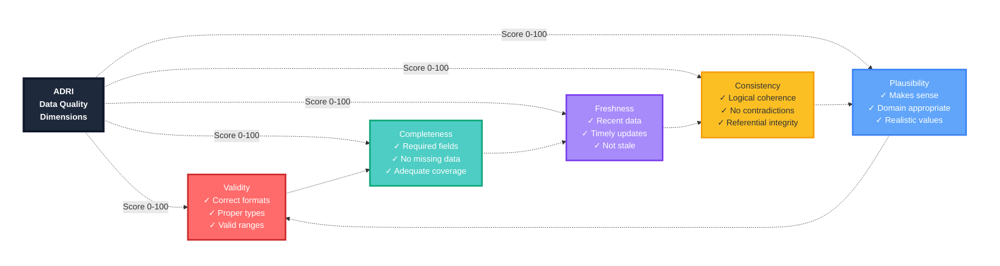
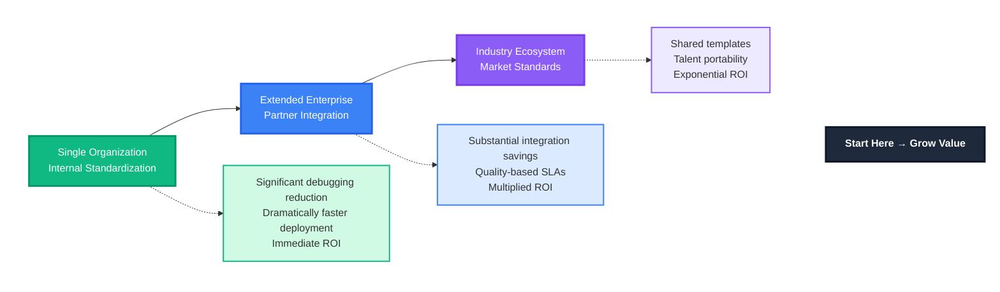

# ADRI: Agent Data Readiness Index

> 📖 **Looking for concrete examples? See [Vision in Action](VISION_IN_ACTION.md)**

## The 99% Problem

**AI agents need 99% reliability to unlock their true value.** Today, they're stuck at 50%.

Why? The data.



This isn't a linear improvement - it's exponential. And the bottleneck isn't the AI models or the frameworks. It's the lack of standards for what constitutes "agent-ready data."

## The Current Reality

Before diving into systematic solutions, let's acknowledge today's pain:

### A Day in the Life

```mermaid
gantt
    title A Day in the Life: Data Quality Pain Points
    dateFormat HH:mm
    axisFormat %H:%M
    
    section RevOps Manager
    Receives CRM export          :done, r1, 09:00, 30m
    Manual data checks           :active, r2, 09:30, 240m
    Finds critical issues        :crit, r3, 13:30, 30m
    Meeting already started      :milestone, 14:00, 0m
    
    section AI Engineer
    Agent processing data        :done, a1, 10:30, 30m
    Agent crashes - bad data     :crit, a2, 11:00, 30m
    Debug error messages         :active, a3, 11:30, 60m
    Trace through logs           :active, a4, 12:30, 90m
    Find missing field           :milestone, 14:00, 0m
    
    section Data Engineer
    Request: make data AI-ready  :done, d1, 14:00, 30m
    No clear definition          :crit, d2, 14:30, 30m
    Write custom validation      :active, d3, 15:00, 120m
    Different standards per project :active, d4, 17:00, 60m
```

These aren't edge cases - they're daily occurrences across every organization trying to leverage AI.

### The Hidden Costs

- **Within Single Companies**: Different teams can't share data or agents effectively
- **Across Partnerships**: Months spent on custom integrations
- **Industry-Wide**: Massive duplication of effort solving the same problems

## The Interoperability Crisis

AI agents are transforming every industry, but there's a critical problem:

**Every agent needs different data. Every data source provides it differently. Nothing works together.**

The result?
- 🔄 Endless custom integrations
- 💸 Massive implementation costs
- ⚠️ 50% agent reliability (when 99% is needed)
- 🚫 No ecosystem innovation

Without standards, we're building on quicksand.

## The Solution: A Universal Standard

ADRI (Agent Data Readiness Index) is an open standard that creates a common language between data suppliers and AI agents. 



Think of it like USB for data:
- **Before USB**: Every device needed custom connectors
- **After USB**: Any device works with any computer
- **Before ADRI**: Every agent needs custom data pipelines
- **After ADRI**: Any agent works with any ADRI-compliant data

## From Battle-Testing to Standard

ADRI wasn't born in a standards committee - it emerged from the trenches:

### The Journey
1. **Real-World Origins**: Developed through hundreds of enterprise implementations at Verodat
2. **Pattern Recognition**: Common problems required common solutions
3. **Refinement**: Battle-tested across industries and use cases
4. **Open Sourcing**: Recognizing the industry-wide need

### Why This Matters
- **Proven Approach**: Not theoretical, but practically validated
- **Real ROI**: Demonstrated value in production environments
- **Continuous Improvement**: Ongoing refinement from actual use
- **Community Evolution**: Now open for collective advancement

## What ADRI Is: Protocol + Framework

At its core, ADRI establishes a **standardized communication protocol** between data sources and AI agents, supported by assessment tools to implement and verify this protocol.



### The ADRI Protocol

ADRI defines a metadata standard that enables data sources to explicitly declare their reliability characteristics:

- **Structured Format**: Companion metadata files (e.g., `data.freshness.json`) that sit alongside data sources
- **Five Dimensions**: Standardized schemas for communicating validity, completeness, freshness, consistency, and plausibility
- **Common Language**: Precise vocabulary for data providers to express quality attributes and limitations
- **Machine-Readable**: JSON-based format that agents can automatically parse and understand

### The ADRI Framework

Supporting the protocol, ADRI provides:

- **Assessment Tools**: Evaluate both inherent data quality AND protocol compliance
- **Scoring System**: Quantify readiness across dimensions (0-100 scale)
- **Guard Mechanisms**: Prevent agents from processing non-compliant data
- **Template System**: Pre-built quality standards for common use cases

### Why This Matters

Traditional approaches focus on *measuring* data quality. ADRI focuses on *communicating* data quality in a way agents can understand and act upon. This shift from measurement to communication is what enables:

- **Agent Autonomy**: Agents can make informed decisions about data usage
- **Source Agnosticism**: Any ADRI-compliant data works with any ADRI-aware agent  
- **Quality Transparency**: Clear, standardized quality declarations replace guesswork
- **Ecosystem Growth**: Common protocol enables a marketplace of interoperable solutions

## How ADRI Unlocks the Ecosystem

### 1. Define Requirements First
```yaml
# invoice-processor.adri.yaml
name: Invoice Processing Agent
requires:
  completeness:
    critical_fields: [invoice_number, amount, currency, date]
    min_score: 95
  validity:
    formats:
      date: ISO8601
      amount: decimal(10,2)
    min_score: 98
```

### 2. Data Suppliers Know What to Build
```python
# Any data source can target the standard
from adri import validate

result = validate(my_data, "invoice-processor.adri.yaml")
print(f"Ready for invoice agent: {result.compliant}")
```

### 3. Agents Trust Their Inputs
```python
# Agents can require compliant data
@requires_adri("invoice-processor.adri.yaml")
def process_invoices(data_source):
    # Agent knows data meets requirements
    return execute_with_confidence(data_source)
```

### 4. True Marketplace Emerges
- **Data providers** compete on quality scores
- **Agent builders** can target any ADRI data
- **Enterprises** mix and match components
- **Innovation** happens at every layer

## Core Technical Architecture

### Multi-dimensional Assessment

Data reliability is assessed across five key dimensions:



- **Validity**: Data conforms to expected formats, types, and ranges
- **Completeness**: Required data is present and adequately populated
- **Freshness**: Data is sufficiently recent for its intended use
- **Consistency**: Data maintains logical coherence within and across datasets
- **Plausibility**: Data values make sense in their domain context

### For AI Engineers

- **Diagnostic Tools**: Analyze data sources to understand their reliability
- **Quantitative Scores**: Set specific reliability thresholds
- **Guard Mechanisms**: Protect agent workflows with quality gates
- **Template Library**: Access pre-built standards for common use cases
- **Source-Agnostic Workflows**: Build once, use with any compliant data
- **Automated Trust Verification**: Runtime quality checks

### For Data Providers

- **Clear Standards**: Know exactly what "agent-ready" means
- **Self-Assessment**: Evaluate data before delivery
- **Metadata Enhancement**: Document reliability characteristics
- **Template Compliance**: Meet industry-standard requirements
- **Certified Data Delivery**: Provide verifiable quality guarantees
- **Quality-Based Differentiation**: Compete on certified quality levels

### For Organizations

- **Governance**: Establish clear data reliability standards
- **Compliance**: Demonstrate due diligence in agent operations
- **Risk Management**: Identify and mitigate data quality risks
- **Standardization**: Consistent expectations across teams
- **Continuous Improvement**: Systematic quality enhancement
- **Team Structure Clarity**: Define roles in the ADRI ecosystem

## Scope and Boundaries

### Single Dataset Focus

ADRI is intentionally designed to assess **individual datasets**, not complex multi-table data models or relationships between datasets. This design choice enables:

1. **Universal Standards**: A "customer" dataset has similar fields across industries, making standardization possible
2. **Simplicity**: Easy to understand, implement, and assess
3. **Composability**: Assess each dataset individually, then compose them in your data platform
4. **Portability**: Templates work across different organizations and industries

#### What ADRI Does:
- ✅ Assess quality of individual CSV files, database tables, or API responses
- ✅ Provide standardized quality scores for single datasets
- ✅ Enable dataset-level quality certification

#### What ADRI Does NOT Do:
- ❌ Validate foreign key relationships between tables
- ❌ Check referential integrity across datasets
- ❌ Assess complex business rules spanning multiple tables
- ❌ Evaluate data model design or architecture

For multi-dataset orchestration and relationship validation, ADRI-compliant datasets can be composed using enterprise data platforms that understand your specific business model.

## Flexibility Through Agent Views

While ADRI focuses on single datasets, it fully supports creating specialized "agent views" - denormalized datasets tailored for specific agent workflows:

### The Agent View Pattern

1. **Create the View**: Combine multiple tables into a single denormalized view
2. **Define Standards**: Create a custom template for your agent's specific needs  
3. **Assess Quality**: Use ADRI to ensure the view meets quality requirements
4. **Deploy with Confidence**: Your agent works with pre-validated, optimized data

### Benefits:
- **Performance**: Agents work with pre-joined, optimized data
- **Simplicity**: Agents consume a single, flat dataset
- **Quality Control**: Custom templates ensure view-specific requirements
- **Flexibility**: Each agent can have its own tailored view

### Example Use Cases:
- **Customer Service Agent**: Denormalized view of customer + recent orders + support history
- **Sales Forecasting Agent**: Flattened view of opportunities + accounts + historical performance
- **Inventory Agent**: Combined view of products + stock levels + supplier data

This pattern allows organizations to maintain complex data models while providing agents with simple, quality-assured data views.

## Implementation Value Levels

ADRI provides value at every level of adoption:



### Single Organization (Immediate ROI)
**Internal standardization alone delivers:**
- Significant reduction in data quality debugging
- Dramatically faster AI agent deployment  
- Clear inter-departmental contracts
- Reusable validation logic

**Example**: Organizations can standardize dozens of internal data sources on ADRI, potentially reducing agent development time from weeks to days.

### Extended Enterprise (Multiplied ROI)
**Adding suppliers and partners:**
- Automated partner data validation
- Quality-based SLAs
- Substantial integration time savings
- Supply chain transparency

**Example**: Enterprises can require ADRI-80+ scores from all suppliers, potentially automating hundreds of manual validation processes.

### Industry Ecosystem (Exponential ROI)
**When multiple organizations adopt:**
- Shared templates and tools
- Industry benchmarks
- Talent portability
- Innovation acceleration

**Key Insight**: Unlike many standards, ADRI delivers value from day one at the single-company level. Broader adoption multiplies benefits but isn't required for positive ROI.

## The ADRI Contract: Enabling True Interoperability

ADRI serves as a **standardized contract layer** between data suppliers and AI engineers, enabling:

### Data Supply Independence
- AI Engineers specify data requirements using ADRI standards
- Any data source meeting these requirements works interchangeably
- Agent workflows remain agnostic to specific providers
- No custom integration code needed

### Trust Through Certification
- Data suppliers provide ADRI certification metadata
- Agents automatically verify quality levels before processing
- Clear context enables confident decision-making
- Runtime quality checks ensure ongoing compliance

### Creating a Data Quality Marketplace
This contract-based approach enables:
- **Data Discovery**: Find sources based on ADRI compliance
- **Quality Competition**: Providers compete on certified quality
- **Automated Matching**: Systems select appropriate data sources
- **Trust Verification**: All parties verify quality claims

### Benefits of Decoupling
1. **For AI Engineers**: Write once, use anywhere - agent code works with any ADRI-compliant data
2. **For Data Suppliers**: Clear quality targets and competitive differentiation
3. **For Organizations**: Flexibility to switch data sources without rewriting agent workflows
4. **For the Ecosystem**: Accelerated innovation through standardized interfaces

## Open Development Model

While ADRI originated at Verodat, its future is community-driven:

### Governance Structure
- **Specification**: Openly documented and versioned
- **Reference Implementation**: MIT licensed
- **Alternative Implementations**: Encouraged and supported
- **Community Contributions**: First-class citizens
- **No Vendor Lock-in**: Use any ADRI-compliant tools

### Contribution Model
- **Templates**: Industry groups maintain sector-specific standards
- **Rules**: Community contributes validation logic
- **Integrations**: Anyone can build ADRI support
- **Documentation**: Collaborative improvement

### Our Promise
Verodat commits to:
1. Maintaining ADRI as a true open standard
2. Supporting community governance evolution
3. Preventing any vendor lock-in mechanics
4. Fostering alternative implementations

## Long-term Vision

ADRI's vision unfolds in practical stages:

### Near Term (0-6 months)
- Single companies achieve internal standardization
- First wave of supplier integrations
- Community template library grows
- Integration ecosystem emerges

### Medium Term (6-18 months)  
- Industry-specific adoptions
- Multi-company networks form
- Commercial tool ecosystem
- Regulatory recognition begins

### Long Term (18+ months)
- Industry standard status
- AI frameworks require ADRI
- Quality-based data markets
- Global interoperability

### The Path is Practical
Each stage builds on real value delivery, not speculative adoption. Organizations can stop at any level and still achieve positive ROI.

## Join the Movement

The future of AI interoperability is being built now. Whether you're:
- Building AI agents
- Managing data pipelines
- Researching AI systems
- Leading digital transformation

You have a role in shaping this standard.

### Start Your Journey

#### For Immediate Impact
1. **Assess**: Run ADRI on your most critical dataset
2. **Standardize**: Implement within one team
3. **Expand**: Roll out to other departments
4. **Share**: Contribute learnings back

#### Resources
- **Quick Start**: [Get running in 5 minutes](GET_STARTED.md)
- **Examples**: [See ADRI in action](../examples/README.md)
- **Community**: [Join the discussion](https://github.com/adri-standard/agent-data-readiness-index/discussions)

### Get Involved

- **Website**: [adri.dev](https://adri.dev)
- **GitHub**: [github.com/adri-standard](https://github.com/adri-standard)
- **Discord**: [discord.gg/adri](https://discord.gg/adri)
- **Twitter**: [@adri_standard](https://twitter.com/adri_standard)

---

<p align="center">
  <strong>ADRI: Making AI agents work everywhere, with any data.</strong>
</p>

<p align="center">
  <i>An open standard by the community, for the community.</i>
</p>

## Purpose & Test Coverage

**Why this file exists**: Defines the core vision and strategic direction for ADRI, establishing why the project exists and what problems it solves for AI agent workflows.

**Key responsibilities**:
- Articulate the 99% reliability problem and its exponential impact
- Position ADRI as the universal standard enabling AI agent interoperability
- Define ADRI's solution as both a protocol and framework
- Establish the value proposition at different implementation levels
- Set the vision for creating a true data quality marketplace

**Test coverage**: Verified by tests documented in [VISION_test_coverage.md](./test_coverage/VISION_test_coverage.md)
