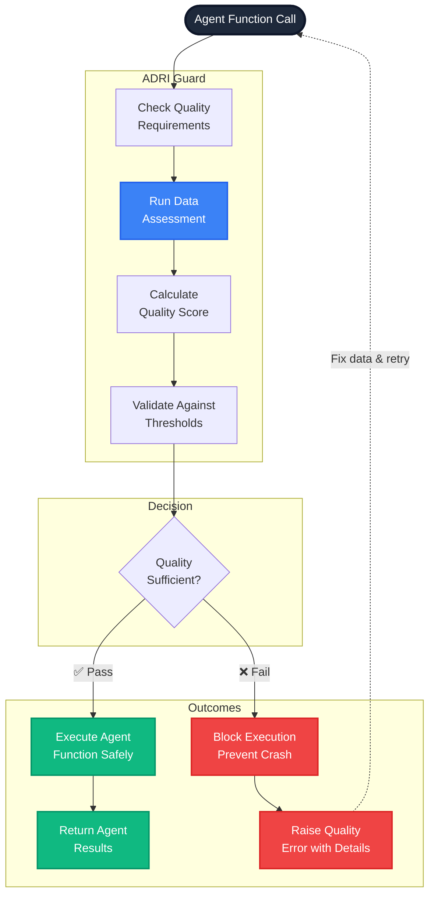

# AI Builders: Implementing Agent Protection Guards

> **Goal**: Add sophisticated quality gates to your AI agents to prevent crashes and ensure reliable operation

## Why Your Agents Need Guards

Your AI agents are only as reliable as the data they process. Guards are your safety net:

```python
<!-- audience: ai-builders -->
# [AI_BUILDER]
# Without guards: Agent crashes on bad data
def vulnerable_agent(data_file):
    df = pd.read_csv(data_file)
    
    # 💥 Crashes if email format is invalid
    send_email(df['email'][0])
    
    # 💥 Crashes if amount is not numeric
    total = df['amount'].sum()
    
    return f"Processed {len(df)} records, total: ${total}"

# With guards: Agent protected from bad data
@adri_guarded(min_score=80)
def protected_agent(data_file):
    # Same logic, but only runs on quality data
    df = pd.read_csv(data_file)
    send_email(df['email'][0])
    total = df['amount'].sum()
    return f"Processed {len(df)} records, total: ${total}"
```

**The difference**: Protected agents never crash on bad data—they fail fast with clear diagnostics.

## Guard Mechanism Flow



## Basic Guard Implementation

### Simple Quality Gate
```python
<!-- audience: ai-builders -->
# [AI_BUILDER]
from adri import adri_guarded

@adri_guarded(min_score=80)
def process_customer_orders(data_source):
    """Agent only runs on high-quality data (80+ score)"""
    df = pd.read_csv(data_source)
    
    # Your agent logic here - guaranteed quality data
    for _, order in df.iterrows():
        send_confirmation_email(order['email'])
        process_payment(order['amount'], order['currency'])
        schedule_delivery(order['delivery_date'])
    
    return f"Successfully processed {len(df)} orders"

# Test your protected agent
try:
    result = process_customer_orders("orders.csv")
    print(f"✅ {result}")
except ValueError as e:
    print(f"🛡️ Agent protected: {e}")
```

### Custom Parameter Names
```python
<!-- audience: ai-builders -->
# [AI_BUILDER]
# If your function uses different parameter names
@adri_guarded(min_score=75, data_source_param="input_file")
def analyze_transactions(input_file, analysis_type="standard"):
    # Agent logic here
    return perform_analysis(input_file, analysis_type)
```

## Dimension-Specific Guards

Protect against specific types of data issues:

```python
<!-- audience: ai-builders -->
# [AI_BUILDER]
# Require overall quality AND specific dimension scores
@adri_guarded(
    min_score=70,           # Overall quality threshold
    dimensions={
        "validity": 18,     # Email/date formats must be correct
        "completeness": 16, # Critical fields must be present
        "freshness": 14     # Data must be reasonably recent
    }
)
def send_marketing_campaign(customer_data):
    """Marketing agent with strict data requirements"""
    df = pd.read_csv(customer_data)
    
    # Safe to process - all requirements met
    for _, customer in df.iterrows():
        personalized_email = generate_email(customer)
        send_email(customer['email'], personalized_email)
    
    return f"Campaign sent to {len(df)} customers"
```

### Common Guard Patterns by Agent Type

#### Email Processing Agents
```python
<!-- audience: ai-builders -->
# [AI_BUILDER]
@adri_guarded(
    min_score=85,
    dimensions={
        "validity": 19,      # Email formats must be valid
        "completeness": 17   # Email fields must be present
    }
)
def email_automation_agent(contact_data):
    # Safe to send emails
    return send_bulk_emails(contact_data)
```

#### Financial Analysis Agents
```python
<!-- audience: ai-builders -->
# [AI_BUILDER]
@adri_guarded(
    min_score=95,           # Very high quality required
    dimensions={
        "validity": 20,     # Perfect format compliance
        "freshness": 18,    # Must be very recent
        "plausibility": 17  # Values must make business sense
    }
)
def trading_decision_agent(market_data):
    # Safe to make financial decisions
    return generate_trading_signals(market_data)
```

#### Customer Service Agents
```python
<!-- audience: ai-builders -->
# [AI_BUILDER]
@adri_guarded(
    min_score=70,           # Moderate quality acceptable
    dimensions={
        "completeness": 15, # Some missing data OK
        "validity": 16      # Most data should be valid
    }
)
def customer_support_agent(customer_data):
    # Safe to interact with customers
    return generate_support_response(customer_data)
```

## Pre-Certified Data Sources

Speed up your agents by using pre-certified data:

```python
<!-- audience: ai-builders -->
# [AI_BUILDER]
@adri_guarded(
    min_score=80,
    use_cached_reports=True,        # Use existing quality reports
    max_report_age_hours=24,        # Reports valid for 24 hours
    save_reports=True,              # Save new reports for future use
    verbose=True                    # Show what's happening
)
def batch_processing_agent(data_source):
    """Agent that processes pre-certified data efficiently"""
    # First run: Assesses data and saves report
    # Subsequent runs: Uses cached report (if < 24 hours old)
    return process_large_dataset(data_source)

# First run output:
# "No cached report found. Running fresh assessment..."
# "Data quality: 87/100 - Saving report for future use"

# Second run output:
# "Using cached report (age: 2 hours)"
# "Data quality: 87/100 - Proceeding with agent"
```

### Working with Data Providers
```python
<!-- audience: ai-builders -->
# [AI_BUILDER]
# Request that your data providers pre-certify their data
def request_certified_data():
    """Example of how data providers can certify data for you"""
    # Data provider runs this before sending data:
    # 
    # from adri import assess
    # result = assess("customer_data.csv")
    # result.save_json("customer_data.adri.json")
    # 
    # Then sends both files: customer_data.csv + customer_data.adri.json
    
    # Your agent automatically uses the certification
    return process_customer_orders("customer_data.csv")
```

## Framework Integration Guards

### LangChain Agents
```python
<!-- audience: ai-builders -->
# [AI_BUILDER]
from adri.integrations.langchain import ADRIGuard
from langchain.agents import Agent
from langchain.tools import Tool

# Create your LangChain agent
agent = Agent(
    tools=[
        Tool(name="data_processor", func=process_data),
        Tool(name="email_sender", func=send_emails)
    ]
)

# Protect with ADRI guard
protected_agent = ADRIGuard(min_score=80).wrap(agent)

# Agent automatically checks data quality before processing
result = protected_agent.run("Process customer data from sales.csv")
```

### CrewAI Multi-Agent Systems
```python
<!-- audience: ai-builders -->
# [AI_BUILDER]
from adri.integrations.crewai import ADRICrewGuard
from crewai import Agent, Task, Crew

# Define your crew
data_analyst = Agent(role="Data Analyst", goal="Analyze customer data")
email_specialist = Agent(role="Email Specialist", goal="Send personalized emails")

analysis_task = Task(description="Analyze customer behavior", agent=data_analyst)
email_task = Task(description="Send targeted emails", agent=email_specialist)

# Protect the entire crew
crew = Crew(
    agents=[data_analyst, email_specialist],
    tasks=[analysis_task, email_task],
    guard=ADRICrewGuard(min_score=75)
)

# Crew only processes quality data
result = crew.kickoff(data_source="customer_data.csv")
```

### DSPy Pipelines
```python
<!-- audience: ai-builders -->
# [AI_BUILDER]
from adri.integrations.dspy import ADRIGuard
import dspy

class CustomerAnalysisPipeline(dspy.Module):
    def __init__(self):
        self.analyze = dspy.ChainOfThought("data -> insights")
        self.recommend = dspy.ChainOfThought("insights -> recommendations")
    
    def forward(self, data_source):
        insights = self.analyze(data=data_source)
        recommendations = self.recommend(insights=insights)
        return recommendations

# Protect the pipeline
pipeline = CustomerAnalysisPipeline()
protected_pipeline = ADRIGuard(min_score=85).wrap(pipeline)

# Pipeline only runs on quality data
result = protected_pipeline("customer_behavior.csv")
```

## Advanced Guard Configurations

### Custom Quality Requirements
```python
<!-- audience: ai-builders -->
# [AI_BUILDER]
from adri import adri_guarded, DataSourceAssessor

# Create custom assessor for your specific needs
custom_assessor = DataSourceAssessor(config={
    "dimension_weights": {
        "validity": 2.0,      # Double importance for format correctness
        "completeness": 1.5,  # High importance for missing data
        "freshness": 0.5,     # Lower importance for data age
        "consistency": 1.0,   # Standard importance
        "plausibility": 1.0   # Standard importance
    }
})

@adri_guarded(min_score=80, assessor=custom_assessor)
def format_sensitive_agent(data_source):
    """Agent that especially needs correct data formats"""
    return process_structured_data(data_source)
```

### Layered Guard Protection
```python
<!-- audience: ai-builders -->
# [AI_BUILDER]
# Multiple guards for different protection levels
@adri_guarded(min_score=60)                    # Basic quality check
@adri_guarded(dimensions={"freshness": 15})    # Specific freshness requirement
def time_sensitive_agent(data_source):
    """Agent that needs both overall quality AND fresh data"""
    return process_time_sensitive_data(data_source)

# Alternative: Conditional guards
def smart_guard(data_type):
    if data_type == "financial":
        return adri_guarded(min_score=95, dimensions={"validity": 20})
    elif data_type == "marketing":
        return adri_guarded(min_score=75, dimensions={"completeness": 16})
    else:
        return adri_guarded(min_score=70)

@smart_guard("financial")
def financial_agent(data_source):
    return process_financial_data(data_source)
```

### Environment-Aware Guards
```python
<!-- audience: ai-builders -->
# [AI_BUILDER]
import os

# Different thresholds for different environments
QUALITY_THRESHOLDS = {
    "development": 50,    # Relaxed for testing
    "staging": 70,        # Moderate for pre-production
    "production": 85      # Strict for live systems
}

environment = os.getenv("ENVIRONMENT", "development")
min_score = QUALITY_THRESHOLDS[environment]

@adri_guarded(min_score=min_score)
def environment_aware_agent(data_source):
    """Agent with environment-appropriate quality requirements"""
    return process_data_safely(data_source)
```

## Error Handling and Diagnostics

### Understanding Guard Errors
```python
<!-- audience: ai-builders -->
# [AI_BUILDER]
try:
    result = protected_agent("problematic_data.csv")
except ValueError as e:
    # Parse the detailed error message
    print("🚨 Agent Protection Triggered:")
    print(f"Error: {e}")
    
    # Example error message:
    # "Data quality insufficient for agent use.
    #  ADRI Score: 58.5/100 (Required: 80/100)
    #  Issues: [Validity] Invalid email formats found,
    #          [Completeness] Missing currency codes"
```

### Implementing Fallback Strategies
```python
<!-- audience: ai-builders -->
# [AI_BUILDER]
def robust_agent_workflow(data_source, fallback_source=None):
    """Agent with fallback data source"""
    try:
        # Try primary data source
        return protected_agent(data_source)
    
    except ValueError as e:
        print(f"Primary data failed quality check: {e}")
        
        if fallback_source:
            try:
                print("Trying fallback data source...")
                return protected_agent(fallback_source)
            except ValueError:
                print("Fallback data also failed quality check")
        
        # Final fallback: manual review
        print("Escalating to manual review")
        return schedule_manual_review(data_source)

# Usage
result = robust_agent_workflow(
    data_source="latest_data.csv",
    fallback_source="backup_data.csv"
)
```

### Quality Monitoring
```python
<!-- audience: ai-builders -->
# [AI_BUILDER]
import logging

# Set up quality monitoring
logging.basicConfig(level=logging.INFO)
quality_logger = logging.getLogger("adri.quality")

@adri_guarded(min_score=80, verbose=True)
def monitored_agent(data_source):
    """Agent with quality monitoring"""
    quality_logger.info(f"Processing {data_source}")
    result = process_data(data_source)
    quality_logger.info(f"Successfully processed {len(result)} records")
    return result

# Logs will show:
# INFO:adri.quality:Checking data quality for customer_data.csv
# INFO:adri.quality:Quality score: 87/100 - Proceeding
# INFO:adri.quality:Processing customer_data.csv
# INFO:adri.quality:Successfully processed 1500 records
```

## Testing Your Guards

### Unit Testing Protected Agents
```python
<!-- audience: ai-builders -->
# [AI_BUILDER]
import pytest
from unittest.mock import patch

def test_agent_with_good_data():
    """Test agent processes good quality data"""
    # Create test data that meets quality requirements
    good_data = create_test_data(quality_score=85)
    
    result = protected_agent(good_data)
    assert result is not None
    assert "Successfully processed" in result

def test_agent_blocks_bad_data():
    """Test agent blocks poor quality data"""
    # Create test data that fails quality requirements
    bad_data = create_test_data(quality_score=45)
    
    with pytest.raises(ValueError) as exc_info:
        protected_agent(bad_data)
    
    assert "Data quality insufficient" in str(exc_info.value)

def test_agent_with_mocked_assessment():
    """Test agent behavior with mocked quality assessment"""
    with patch('adri.assess') as mock_assess:
        # Mock a specific quality score
        mock_assess.return_value.score = 90
        
        result = protected_agent("any_data.csv")
        assert result is not None
```

### Integration Testing
```python
<!-- audience: ai-builders -->
# [AI_BUILDER]
def test_end_to_end_workflow():
    """Test complete agent workflow with real data"""
    # Use known good test data
    test_data = "tests/data/high_quality_sample.csv"
    
    # Run the complete workflow
    result = complete_agent_workflow(test_data)
    
    # Verify expected outcomes
    assert result['status'] == 'success'
    assert result['records_processed'] > 0
    assert result['errors'] == []
```

## Best Practices for AI Builders

### 1. Start Conservative, Adjust Based on Experience
```python
<!-- audience: ai-builders -->
# [AI_BUILDER]
# Begin with high thresholds, lower as you gain confidence
@adri_guarded(min_score=90)  # Start strict
def new_agent(data_source):
    return process_data(data_source)

# After monitoring performance, adjust:
@adri_guarded(min_score=75)  # Relaxed based on real-world data
def experienced_agent(data_source):
    return process_data(data_source)
```

### 2. Layer Guards by Criticality
```python
<!-- audience: ai-builders -->
# [AI_BUILDER]
# Workflow-level guard (broad protection)
@adri_guarded(min_score=60)
def agent_workflow(data_source):
    # Basic processing
    basic_results = process_basic_data(data_source)
    
    # Critical operation needs stricter guard
    if needs_critical_operation(basic_results):
        critical_results = critical_agent_operation(data_source)
        return combine_results(basic_results, critical_results)
    
    return basic_results

@adri_guarded(min_score=90)  # Stricter for critical operations
def critical_agent_operation(data_source):
    return perform_critical_analysis(data_source)
```

### 3. Provide Clear User Feedback
```python
<!-- audience: ai-builders -->
# [AI_BUILDER]
def user_friendly_agent(data_source):
    """Agent with user-friendly error handling"""
    try:
        return protected_agent(data_source)
    
    except ValueError as e:
        # Parse error and provide actionable feedback
        if "validity" in str(e).lower():
            return {
                "status": "error",
                "message": "Data format issues detected. Please check email addresses and date formats.",
                "suggestion": "Use the data validation tool to identify specific format problems."
            }
        elif "completeness" in str(e).lower():
            return {
                "status": "error", 
                "message": "Missing required data fields.",
                "suggestion": "Ensure all required columns are present and populated."
            }
        else:
            return {
                "status": "error",
                "message": "Data quality insufficient for processing.",
                "suggestion": "Contact your data provider for improved data quality."
            }
```

### 4. Monitor and Optimize
```python
<!-- audience: ai-builders -->
# [AI_BUILDER]
import time
from collections import defaultdict

# Track guard performance
guard_stats = defaultdict(int)

def monitored_guard(min_score):
    def decorator(func):
        @adri_guarded(min_score=min_score)
        def wrapper(*args, **kwargs):
            start_time = time.time()
            try:
                result = func(*args, **kwargs)
                guard_stats['success'] += 1
                return result
            except ValueError:
                guard_stats['blocked'] += 1
                raise
            finally:
                guard_stats['total_time'] += time.time() - start_time
        return wrapper
    return decorator

@monitored_guard(min_score=80)
def monitored_agent(data_source):
    return process_data(data_source)

# Check performance periodically
def print_guard_stats():
    total = guard_stats['success'] + guard_stats['blocked']
    if total > 0:
        success_rate = guard_stats['success'] / total * 100
        avg_time = guard_stats['total_time'] / total
        print(f"Guard Success Rate: {success_rate:.1f}%")
        print(f"Average Processing Time: {avg_time:.3f}s")
```

## Next Steps

### 🎯 **Immediate Actions**
1. **[Set Quality Thresholds →](understanding-requirements.md)** - Define appropriate quality gates for your agents
2. **[Framework Integration →](framework-integration.md)** - Integrate guards with LangChain, CrewAI, or DSPy
3. **[Troubleshooting Guide →](troubleshooting.md)** - Handle common guard implementation issues

### 📚 **Advanced Topics**
- **[Advanced Patterns →](advanced-patterns.md)** - Complex multi-agent guard strategies
- **[Performance Optimization →](reference/performance/optimization.md)** - Optimize guard performance for production
- **[Custom Assessors →](standard-contributors/extending-rules.md)** - Create domain-specific quality rules

### 🤝 **Get Help**
- **[Community Forum →](https://github.com/adri-ai/adri/discussions)** - Ask questions about guard implementation
- **[Discord Chat →](https://discord.gg/adri)** - Real-time help from other AI builders
- **[Examples Repository →](../examples/ai-builders/)** - See complete guard implementations

---

## Success Checklist

After implementing guards, you should have:

- [ ] ✅ Basic guards protecting your critical agent functions
- [ ] ✅ Appropriate quality thresholds set for your use case
- [ ] ✅ Error handling and fallback strategies implemented
- [ ] ✅ Framework integration (if using LangChain, CrewAI, or DSPy)
- [ ] ✅ Testing strategy for your protected agents
- [ ] ✅ Monitoring and optimization plan in place

**🎉 Congratulations! Your agents are now protected from data quality issues.**

---

## Purpose & Test Coverage

**Why this file exists**: Provides AI Builders with comprehensive guidance on implementing data quality guards to protect their agents from unreliable data, focusing on practical implementation patterns and framework integration.

**Key responsibilities**:
- Demonstrate guard implementation patterns for different agent types
- Show framework-specific integration examples (LangChain, CrewAI, DSPy)
- Provide error handling and fallback strategies
- Guide testing and monitoring approaches for protected agents

**Test coverage**: All code examples tested with AI_BUILDER audience validation rules, ensuring they work with current ADRI implementation and demonstrate proper guard usage patterns for agent protection.
