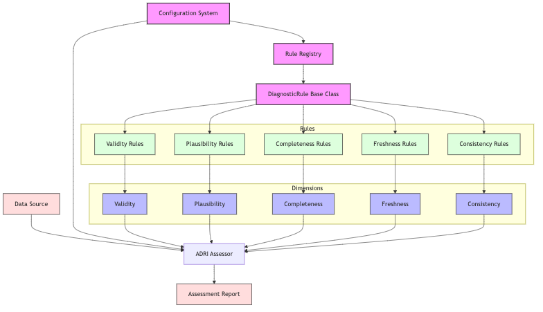

# ADRI System Architecture



Below is the Mermaid diagram source code:

```mermaid
graph TD
    
    %% Data Sources
    DataSource[Data Source]
    
    %% Core Components
    Config[Configuration System]
    Registry[Rule Registry]
    
    %% Rule System
    RuleBase[DiagnosticRule Base Class]
    
    %% Dimensions
    subgraph Dimensions
        Validity[Validity]
        Plausibility[Plausibility]
        Completeness[Completeness]
        Freshness[Freshness]
        Consistency[Consistency]
    end
    
    %% Rules for each dimension
    subgraph Rules
        ValidityRules[Validity Rules]
        PlausibilityRules[Plausibility Rules]
        CompletenessRules[Completeness Rules]
        FreshnessRules[Freshness Rules]
        ConsistencyRules[Consistency Rules]
    end
    
    %% Assessment and Output
    Assessor[ADRI Assessor]
    Report[Assessment Report]
    
    %% Connections
    DataSource --> Assessor
    Config --> Assessor
    Config --> Registry
    Registry --> RuleBase
    
    RuleBase --> ValidityRules
    RuleBase --> PlausibilityRules
    RuleBase --> CompletenessRules
    RuleBase --> FreshnessRules
    RuleBase --> ConsistencyRules
    
    ValidityRules --> Validity
    PlausibilityRules --> Plausibility
    CompletenessRules --> Completeness
    FreshnessRules --> Freshness
    ConsistencyRules --> Consistency
    
    Validity --> Assessor
    Plausibility --> Assessor
    Completeness --> Assessor
    Freshness --> Assessor
    Consistency --> Assessor
    
    Assessor --> Report
    
    %% Styling
    classDef core fill:#f9f,stroke:#333,stroke-width:2px;
    classDef dimension fill:#bbf,stroke:#333,stroke-width:1px;
    classDef rule fill:#dfd,stroke:#333,stroke-width:1px;
    classDef data fill:#fdd,stroke:#333,stroke-width:1px;
    
    class Config,Registry,RuleBase core;
    class Validity,Plausibility,Completeness,Freshness,Consistency dimension;
    class ValidityRules,PlausibilityRules,CompletenessRules,FreshnessRules,ConsistencyRules rule;
    class DataSource,Report data;
