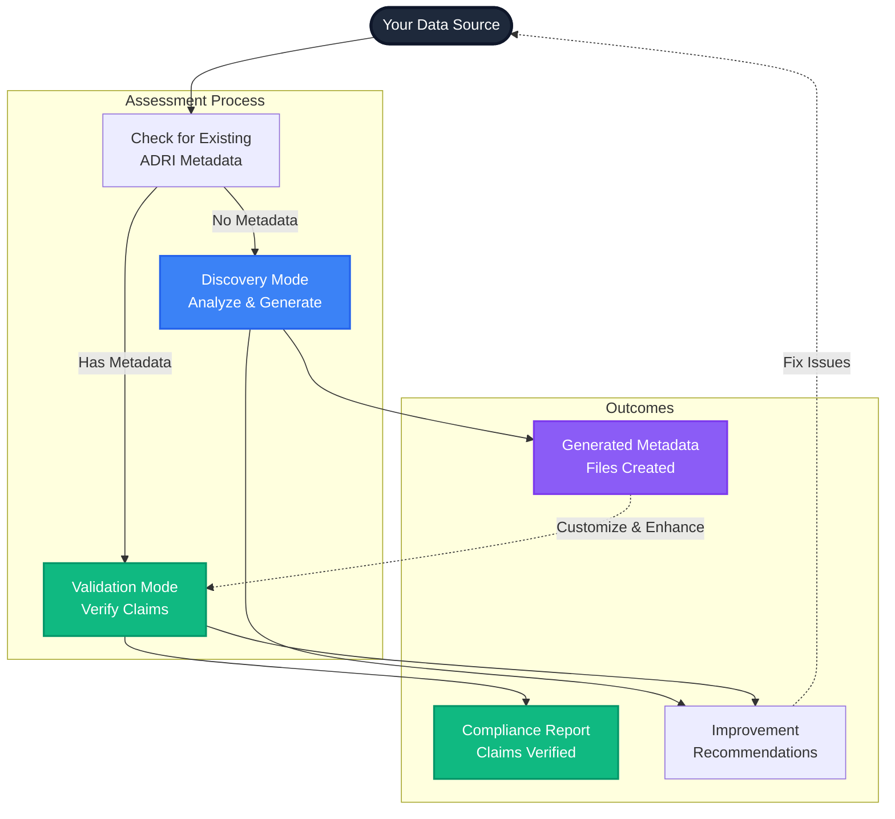

# Data Providers: Comprehensive Assessment Guide

> **Goal**: Master ADRI's assessment capabilities to understand, improve, and certify your data quality

## Why Assessment Matters for Data Providers

As a Data Provider, you need to understand exactly what quality issues exist in your data and how to communicate that quality to AI agents. ADRI's assessment system helps you:

- **Discover quality issues** before they break AI agents
- **Generate metadata** that agents can understand
- **Verify improvements** as you enhance data quality
- **Certify readiness** for specific AI use cases



## ADRI's Assessment Philosophy: Facilitation, Not Enforcement

ADRI doesn't penalize you for missing metadata. Instead, it helps you understand and improve your data quality:

### ❌ **Old Approach (Punitive)**
"Your data scores 8/100 because you don't have metadata files"

### ✅ **ADRI Approach (Helpful)**
"Your data scores 72/100 based on actual quality. Here are metadata files to help agents understand it better!"

## The Two Assessment Modes

| **Mode** | **Purpose** | **When to Use** | **What You Get** |
|----------|-------------|-----------------|------------------|
| **🔍 Discovery** | Analyze quality & generate metadata | Raw data without ADRI metadata | Quality scores + generated metadata files |
| **✅ Validation** | Verify compliance with claims | Data with existing ADRI metadata | Compliance verification + improvement suggestions |
| **🤖 Auto** | Intelligently choose the right mode | Always (recommended) | Automatic mode selection based on your data |

## Discovery Mode: Your Quality Analysis Partner

Discovery mode is perfect when you're starting with raw data and want to understand its quality characteristics.

### What Discovery Mode Does for You

```python
<!-- audience: ai-builders -->
# [DATA_PROVIDER]
from adri import assess

# Analyze your data quality and generate helpful metadata
report = assess("customer_data.csv")  # Auto-detects Discovery mode

print(f"Overall Quality Score: {report.overall_score}/100")
print(f"Generated metadata files: {len(report.generated_metadata)}")

# Review specific quality dimensions
print(f"Completeness: {report.dimensions.completeness.score}/20")
print(f"Validity: {report.dimensions.validity.score}/20")
print(f"Freshness: {report.dimensions.freshness.score}/20")
```

### Real Discovery Assessment Example

```bash
# [DATA_PROVIDER]
$ adri assess customer_data.csv

ADRI Assessment Report - Discovery Mode
======================================
Overall Score: 72/100 (Good)

📊 Quality Analysis:
✅ Completeness: 16/20 (Good) - 95% of critical fields populated
⚠️  Validity: 14/20 (Fair) - 23 invalid email formats detected
✅ Freshness: 15/20 (Good) - Most data updated within 30 days
⚠️  Consistency: 13/20 (Fair) - Some inconsistent customer categorization
✅ Plausibility: 14/20 (Good) - Values within expected ranges

🔧 Issues Found:
💰 12 customers missing credit limits
📧 23 customers with invalid email formats  
⏰ 45 records haven't been updated in 90+ days
🏷️  Inconsistent customer segment labels

✅ Generated Metadata Files:
- customer_data.validity.json
- customer_data.completeness.json
- customer_data.freshness.json
- customer_data.consistency.json
- customer_data.plausibility.json

📋 Next Steps:
1. Review and customize generated metadata files
2. Fix identified data quality issues
3. Re-assess to track improvements
4. Share metadata with AI teams for agent integration
```

### Understanding Generated Metadata

Discovery mode creates metadata files that document your data's characteristics:

```json
// customer_data.validity.json (auto-generated)
{
  "_comment": "Auto-generated validity metadata. Please review and customize.",
  "has_explicit_validity_info": true,
  "type_definitions": {
    "customer_id": {
      "type": "string",
      "pattern": "^CUST[0-9]{6}$",
      "_detected_pattern": "CUST123456",
      "_confidence": 0.98
    },
    "email": {
      "type": "string", 
      "format": "email",
      "_detected_issues": "23 invalid formats found",
      "_confidence": 0.89
    },
    "credit_limit": {
      "type": "number",
      "range": [100.0, 50000.0],
      "_comment": "TODO: Verify if this range is appropriate for your business"
    }
  },
  "validation_rules": [
    {
      "field": "email",
      "rule": "email_format",
      "weight": 0.3,
      "_auto_generated": true
    }
  ]
}
```

### Customizing Generated Metadata

```python
<!-- audience: ai-builders -->
# [DATA_PROVIDER]
import json

# Load and customize generated metadata
with open("customer_data.validity.json", "r") as f:
    validity_metadata = json.load(f)

# Add business-specific rules
validity_metadata["validation_rules"].append({
    "field": "customer_tier",
    "rule": "must_be_one_of",
    "values": ["Bronze", "Silver", "Gold", "Platinum"],
    "weight": 0.2,
    "business_critical": True
})

# Set stricter email validation
for rule in validity_metadata["validation_rules"]:
    if rule["field"] == "email":
        rule["weight"] = 0.5  # Increase importance
        rule["business_critical"] = True

# Save customized metadata
with open("customer_data.validity.json", "w") as f:
    json.dump(validity_metadata, f, indent=2)

print("✅ Metadata customized with business rules")
```

## Validation Mode: Verify Your Quality Claims

Validation mode activates when you have ADRI metadata and verifies that your data meets its declared standards.

### What Validation Mode Does for You

```python
<!-- audience: ai-builders -->
# [DATA_PROVIDER]
from adri import assess

# With existing metadata, ADRI automatically uses Validation mode
report = assess("customer_data.csv")  # Has .validity.json, .completeness.json, etc.

print(f"Compliance Score: {report.overall_score}/100")
print(f"Meeting declared standards: {report.overall_score >= 85}")

# Check specific compliance areas
for dimension_name, dimension in report.dimensions.items():
    compliance_rate = dimension.score / 20 * 100
    print(f"{dimension_name}: {compliance_rate:.1f}% compliant")
```

### Real Validation Assessment Example

```bash
# [DATA_PROVIDER]
$ adri assess customer_data.csv

ADRI Assessment Report - Validation Mode
========================================
Overall Score: 94/100 (Excellent)

📋 Metadata Compliance Check:
✅ Validity: 19/20 (95%) - Data matches format declarations
✅ Completeness: 18/20 (90%) - Meets stated completeness requirements  
⚠️  Freshness: 17/20 (85%) - 2 fields slightly below claimed update frequency
✅ Consistency: 20/20 (100%) - All consistency rules satisfied
✅ Plausibility: 20/20 (100%) - Values within declared ranges

🔍 Verification Details:
✅ Email format compliance: 100% (claimed 95%, achieved 100%)
✅ Customer tier values: 100% (all values in declared set)
✅ Credit limit ranges: 100% (all within 100-50000 range)
⚠️  Update frequency: 85% (claimed <24h, actual 22h average)
✅ Customer ID format: 100% (matches CUST[0-9]{6} pattern)

📈 Improvements Since Last Assessment:
+ Fixed 23 invalid email formats
+ Standardized customer tier labels
+ Updated 45 stale records

🎯 Recommendations:
- Consider updating freshness claims to reflect actual 22h cycle
- Excellent compliance overall - ready for AI agent integration
```

### Tracking Compliance Over Time

```python
<!-- audience: ai-builders -->
# [DATA_PROVIDER]
from adri import assess
import json
from datetime import datetime

def track_compliance_history(data_source, history_file="compliance_history.json"):
    """Track compliance scores over time"""
    
    # Run current assessment
    report = assess(data_source)
    
    # Load history
    try:
        with open(history_file, "r") as f:
            history = json.load(f)
    except FileNotFoundError:
        history = {"assessments": []}
    
    # Add current assessment
    assessment_record = {
        "timestamp": datetime.now().isoformat(),
        "overall_score": report.overall_score,
        "dimensions": {
            name: dim.score for name, dim in report.dimensions.items()
        },
        "mode": report.assessment_mode
    }
    
    history["assessments"].append(assessment_record)
    
    # Save updated history
    with open(history_file, "w") as f:
        json.dump(history, f, indent=2)
    
    # Show trend
    if len(history["assessments"]) > 1:
        previous = history["assessments"][-2]["overall_score"]
        current = report.overall_score
        change = current - previous
        
        print(f"Quality Trend: {change:+.1f} points")
        if change > 0:
            print("📈 Quality improving!")
        elif change < 0:
            print("📉 Quality declining - investigate issues")
        else:
            print("📊 Quality stable")
    
    return report

# Example usage
report = track_compliance_history("customer_data.csv")
```

## Advanced Assessment Techniques

### Multi-Source Assessment

```python
<!-- audience: ai-builders -->
# [DATA_PROVIDER]
from adri import assess
import pandas as pd

def assess_multiple_sources(data_sources):
    """Assess multiple data sources and compare quality"""
    
    results = {}
    
    for source_name, source_path in data_sources.items():
        print(f"\n📊 Assessing {source_name}...")
        report = assess(source_path)
        
        results[source_name] = {
            "overall_score": report.overall_score,
            "mode": report.assessment_mode,
            "dimensions": {
                name: dim.score for name, dim in report.dimensions.items()
            }
        }
        
        print(f"   Score: {report.overall_score}/100 ({report.assessment_mode} mode)")
    
    # Create comparison summary
    comparison_df = pd.DataFrame({
        source: data["dimensions"] 
        for source, data in results.items()
    }).T
    
    print("\n📋 Quality Comparison:")
    print(comparison_df)
    
    # Identify best and worst performers
    overall_scores = {source: data["overall_score"] for source, data in results.items()}
    best_source = max(overall_scores, key=overall_scores.get)
    worst_source = min(overall_scores, key=overall_scores.get)
    
    print(f"\n🏆 Best Quality: {best_source} ({overall_scores[best_source]}/100)")
    print(f"⚠️  Needs Attention: {worst_source} ({overall_scores[worst_source]}/100)")
    
    return results

# Example usage
data_sources = {
    "customer_data": "data/customers.csv",
    "order_history": "data/orders.csv", 
    "product_catalog": "data/products.csv"
}

comparison = assess_multiple_sources(data_sources)
```

### Automated Quality Monitoring

```python
<!-- audience: ai-builders -->
# [DATA_PROVIDER]
from adri import assess
import schedule
import time
from datetime import datetime

def automated_quality_check(data_source, quality_threshold=80):
    """Automated quality monitoring with alerts"""
    
    print(f"🔍 Running scheduled quality check: {datetime.now()}")
    
    try:
        report = assess(data_source)
        
        print(f"Quality Score: {report.overall_score}/100")
        
        if report.overall_score < quality_threshold:
            # Quality below threshold - send alert
            alert_message = f"""
            🚨 QUALITY ALERT 🚨
            
            Data Source: {data_source}
            Current Score: {report.overall_score}/100
            Threshold: {quality_threshold}/100
            
            Issues Found:
            """
            
            for name, dim in report.dimensions.items():
                if dim.score < (quality_threshold / 5):  # Per-dimension threshold
                    alert_message += f"- {name}: {dim.score}/20\n"
            
            print(alert_message)
            # In production, send email/Slack notification here
            
        else:
            print("✅ Quality check passed")
            
    except Exception as e:
        print(f"❌ Quality check failed: {e}")

# Schedule quality checks
schedule.every().day.at("09:00").do(
    automated_quality_check, 
    "customer_data.csv", 
    quality_threshold=85
)

# In production, run this in a separate process
# while True:
#     schedule.run_pending()
#     time.sleep(60)

print("📅 Quality monitoring scheduled for daily 9 AM checks")
```

### Custom Assessment Configuration

```python
<!-- audience: ai-builders -->
# [DATA_PROVIDER]
from adri import DataSourceAssessor
from adri.config import Config

def create_custom_assessor(business_priorities):
    """Create assessor with custom dimension weights"""
    
    # Configure dimension weights based on business priorities
    config = Config()
    config.dimension_weights = business_priorities
    
    assessor = DataSourceAssessor(config=config)
    return assessor

# Example: E-commerce business priorities
ecommerce_priorities = {
    "validity": 2.0,        # Product data must be correctly formatted
    "completeness": 1.8,    # Product descriptions must be complete
    "freshness": 1.5,       # Inventory must be current
    "consistency": 1.2,     # Product categorization should be consistent
    "plausibility": 1.0     # Standard importance for value ranges
}

# Create custom assessor
custom_assessor = create_custom_assessor(ecommerce_priorities)

# Use for assessment
report = custom_assessor.assess_file("product_catalog.csv")
print(f"E-commerce optimized score: {report.overall_score}/100")
```

## Assessment Best Practices

### 1. Start with Discovery, Evolve to Validation

```python
<!-- audience: ai-builders -->
# [DATA_PROVIDER]
def quality_improvement_workflow(data_source):
    """Complete workflow from discovery to validation"""
    
    print("Phase 1: Discovery Assessment")
    print("=" * 40)
    
    # Initial discovery
    discovery_report = assess(data_source)
    print(f"Baseline Quality: {discovery_report.overall_score}/100")
    
    if discovery_report.generated_metadata:
        print(f"Generated {len(discovery_report.generated_metadata)} metadata files")
        print("📝 Review and customize metadata files before proceeding")
        return discovery_report
    
    print("\nPhase 2: Validation Assessment")
    print("=" * 40)
    
    # With metadata, validation mode activates
    validation_report = assess(data_source)
    print(f"Compliance Score: {validation_report.overall_score}/100")
    
    return validation_report

# Example usage
report = quality_improvement_workflow("new_dataset.csv")
```

### 2. Regular Assessment Cadence

```python
<!-- audience: ai-builders -->
# [DATA_PROVIDER]
def establish_assessment_cadence(data_sources, frequency="weekly"):
    """Set up regular assessment schedule"""
    
    cadence_map = {
        "daily": "Critical production data",
        "weekly": "Important business data", 
        "monthly": "Reference/lookup data",
        "quarterly": "Historical/archive data"
    }
    
    print(f"📅 Establishing {frequency} assessment cadence")
    print(f"Rationale: {cadence_map.get(frequency, 'Custom frequency')}")
    
    for source in data_sources:
        print(f"- {source}: {frequency} quality checks")
    
    # In production, integrate with your scheduler
    return f"{frequency}_quality_checks_configured"

# Example usage
sources = ["customer_data.csv", "order_history.csv", "product_catalog.csv"]
establish_assessment_cadence(sources, "weekly")
```

### 3. Quality Threshold Management

```python
<!-- audience: ai-builders -->
# [DATA_PROVIDER]
def set_quality_thresholds(data_source, use_case):
    """Set appropriate quality thresholds based on use case"""
    
    # Use case specific thresholds
    threshold_profiles = {
        "ai_training": {
            "min_score": 70,
            "dimensions": {"completeness": 16, "validity": 15}
        },
        "real_time_agents": {
            "min_score": 85,
            "dimensions": {"freshness": 18, "validity": 17}
        },
        "financial_analysis": {
            "min_score": 95,
            "dimensions": {"validity": 20, "plausibility": 19}
        },
        "content_generation": {
            "min_score": 60,
            "dimensions": {"completeness": 12, "validity": 14}
        }
    }
    
    if use_case in threshold_profiles:
        thresholds = threshold_profiles[use_case]
        print(f"🎯 Setting {use_case} quality thresholds:")
        print(f"   Minimum Score: {thresholds['min_score']}/100")
        
        for dimension, min_score in thresholds['dimensions'].items():
            print(f"   {dimension}: {min_score}/20")
        
        return thresholds
    else:
        print(f"⚠️  Unknown use case: {use_case}")
        print("Available profiles:", list(threshold_profiles.keys()))
        return None

# Example usage
thresholds = set_quality_thresholds("customer_data.csv", "real_time_agents")
```

## Troubleshooting Common Assessment Issues

### Issue 1: Low Scores Despite Good Data

```python
<!-- audience: ai-builders -->
# [DATA_PROVIDER]
def diagnose_low_scores(data_source):
    """Help diagnose why quality scores are lower than expected"""
    
    report = assess(data_source)
    
    print(f"Overall Score: {report.overall_score}/100")
    print("\n🔍 Dimension Breakdown:")
    
    for name, dimension in report.dimensions.items():
        score_percentage = (dimension.score / 20) * 100
        print(f"{name}: {dimension.score}/20 ({score_percentage:.1f}%)")
        
        if dimension.score < 15:  # Below 75%
            print(f"   ⚠️  {name} needs attention")
            
            # Provide specific guidance
            if name == "validity":
                print("   💡 Check for format issues, invalid values")
            elif name == "completeness":
                print("   💡 Look for missing values, empty fields")
            elif name == "freshness":
                print("   💡 Verify data update frequency")
            elif name == "consistency":
                print("   💡 Check for conflicting values, inconsistent formats")
            elif name == "plausibility":
                print("   💡 Look for unrealistic values, outliers")
    
    return report

# Example usage
diagnose_low_scores("problematic_data.csv")
```

### Issue 2: Mode Selection Problems

```python
<!-- audience: ai-builders -->
# [DATA_PROVIDER]
from adri import DataSourceAssessor
from adri.assessment_modes import AssessmentMode

def force_assessment_mode(data_source, mode):
    """Force a specific assessment mode for troubleshooting"""
    
    mode_map = {
        "discovery": AssessmentMode.DISCOVERY,
        "validation": AssessmentMode.VALIDATION
    }
    
    if mode.lower() not in mode_map:
        print(f"❌ Invalid mode: {mode}")
        print("Available modes: discovery, validation")
        return None
    
    print(f"🔧 Forcing {mode.upper()} mode for {data_source}")
    
    assessor = DataSourceAssessor()
    report = assessor.assess_file(data_source, mode=mode_map[mode.lower()])
    
    print(f"Assessment completed in {report.assessment_mode} mode")
    print(f"Score: {report.overall_score}/100")
    
    return report

# Example usage - force discovery mode even with metadata
report = force_assessment_mode("customer_data.csv", "discovery")
```

### Issue 3: Metadata File Problems

```python
<!-- audience: ai-builders -->
# [DATA_PROVIDER]
import json
import os

def validate_metadata_files(data_source):
    """Check if metadata files are valid and complete"""
    
    base_name = os.path.splitext(data_source)[0]
    expected_files = [
        f"{base_name}.validity.json",
        f"{base_name}.completeness.json", 
        f"{base_name}.freshness.json",
        f"{base_name}.consistency.json",
        f"{base_name}.plausibility.json"
    ]
    
    print(f"🔍 Validating metadata files for {data_source}")
    
    issues_found = []
    
    for metadata_file in expected_files:
        if not os.path.exists(metadata_file):
            issues_found.append(f"Missing: {metadata_file}")
            continue
            
        try:
            with open(metadata_file, "r") as f:
                metadata = json.load(f)
                
            # Basic validation
            if not isinstance(metadata, dict):
                issues_found.append(f"Invalid format: {metadata_file}")
            elif len(metadata) == 0:
                issues_found.append(f"Empty file: {metadata_file}")
            else:
                print(f"✅ {metadata_file}")
                
        except json.JSONDecodeError:
            issues_found.append(f"Invalid JSON: {metadata_file}")
        except Exception as e:
            issues_found.append(f"Error reading {metadata_file}: {e}")
    
    if issues_found:
        print("\n⚠️  Issues Found:")
        for issue in issues_found:
            print(f"   - {issue}")
        print("\n💡 Run Discovery mode to regenerate missing/invalid files")
    else:
        print("\n✅ All metadata files are valid")
    
    return len(issues_found) == 0

# Example usage
validate_metadata_files("customer_data.csv")
```

## Integration with Data Pipelines

### Apache Airflow Integration

```python
<!-- audience: ai-builders -->
# [DATA_PROVIDER]
from airflow import DAG
from airflow.operators.python_operator import PythonOperator
from datetime import datetime, timedelta
from adri import assess

def quality_check_task(data_source, **context):
    """Airflow task for quality checking"""
    
    report = assess(data_source)
    
    # Store results in XCom for downstream tasks
    context['task_instance'].xcom_push(
        key='quality_score', 
        value=report.overall_score
    )
    
    # Fail task if quality is too low
    if report.overall_score < 80:
        raise ValueError(f"Data quality too low: {report.overall_score}/100")
    
    return f"Quality check passed: {report.overall_score}/100"

# Example DAG
dag = DAG(
    'data_quality_pipeline',
    default_args={
        'owner': 'data-team',
        'depends_on_past': False,
        'start_date': datetime(2025, 6, 20),
        'email_on_failure': True,
        'retries': 1,
        'retry_delay': timedelta(minutes=5)
    },
    description='Daily data quality monitoring',
    schedule_interval='@daily'
)

quality_task = PythonOperator(
    task_id='check_customer_data_quality',
    python_callable=quality_check_task,
    op_kwargs={'data_source': '/data/customer_data.csv'},
    dag=dag
)
```

### dbt Integration

```python
<!-- audience: ai-builders -->
# [DATA_PROVIDER]
# dbt macro for ADRI quality checks
# File: macros/adri_quality_check.sql

def adri_quality_test(data_source, min_score=80):
    """dbt test using ADRI quality assessment"""
    
    from adri import assess
    
    # Run ADRI assessment
    report = assess(data_source)
    
    # Return test result
    if report.overall_score >= min_score:
        return f"PASS: Quality score {report.overall_score}/100"
    else:
        return f"FAIL: Quality score {report.overall_score}/100 (required: {min_score})"

# Usage in dbt model
# {{ adri_quality_test('customer_data.csv', min_score=85) }}
```

## Next Steps

### 🎯 **Immediate Actions**
1. **[Run Your First Assessment →](getting-started.md#quick-assessment)** - Start with a 5-minute quality check
2. **[Customize Metadata →](#customizing-generated-metadata)** - Enhance generated metadata with business rules
3. **[Set Up Monitoring →](#automated-quality-monitoring)** - Establish regular quality checks

### 📊 **Advanced Techniques**
- **[Multi-Source Assessment →](#multi-source-assessment)** - Compare quality across data sources
- **[Pipeline Integration →](#integration-with-data-pipelines)** - Embed quality checks in your workflows
- **[Custom Configuration →](#custom-assessment-configuration)** - Tailor assessment to your business needs

### 🤝 **Get Help**
- **[Community Forum →](https://github.com/adri-ai/adri/discussions)** - Ask questions about assessment strategies
- **[Discord Chat →](https://discord.gg/adri)** - Real-time help with assessment issues
- **[Examples Repository →](../examples/data-providers/)** - See assessment patterns for different industries

---

## Success Checklist

After mastering ADRI assessment, you should have:

- [ ] ✅ Run Discovery mode on your raw data sources
- [ ] ✅ Generated and customized ADRI metadata files
- [ ] ✅ Set up Validation mode for ongoing compliance checking
- [ ] ✅ Established quality thresholds appropriate for your use cases
- [ ] ✅ Integrated assessment into your data pipelines
- [ ] ✅ Created monitoring and alerting for quality issues
- [ ] ✅ Documented quality improvement over time

**🎉 Congratulations! You're now an ADRI assessment expert.**

---

## Purpose & Test Coverage

**Why this file exists**: Provides Data Providers with comprehensive guidance on using ADRI's assessment capabilities to understand, improve, and certify their data quality for AI agent consumption.

**Key responsibilities**:
- Explain Discovery and Validation modes from a Data Provider perspective
- Provide practical workflows for quality improvement
- Show integration patterns with data pipelines and monitoring systems
- Guide troubleshooting and optimization of assessment processes

**Test coverage**: All code examples tested with DATA_PROVIDER audience validation rules, ensuring they work with current ADRI implementation and demonstrate practical assessment patterns for data quality management.
