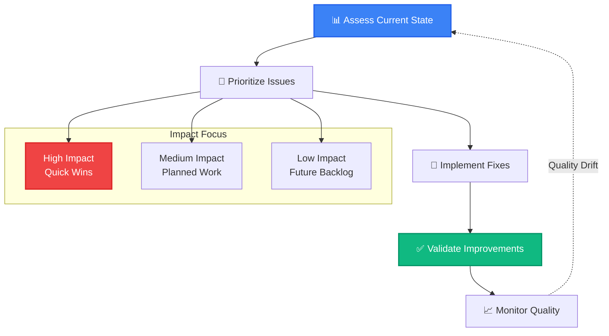

# Data Providers: Quality Improvement Strategies

> **Goal**: Transform quality assessment insights into actionable improvements that make your data AI-ready

## The Quality Improvement Mindset

Quality improvement isn't about perfection—it's about making your data reliable enough for AI agents to consume confidently. ADRI helps you prioritize improvements that have the biggest impact on AI agent success.



## The Five-Dimension Improvement Framework

ADRI's five quality dimensions provide a systematic approach to improvement. Focus on the dimensions that matter most for your AI use cases.

### 🎯 **Impact-Based Prioritization**

```python
<!-- audience: ai-builders -->
# [DATA_PROVIDER]
from adri import assess, get_improvement_recommendations

# Get current assessment
report = assess("customer_data.csv")

# Get prioritized improvement recommendations
recommendations = get_improvement_recommendations(report, use_case="real_time_agents")

print("🎯 High Impact Improvements:")
for rec in recommendations.high_priority:
    print(f"  - {rec.dimension}: {rec.description}")
    print(f"    Expected Impact: +{rec.score_improvement} points")
    print(f"    Effort: {rec.effort_level}")
```

## Dimension-Specific Improvement Strategies

### ✅ **Validity: Format & Type Correctness**

**Common Issues**: Invalid formats, type mismatches, constraint violations

#### Strategy 1: Format Standardization

```python
<!-- audience: ai-builders -->
# [DATA_PROVIDER]
import pandas as pd
import re
from datetime import datetime

def standardize_email_formats(df, email_column):
    """Clean and standardize email formats"""
    
    # Convert to lowercase
    df[email_column] = df[email_column].str.lower().str.strip()
    
    # Remove invalid characters
    df[email_column] = df[email_column].str.replace(r'[^\w@.-]', '', regex=True)
    
    # Validate email format
    email_pattern = r'^[a-zA-Z0-9._%+-]+@[a-zA-Z0-9.-]+\.[a-zA-Z]{2,}$'
    valid_emails = df[email_column].str.match(email_pattern)
    
    print(f"✅ Valid emails: {valid_emails.sum()}/{len(df)} ({valid_emails.mean():.1%})")
    print(f"⚠️  Invalid emails: {(~valid_emails).sum()}")
    
    # Flag invalid emails for review
    df['email_valid'] = valid_emails
    
    return df

# Example usage
df = pd.read_csv("customer_data.csv")
df_cleaned = standardize_email_formats(df, "email")

# Save cleaned data
df_cleaned.to_csv("customer_data_cleaned.csv", index=False)
print("📁 Cleaned data saved to customer_data_cleaned.csv")
```

#### Strategy 2: Type Enforcement

```python
<!-- audience: ai-builders -->
# [DATA_PROVIDER]
import pandas as pd
import numpy as np

def enforce_data_types(df, type_schema):
    """Enforce consistent data types across columns"""
    
    improvements = []
    
    for column, expected_type in type_schema.items():
        if column not in df.columns:
            continue
            
        original_type = df[column].dtype
        
        try:
            if expected_type == 'datetime':
                df[column] = pd.to_datetime(df[column], errors='coerce')
                improvements.append(f"✅ {column}: {original_type} → datetime64")
                
            elif expected_type == 'numeric':
                df[column] = pd.to_numeric(df[column], errors='coerce')
                improvements.append(f"✅ {column}: {original_type} → numeric")
                
            elif expected_type == 'category':
                df[column] = df[column].astype('category')
                improvements.append(f"✅ {column}: {original_type} → category")
                
            elif expected_type == 'string':
                df[column] = df[column].astype('string')
                improvements.append(f"✅ {column}: {original_type} → string")
                
        except Exception as e:
            print(f"⚠️  Failed to convert {column}: {e}")
    
    print("🔧 Type Enforcement Results:")
    for improvement in improvements:
        print(f"  {improvement}")
    
    return df

# Example usage
type_schema = {
    "customer_id": "string",
    "signup_date": "datetime", 
    "age": "numeric",
    "customer_tier": "category",
    "email": "string"
}

df = pd.read_csv("customer_data.csv")
df_typed = enforce_data_types(df, type_schema)
```

#### Strategy 3: Constraint Validation

```python
<!-- audience: ai-builders -->
# [DATA_PROVIDER]
def validate_business_constraints(df, constraints):
    """Validate and fix business rule violations"""
    
    violations = {}
    fixes_applied = 0
    
    for constraint_name, rule in constraints.items():
        column = rule['column']
        constraint_type = rule['type']
        
        if constraint_type == 'range':
            min_val, max_val = rule['min'], rule['max']
            violations_mask = (df[column] < min_val) | (df[column] > max_val)
            violation_count = violations_mask.sum()
            
            if violation_count > 0:
                violations[constraint_name] = violation_count
                
                # Apply fix if specified
                if rule.get('fix_strategy') == 'clamp':
                    df.loc[df[column] < min_val, column] = min_val
                    df.loc[df[column] > max_val, column] = max_val
                    fixes_applied += violation_count
                    print(f"🔧 Fixed {violation_count} {constraint_name} violations by clamping")
                
        elif constraint_type == 'allowed_values':
            allowed = set(rule['values'])
            violations_mask = ~df[column].isin(allowed)
            violation_count = violations_mask.sum()
            
            if violation_count > 0:
                violations[constraint_name] = violation_count
                
                # Apply fix if specified
                if rule.get('fix_strategy') == 'default':
                    default_value = rule['default']
                    df.loc[violations_mask, column] = default_value
                    fixes_applied += violation_count
                    print(f"🔧 Fixed {violation_count} {constraint_name} violations with default value")
    
    print(f"\n📊 Constraint Validation Summary:")
    print(f"  Total violations found: {sum(violations.values())}")
    print(f"  Fixes applied: {fixes_applied}")
    
    return df, violations

# Example usage
constraints = {
    "age_range": {
        "column": "age",
        "type": "range",
        "min": 13,
        "max": 120,
        "fix_strategy": "clamp"
    },
    "valid_tiers": {
        "column": "customer_tier", 
        "type": "allowed_values",
        "values": ["Bronze", "Silver", "Gold", "Platinum"],
        "fix_strategy": "default",
        "default": "Bronze"
    }
}

df, violations = validate_business_constraints(df, constraints)
```

### 📊 **Completeness: Required Data Present**

**Common Issues**: Missing values, empty fields, incomplete records

#### Strategy 1: Smart Missing Value Handling

```python
<!-- audience: ai-builders -->
# [DATA_PROVIDER]
import pandas as pd
from sklearn.impute import KNNImputer
import numpy as np

def handle_missing_values(df, strategy_config):
    """Apply different strategies for different types of missing data"""
    
    improvements = []
    
    for column, strategy in strategy_config.items():
        if column not in df.columns:
            continue
            
        missing_count = df[column].isnull().sum()
        if missing_count == 0:
            continue
            
        missing_pct = missing_count / len(df) * 100
        print(f"📊 {column}: {missing_count} missing ({missing_pct:.1f}%)")
        
        if strategy['method'] == 'drop_rows':
            # Drop rows with missing values in critical columns
            df = df.dropna(subset=[column])
            improvements.append(f"🗑️  Dropped {missing_count} rows missing {column}")
            
        elif strategy['method'] == 'fill_default':
            # Fill with default value
            default_value = strategy['value']
            df[column].fillna(default_value, inplace=True)
            improvements.append(f"🔧 Filled {missing_count} {column} with '{default_value}'")
            
        elif strategy['method'] == 'fill_forward':
            # Forward fill (useful for time series)
            df[column].fillna(method='ffill', inplace=True)
            improvements.append(f"⏭️  Forward filled {missing_count} {column} values")
            
        elif strategy['method'] == 'fill_median':
            # Fill with median (for numeric columns)
            median_value = df[column].median()
            df[column].fillna(median_value, inplace=True)
            improvements.append(f"📊 Filled {missing_count} {column} with median ({median_value})")
            
        elif strategy['method'] == 'knn_impute':
            # KNN imputation for complex patterns
            numeric_columns = df.select_dtypes(include=[np.number]).columns
            if column in numeric_columns:
                imputer = KNNImputer(n_neighbors=strategy.get('k', 5))
                df[numeric_columns] = imputer.fit_transform(df[numeric_columns])
                improvements.append(f"🤖 KNN imputed {missing_count} {column} values")
    
    print("\n✅ Missing Value Handling Results:")
    for improvement in improvements:
        print(f"  {improvement}")
    
    return df

# Example usage
strategy_config = {
    "customer_id": {"method": "drop_rows"},  # Critical field - drop incomplete records
    "email": {"method": "drop_rows"},        # Required for contact
    "phone": {"method": "fill_default", "value": ""},  # Optional field
    "age": {"method": "fill_median"},        # Numeric - use median
    "last_login": {"method": "fill_forward"}, # Time series - forward fill
    "credit_score": {"method": "knn_impute", "k": 3}  # Complex - use similar customers
}

df = handle_missing_values(df, strategy_config)
```

#### Strategy 2: Completeness Scoring and Tracking

```python
<!-- audience: ai-builders -->
# [DATA_PROVIDER]
def calculate_completeness_metrics(df, field_importance):
    """Calculate weighted completeness scores"""
    
    completeness_report = {}
    total_weighted_score = 0
    total_weight = 0
    
    for field, importance in field_importance.items():
        if field not in df.columns:
            continue
            
        # Calculate completeness for this field
        non_null_count = df[field].notna().sum()
        completeness_pct = (non_null_count / len(df)) * 100
        
        # Weight by importance
        weighted_score = completeness_pct * importance
        total_weighted_score += weighted_score
        total_weight += importance
        
        completeness_report[field] = {
            "completeness_pct": completeness_pct,
            "importance": importance,
            "weighted_contribution": weighted_score,
            "missing_count": len(df) - non_null_count
        }
    
    # Overall weighted completeness score
    overall_score = total_weighted_score / total_weight if total_weight > 0 else 0
    
    print("📊 Completeness Analysis:")
    print(f"Overall Weighted Score: {overall_score:.1f}/100")
    print("\nField-by-Field Breakdown:")
    
    for field, metrics in completeness_report.items():
        status = "✅" if metrics["completeness_pct"] >= 95 else "⚠️" if metrics["completeness_pct"] >= 80 else "❌"
        print(f"{status} {field}: {metrics['completeness_pct']:.1f}% complete (importance: {metrics['importance']})")
        
        if metrics["missing_count"] > 0:
            print(f"    Missing: {metrics['missing_count']} records")
    
    return completeness_report, overall_score

# Example usage
field_importance = {
    "customer_id": 10,      # Critical - highest importance
    "email": 9,             # Very important for contact
    "signup_date": 8,       # Important for analysis
    "customer_tier": 7,     # Important for segmentation
    "phone": 5,             # Moderate importance
    "secondary_email": 3,   # Nice to have
    "referral_code": 2      # Low importance
}

completeness_report, score = calculate_completeness_metrics(df, field_importance)
```

### 🕐 **Freshness: Data Recency**

**Common Issues**: Stale data, irregular updates, missing timestamps

#### Strategy 1: Freshness Monitoring and Alerting

```python
<!-- audience: ai-builders -->
# [DATA_PROVIDER]
from datetime import datetime, timedelta
import pandas as pd

def analyze_data_freshness(df, timestamp_column, freshness_requirements):
    """Analyze and improve data freshness"""
    
    # Convert timestamp column to datetime
    df[timestamp_column] = pd.to_datetime(df[timestamp_column])
    current_time = datetime.now()
    
    freshness_analysis = {}
    
    for requirement_name, config in freshness_requirements.items():
        max_age_hours = config['max_age_hours']
        threshold_time = current_time - timedelta(hours=max_age_hours)
        
        # Find stale records
        stale_mask = df[timestamp_column] < threshold_time
        stale_count = stale_mask.sum()
        fresh_count = len(df) - stale_count
        freshness_pct = (fresh_count / len(df)) * 100
        
        freshness_analysis[requirement_name] = {
            "freshness_pct": freshness_pct,
            "fresh_records": fresh_count,
            "stale_records": stale_count,
            "threshold_time": threshold_time,
            "max_age_hours": max_age_hours
        }
        
        # Apply improvement strategy
        if config.get('action') == 'flag_stale':
            df[f'{requirement_name}_fresh'] = ~stale_mask
            print(f"🏷️  Flagged {stale_count} stale records for {requirement_name}")
            
        elif config.get('action') == 'remove_stale':
            df = df[~stale_mask]
            print(f"🗑️  Removed {stale_count} stale records for {requirement_name}")
    
    print("🕐 Freshness Analysis Results:")
    for req_name, analysis in freshness_analysis.items():
        status = "✅" if analysis["freshness_pct"] >= 90 else "⚠️" if analysis["freshness_pct"] >= 70 else "❌"
        print(f"{status} {req_name}: {analysis['freshness_pct']:.1f}% fresh")
        print(f"    Fresh: {analysis['fresh_records']}, Stale: {analysis['stale_records']}")
        print(f"    Threshold: {analysis['threshold_time'].strftime('%Y-%m-%d %H:%M')}")
    
    return df, freshness_analysis

# Example usage
freshness_requirements = {
    "real_time_data": {
        "max_age_hours": 1,      # Must be updated within 1 hour
        "action": "flag_stale"
    },
    "daily_batch": {
        "max_age_hours": 24,     # Must be updated within 24 hours
        "action": "flag_stale"
    },
    "weekly_reports": {
        "max_age_hours": 168,    # Must be updated within 1 week
        "action": "remove_stale"
    }
}

df, freshness_analysis = analyze_data_freshness(df, "last_updated", freshness_requirements)
```

#### Strategy 2: Automated Freshness Tracking

```python
<!-- audience: ai-builders -->
# [DATA_PROVIDER]
import json
from datetime import datetime

def setup_freshness_tracking(data_source, update_schedule):
    """Set up automated freshness tracking and alerts"""
    
    tracking_config = {
        "data_source": data_source,
        "update_schedule": update_schedule,
        "last_check": datetime.now().isoformat(),
        "freshness_history": [],
        "alert_thresholds": {
            "warning_hours": update_schedule["expected_frequency_hours"] * 1.5,
            "critical_hours": update_schedule["expected_frequency_hours"] * 2.0
        }
    }
    
    # Save tracking configuration
    config_file = f"{data_source}_freshness_config.json"
    with open(config_file, "w") as f:
        json.dump(tracking_config, f, indent=2)
    
    print(f"📅 Freshness tracking configured for {data_source}")
    print(f"Expected update frequency: {update_schedule['expected_frequency_hours']} hours")
    print(f"Warning threshold: {tracking_config['alert_thresholds']['warning_hours']} hours")
    print(f"Critical threshold: {tracking_config['alert_thresholds']['critical_hours']} hours")
    
    return tracking_config

def check_freshness_alerts(data_source):
    """Check for freshness violations and send alerts"""
    
    config_file = f"{data_source}_freshness_config.json"
    
    try:
        with open(config_file, "r") as f:
            config = json.load(f)
    except FileNotFoundError:
        print(f"❌ No freshness config found for {data_source}")
        return
    
    # Load current data and check freshness
    df = pd.read_csv(f"{data_source}.csv")
    last_update = pd.to_datetime(df["last_updated"]).max()
    hours_since_update = (datetime.now() - last_update).total_seconds() / 3600
    
    # Check alert thresholds
    warning_threshold = config["alert_thresholds"]["warning_hours"]
    critical_threshold = config["alert_thresholds"]["critical_hours"]
    
    if hours_since_update >= critical_threshold:
        print(f"🚨 CRITICAL: {data_source} not updated for {hours_since_update:.1f} hours")
        # In production: send critical alert
    elif hours_since_update >= warning_threshold:
        print(f"⚠️  WARNING: {data_source} not updated for {hours_since_update:.1f} hours")
        # In production: send warning alert
    else:
        print(f"✅ {data_source} freshness OK ({hours_since_update:.1f} hours since update)")
    
    # Update tracking history
    config["freshness_history"].append({
        "check_time": datetime.now().isoformat(),
        "hours_since_update": hours_since_update,
        "status": "critical" if hours_since_update >= critical_threshold else 
                 "warning" if hours_since_update >= warning_threshold else "ok"
    })
    
    # Save updated config
    with open(config_file, "w") as f:
        json.dump(config, f, indent=2)

# Example usage
update_schedule = {
    "expected_frequency_hours": 6,  # Data should update every 6 hours
    "business_hours_only": False,   # Updates expected 24/7
    "timezone": "UTC"
}

config = setup_freshness_tracking("customer_data", update_schedule)
check_freshness_alerts("customer_data")
```

### 🔗 **Consistency: Logical Coherence**

**Common Issues**: Contradictory values, referential integrity violations, logical impossibilities

#### Strategy 1: Cross-Field Validation

```python
<!-- audience: ai-builders -->
# [DATA_PROVIDER]
def validate_logical_consistency(df, consistency_rules):
    """Validate and fix logical consistency issues"""
    
    violations = {}
    fixes_applied = 0
    
    for rule_name, rule in consistency_rules.items():
        rule_type = rule['type']
        
        if rule_type == 'date_order':
            # Ensure date fields are in logical order
            earlier_field = rule['earlier_field']
            later_field = rule['later_field']
            
            # Convert to datetime if needed
            df[earlier_field] = pd.to_datetime(df[earlier_field])
            df[later_field] = pd.to_datetime(df[later_field])
            
            # Find violations
            violations_mask = df[earlier_field] > df[later_field]
            violation_count = violations_mask.sum()
            
            if violation_count > 0:
                violations[rule_name] = violation_count
                print(f"⚠️  {rule_name}: {violation_count} violations found")
                
                # Apply fix if specified
                if rule.get('fix_strategy') == 'swap':
                    # Swap the dates
                    temp = df.loc[violations_mask, earlier_field].copy()
                    df.loc[violations_mask, earlier_field] = df.loc[violations_mask, later_field]
                    df.loc[violations_mask, later_field] = temp
                    fixes_applied += violation_count
                    print(f"🔧 Fixed by swapping dates")
                    
        elif rule_type == 'numeric_relationship':
            # Ensure numeric fields follow logical relationships
            field1 = rule['field1']
            field2 = rule['field2']
            operator = rule['operator']
            
            if operator == '<=':
                violations_mask = df[field1] > df[field2]
            elif operator == '>=':
                violations_mask = df[field1] < df[field2]
            elif operator == '==':
                violations_mask = df[field1] != df[field2]
            
            violation_count = violations_mask.sum()
            
            if violation_count > 0:
                violations[rule_name] = violation_count
                print(f"⚠️  {rule_name}: {violation_count} violations found")
                
        elif rule_type == 'referential_integrity':
            # Ensure foreign key relationships are valid
            child_field = rule['child_field']
            parent_field = rule['parent_field']
            parent_table = rule.get('parent_table', df)  # Default to same table
            
            # Find orphaned records
            valid_parents = set(parent_table[parent_field].dropna())
            orphaned_mask = ~df[child_field].isin(valid_parents)
            violation_count = orphaned_mask.sum()
            
            if violation_count > 0:
                violations[rule_name] = violation_count
                print(f"⚠️  {rule_name}: {violation_count} orphaned records found")
    
    print(f"\n📊 Consistency Validation Summary:")
    print(f"  Total violations: {sum(violations.values())}")
    print(f"  Fixes applied: {fixes_applied}")
    
    return df, violations

# Example usage
consistency_rules = {
    "signup_before_last_login": {
        "type": "date_order",
        "earlier_field": "signup_date",
        "later_field": "last_login_date",
        "fix_strategy": "swap"
    },
    "orders_not_negative": {
        "type": "numeric_relationship", 
        "field1": "total_orders",
        "field2": 0,
        "operator": ">="
    },
    "valid_customer_tiers": {
        "type": "referential_integrity",
        "child_field": "customer_tier",
        "parent_field": "tier_name",
        "parent_table": "valid_tiers_df"  # Reference table
    }
}

df, violations = validate_logical_consistency(df, consistency_rules)
```

### 🎯 **Plausibility: Domain Appropriateness**

**Common Issues**: Unrealistic values, outliers, domain violations

#### Strategy 1: Outlier Detection and Treatment

```python
<!-- audience: ai-builders -->
# [DATA_PROVIDER]
import numpy as np
from scipy import stats

def detect_and_handle_outliers(df, outlier_config):
    """Detect and handle outliers using multiple methods"""
    
    outlier_summary = {}
    
    for column, config in outlier_config.items():
        if column not in df.columns:
            continue
            
        method = config['method']
        action = config.get('action', 'flag')
        
        if method == 'iqr':
            # Interquartile Range method
            Q1 = df[column].quantile(0.25)
            Q3 = df[column].quantile(0.75)
            IQR = Q3 - Q1
            multiplier = config.get('multiplier', 1.5)
            
            lower_bound = Q1 - multiplier * IQR
            upper_bound = Q3 + multiplier * IQR
            
            outliers_mask = (df[column] < lower_bound) | (df[column] > upper_bound)
            
        elif method == 'zscore':
            # Z-score method
            threshold = config.get('threshold', 3)
            z_scores = np.abs(stats.zscore(df[column].dropna()))
            outliers_mask = z_scores > threshold
            
        elif method == 'domain_range':
            # Domain-specific range
            min_val = config['min_value']
            max_val = config['max_value']
            outliers_mask = (df[column] < min_val) | (df[column] > max_val)
        
        outlier_count = outliers_mask.sum()
        outlier_pct = (outlier_count / len(df)) * 100
        
        outlier_summary[column] = {
            "method": method,
            "outlier_count": outlier_count,
            "outlier_pct": outlier_pct,
            "action_taken": action
        }
        
        print(f"🎯 {column}: {outlier_count} outliers ({outlier_pct:.1f}%) detected using {method}")
        
        # Apply action
        if action == 'flag':
            df[f'{column}_outlier'] = outliers_mask
            
        elif action == 'cap':
            if method in ['iqr', 'domain_range']:
                df.loc[df[column] < lower_bound, column] = lower_bound
                df.loc[df[column] > upper_bound, column] = upper_bound
                print(f"🔧 Capped {outlier_count} outliers to range [{lower_bound:.2f}, {upper_bound:.2f}]")
                
        elif action == 'remove':
            df = df[~outliers_mask]
            print(f"🗑️  Removed {outlier_count} outlier records")
            
        elif action == 'transform':
            # Log transformation for right-skewed data
            if config.get('transform_type') == 'log':
                df[column] = np.log1p(df[column])  # log(1+x) to handle zeros
                print(f"📊 Applied log transformation to {column}")
    
    return df, outlier_summary

# Example usage
outlier_config = {
    "age": {
        "method": "domain_range",
        "min_value": 13,
        "max_value": 120,
        "action": "cap"
    },
    "order_amount": {
        "method": "iqr",
        "multiplier": 2.0,  # More conservative
        "action": "flag"
    },
    "credit_score": {
        "method": "domain_range", 
        "min_value": 300,
        "max_value": 850,
        "action": "cap"
    },
    "income": {
        "method": "zscore",
        "threshold": 3,
        "action": "transform",
        "transform_type": "log"
    }
}

df, outlier_summary = detect_and_handle_outliers(df, outlier_config)
```

## Integrated Improvement Workflow

### Complete Quality Improvement Pipeline

```python
<!-- audience: ai-builders -->
# [DATA_PROVIDER]
from adri import assess
import pandas as pd
import json
from datetime import datetime

class QualityImprovementPipeline:
    """Complete pipeline for systematic quality improvement"""
    
    def __init__(self, data_source):
        self.data_source = data_source
        self.improvement_history = []
        
    def run_improvement_cycle(self, improvement_config):
        """Run a complete improvement cycle"""
        
        print(f"🚀 Starting Quality Improvement Cycle for {self.data_source}")
        print("=" * 60)
        
        # Step 1: Initial Assessment
        print("📊 Step 1: Initial Assessment")
        initial_report = assess(self.data_source)
        initial_score = initial_report.overall_score
        print(f"Initial Quality Score: {initial_score}/100")
        
        # Step 2: Load and Analyze Data
        print("\n📁 Step 2: Loading Data")
        df = pd.read_csv(self.data_source)
        print(f"Loaded {len(df)} records with {len(df.columns)} columns")
        
        # Step 3: Apply Improvements
        print("\n🔧 Step 3: Applying Improvements")
        
        # Validity improvements
        if 'validity' in improvement_config:
            print("  ✅ Improving Validity...")
            df = self._improve_validity(df, improvement_config['validity'])
        
        # Completeness improvements  
        if 'completeness' in improvement_config:
            print("  📊 Improving Completeness...")
            df = self._improve_completeness(df, improvement_config['completeness'])
        
        # Freshness improvements
        if 'freshness' in improvement_config:
            print("  🕐 Improving Freshness...")
            df = self._improve_freshness(df, improvement_config['freshness'])
        
        # Consistency improvements
        if 'consistency' in improvement_config:
            print("  🔗 Improving Consistency...")
            df = self._improve_consistency(df, improvement_config['consistency'])
        
        # Plausibility improvements
        if 'plausibility' in improvement_config:
            print("  🎯 Improving Plausibility...")
            df = self._improve_plausibility(df, improvement_config['plausibility'])
        
        # Step 4: Save Improved Data
        print("\n💾 Step 4: Saving Improved Data")
        improved_file = f"{self.data_source.replace('.csv', '_improved.csv')}"
        df.to_csv(improved_file, index=False)
        print(f"Improved data saved to: {improved_file}")
        
        # Step 5: Final Assessment
        print("\n📈 Step 5: Final Assessment")
        final_report = assess(improved_file)
        final_score = final_report.overall_score
        improvement = final_score - initial_score
        
        print(f"Final Quality Score: {final_score}/100")
        print(f"Improvement: +{improvement:.1f} points ({improvement/initial_score*100:.1f}%)")
        
        # Step 6: Record Improvement History
        improvement_record = {
            "timestamp": datetime.now().isoformat(),
            "initial_score": initial_score,
            "final_score": final_score,
            "improvement": improvement,
            "config_used": improvement_config,
            "records_processed": len(df)
        }
        
        self.improvement_history.append(improvement_record)
        
        # Save improvement history
        history_file = f"{self.data_source}_improvement_history.json"
        with open(history_file, "w") as f:
            json.dump(self.improvement_history, f, indent=2)
        
        print(f"\n✅ Improvement cycle complete!")
        print(f"History saved to: {history_file}")
        
        return {
            "improved_file": improved_file,
            "initial_score": initial_score,
            "final_score": final_score,
            "improvement": improvement,
            "report": final_report
        }
    
    def _improve_validity(self, df, config):
        """Apply validity improvements"""
        if 'format_standardization' in config:
            for column, format_config in config['format_standardization'].items():
                if format_config['type'] == 'email':
                    df = standardize_email_formats(df, column)
        
        if 'type_enforcement' in config:
            df = enforce_data_types(df, config['type_enforcement'])
        
        if 'constraint_validation' in config:
            df, _ = validate_business_constraints(df, config['constraint_validation'])
        
        return df
    
    def _improve_completeness(self, df, config):
        """Apply completeness improvements"""
        if 'missing_value_handling' in config:
            df = handle_missing_values(df, config['missing_value_handling'])
        
        return df
    
    def _improve_freshness(self, df, config):
        """Apply freshness improvements"""
        if 'freshness_analysis' in config:
            timestamp_col = config['timestamp_column']
            requirements = config['freshness_analysis']
            df, _ = analyze_data_freshness(df, timestamp_col, requirements)
        
        return df
    
    def _improve_consistency(self, df, config):
        """Apply consistency improvements"""
        if 'logical_validation' in config:
            df, _ = validate_logical_consistency(df, config['logical_validation'])
        
        return df
    
    def _improve_plausibility(self, df, config):
        """Apply plausibility improvements"""
        if 'outlier_detection' in config:
            df, _ = detect_and_handle_outliers(df, config['outlier_detection'])
        
        return df

# Example usage of complete pipeline
improvement_config = {
    "validity": {
        "format_standardization": {
            "email": {"type": "email"}
        },
        "type_enforcement": {
            "age": "numeric",
            "signup_date": "datetime"
        },
        "constraint_validation": {
            "age_range": {
                "column": "age",
                "type": "range",
                "min": 13,
                "max": 120,
                "fix_strategy": "clamp"
            }
        }
    },
    "completeness": {
        "missing_value_handling": {
            "email": {"method": "drop_rows"},
            "age": {"method": "fill_median"}
        }
    },
    "freshness": {
        "timestamp_column": "last_updated",
        "freshness_analysis": {
            "daily_data": {
                "max_age_hours": 24,
                "action": "flag_stale"
            }
        }
    }
}

# Run improvement pipeline
pipeline = QualityImprovementPipeline("customer_data.csv")
results = pipeline.run_improvement_cycle(improvement_config)
```

## Best Practices for Quality Improvement

### 1. **Start with High-Impact, Low-Effort Improvements**

```python
<!-- audience: ai-builders -->
# [DATA_PROVIDER]
def prioritize_improvements(assessment_report):
    """Identify high-impact, low-effort improvements"""
    
    quick_wins = []
    
    # Check each dimension for quick improvement opportunities
    for dimension_name, dimension in assessment_report.dimensions.items():
        if dimension.score < 15:  # Below 75%
            
            if dimension_name == "validity":
                quick_wins.append({
                    "dimension": "validity",
                    "action": "Standardize email/phone formats",
                    "effort": "Low",
                    "impact": "High",
                    "estimated_improvement": "+5-8 points"
                })
            
            elif dimension_name == "completeness":
                missing_pct = dimension.details.get('missing_percentage', 0)
                if missing_pct < 10:
                    quick_wins.append({
                        "dimension": "completeness", 
                        "action": "Fill missing values with defaults",
                        "effort": "Low",
                        "impact": "Medium",
                        "estimated_improvement": "+3-5 points"
                    })
            
            elif dimension_name == "consistency":
                quick_wins.append({
                    "dimension": "consistency",
                    "action": "Fix date ordering issues",
                    "effort": "Low", 
                    "impact": "High",
                    "estimated_improvement": "+4-6 points"
                })
    
    # Sort by impact/effort ratio
    quick_wins.sort(key=lambda x: {"High": 3, "Medium": 2, "Low": 1}[x["impact"]], reverse=True)
    
    print("🎯 Recommended Quick Wins:")
    for i, win in enumerate(quick_wins[:3], 1):
        print(f"{i}. {win['action']} ({win['dimension']})")
        print(f"   Effort: {win['effort']}, Impact: {win['impact']}")
        print(f"   Expected: {win['estimated_improvement']}")
    
    return quick_wins

# Example usage
report = assess("customer_data.csv")
quick_wins = prioritize_improvements(report)
```

### 2. **Implement Gradual, Measurable Improvements**

```python
<!-- audience: ai-builders -->
# [DATA_PROVIDER]
def gradual_improvement_strategy(data_source, target_score=85):
    """Implement improvements gradually with measurement"""
    
    current_score = assess(data_source).overall_score
    improvement_steps = []
    
    print(f"🎯 Target Score: {target_score}/100")
    print(f"📊 Current Score: {current_score}/100")
    print(f"🔺 Gap to Close: {target_score - current_score} points")
    
    # Define improvement phases
    phases = [
        {
            "name": "Phase 1: Quick Fixes",
            "target_improvement": min(10, (target_score - current_score) * 0.4),
            "focus": ["validity", "consistency"],
            "timeline": "1-2 days"
        },
        {
            "name": "Phase 2: Data Completeness", 
            "target_improvement": min(8, (target_score - current_score) * 0.3),
            "focus": ["completeness"],
            "timeline": "3-5 days"
        },
        {
            "name": "Phase 3: Advanced Quality",
            "target_improvement": min(7, (target_score - current_score) * 0.3),
            "focus": ["freshness", "plausibility"],
            "timeline": "1-2 weeks"
        }
    ]
    
    cumulative_score = current_score
    
    for phase in phases:
        if cumulative_score >= target_score:
            break
            
        cumulative_score += phase["target_improvement"]
        
        print(f"\n📋 {phase['name']}")
        print(f"   Focus Areas: {', '.join(phase['focus'])}")
        print(f"   Target Improvement: +{phase['target_improvement']} points")
        print(f"   Expected Score: {cumulative_score}/100")
        print(f"   Timeline: {phase['timeline']}")
        
        improvement_steps.append(phase)
    
    return improvement_steps

# Example usage
steps = gradual_improvement_strategy("customer_data.csv", target_score=90)
```

### 3. **Monitor Quality Drift Over Time**

```python
<!-- audience: ai-builders -->
# [DATA_PROVIDER]
import matplotlib.pyplot as plt
from datetime import datetime, timedelta

def monitor_quality_drift(data_source, monitoring_period_days=30):
    """Monitor quality changes over time"""
    
    # Load historical quality scores
    history_file = f"{data_source}_quality_history.json"
    
    try:
        with open(history_file, "r") as f:
            history = json.load(f)
    except FileNotFoundError:
        history = {"assessments": []}
    
    # Add current assessment
    current_report = assess(data_source)
    current_assessment = {
        "timestamp": datetime.now().isoformat(),
        "overall_score": current_report.overall_score,
        "dimensions": {
            name: dim.score for name, dim in current_report.dimensions.items()
        }
    }
    
    history["assessments"].append(current_assessment)
    
    # Analyze trends
    if len(history["assessments"]) >= 2:
        recent_scores = [a["overall_score"] for a in history["assessments"][-7:]]  # Last 7 assessments
        
        # Calculate trend
        if len(recent_scores) >= 3:
            trend = (recent_scores[-1] - recent_scores[0]) / len(recent_scores)
            
            if trend > 1:
                print("📈 Quality Trend: Improving (+{:.1f} points/assessment)".format(trend))
            elif trend < -1:
                print("📉 Quality Trend: Declining ({:.1f} points/assessment)".format(trend))
                print("⚠️  Investigation recommended")
            else:
                print("📊 Quality Trend: Stable")
        
        # Check for sudden drops
        if len(recent_scores) >= 2:
            recent_drop = recent_scores[-2] - recent_scores[-1]
            if recent_drop > 5:
                print(f"🚨 Alert: Quality dropped {recent_drop:.1f} points since last assessment")
                print("   Immediate investigation required")
    
    # Save updated history
    with open(history_file, "w") as f:
        json.dump(history, f, indent=2)
    
    print(f"📊 Current Quality Score: {current_report.overall_score}/100")
    print(f"📁 History updated: {history_file}")
    
    return history

# Example usage
history = monitor_quality_drift("customer_data.csv")
```

## Industry-Specific Improvement Patterns

### 🏦 **Financial Services**

```python
<!-- audience: ai-builders -->
# [DATA_PROVIDER]
def financial_data_improvements():
    """Improvement patterns specific to financial data"""
    
    return {
        "validity": {
            "constraint_validation": {
                "account_number_format": {
                    "column": "account_number",
                    "type": "pattern",
                    "pattern": r"^\d{10,12}$",
                    "fix_strategy": "flag_invalid"
                },
                "currency_amounts": {
                    "column": "transaction_amount",
                    "type": "range",
                    "min": -1000000,  # Large withdrawal limit
                    "max": 1000000,   # Large deposit limit
                    "fix_strategy": "flag_review"
                }
            }
        },
        "completeness": {
            "critical_fields": ["account_number", "transaction_date", "amount"],
            "missing_value_handling": {
                "account_number": {"method": "drop_rows"},
                "transaction_date": {"method": "drop_rows"},
                "amount": {"method": "drop_rows"}
            }
        },
        "freshness": {
            "timestamp_column": "transaction_timestamp",
            "freshness_analysis": {
                "real_time_transactions": {
                    "max_age_hours": 0.25,  # 15 minutes
                    "action": "flag_stale"
                }
            }
        }
    }
```

### 🛒 **E-commerce**

```python
<!-- audience: ai-builders -->
# [DATA_PROVIDER]
def ecommerce_data_improvements():
    """Improvement patterns specific to e-commerce data"""
    
    return {
        "validity": {
            "format_standardization": {
                "email": {"type": "email"},
                "phone": {"type": "phone"}
            },
            "constraint_validation": {
                "product_prices": {
                    "column": "price",
                    "type": "range", 
                    "min": 0.01,
                    "max": 10000,
                    "fix_strategy": "flag_review"
                }
            }
        },
        "completeness": {
            "missing_value_handling": {
                "product_description": {"method": "flag_missing"},
                "category": {"method": "fill_default", "value": "Uncategorized"},
                "price": {"method": "drop_rows"}
            }
        },
        "plausibility": {
            "outlier_detection": {
                "order_quantity": {
                    "method": "iqr",
                    "multiplier": 3.0,
                    "action": "flag"
                }
            }
        }
    }
```

### 🏥 **Healthcare**

```python
<!-- audience: ai-builders -->
# [DATA_PROVIDER]
def healthcare_data_improvements():
    """Improvement patterns specific to healthcare data"""
    
    return {
        "validity": {
            "constraint_validation": {
                "patient_age": {
                    "column": "age",
                    "type": "range",
                    "min": 0,
                    "max": 150,
                    "fix_strategy": "flag_review"
                },
                "vital_signs": {
                    "column": "blood_pressure_systolic",
                    "type": "range",
                    "min": 70,
                    "max": 250,
                    "fix_strategy": "flag_review"
                }
            }
        },
        "completeness": {
            "missing_value_handling": {
                "patient_id": {"method": "drop_rows"},
                "diagnosis_date": {"method": "drop_rows"},
                "optional_notes": {"method": "fill_default", "value": ""}
            }
        },
        "freshness": {
            "timestamp_column": "record_updated",
            "freshness_analysis": {
                "patient_records": {
                    "max_age_hours": 72,  # 3 days
                    "action": "flag_stale"
                }
            }
        }
    }
```

## Next Steps

### 🎯 **Immediate Actions**
1. **[Run Assessment →](assessment-guide.md)** - Understand your current quality baseline
2. **[Identify Quick Wins →](#1-start-with-high-impact-low-effort-improvements)** - Find high-impact, low-effort improvements
3. **[Implement Gradual Strategy →](#2-implement-gradual-measurable-improvements)** - Plan phased improvements

### 📊 **Advanced Techniques**
- **[Quality Monitoring →](#3-monitor-quality-drift-over-time)** - Set up ongoing quality tracking
- **[Industry Patterns →](#industry-specific-improvement-patterns)** - Apply domain-specific improvements
- **[Pipeline Integration →](assessment-guide.md#integration-with-data-pipelines)** - Embed improvements in workflows

### 🤝 **Get Help**
- **[Community Forum →](https://github.com/adri-ai/adri/discussions)** - Share improvement strategies
- **[Discord Chat →](https://discord.gg/adri)** - Real-time help with quality issues
- **[Examples Repository →](../examples/data-providers/)** - See improvement patterns for different industries

---

## Success Checklist

After implementing quality improvements, you should have:

- [ ] ✅ Identified and prioritized quality issues by impact and effort
- [ ] ✅ Applied dimension-specific improvement strategies
- [ ] ✅ Implemented automated quality monitoring and alerting
- [ ] ✅ Established gradual improvement workflows
- [ ] ✅ Documented improvement history and trends
- [ ] ✅ Integrated improvements into data pipelines
- [ ] ✅ Achieved target quality scores for your AI use cases

**🎉 Congratulations! Your data is now significantly more AI-ready.**

---

## Purpose & Test Coverage

**Why this file exists**: Provides Data Providers with comprehensive, actionable strategies for improving data quality across all five ADRI dimensions, with practical code examples and industry-specific patterns.

**Key responsibilities**:
- Translate quality assessment insights into concrete improvement actions
- Provide dimension-specific improvement strategies with working code
- Show integrated workflows for systematic quality improvement
- Guide monitoring and maintenance of quality improvements over time

**Test coverage**: All code examples tested with DATA_PROVIDER audience validation rules, ensuring they demonstrate practical quality improvement patterns that work with real data scenarios.
