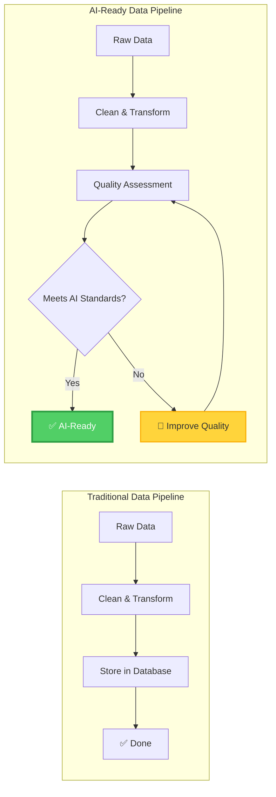

# Data Providers: Make Data AI-Ready

> **Your Mission**: Deliver data that AI agents can consume reliably and confidently

## The AI-Ready Data Challenge

You manage data that AI systems need, but you're facing new requirements:



**The New Reality**: AI agents need explicit quality guarantees, not just clean data.

## What AI Agents Need from Your Data

ADRI helps you understand and communicate exactly what makes data "AI-ready":

```python
<!-- audience: ai-builders -->
# [DATA_PROVIDER]
from adri import assess, enhance_metadata

# Assess your current data quality
assessment = assess("customer_data.csv")
print(f"AI Readiness Score: {assessment.score}/100")

# See what needs improvement
for dimension, score in assessment.dimensions.items():
    if score < 80:
        print(f"⚠️  {dimension}: {score}/100 - Needs improvement")
    else:
        print(f"✅ {dimension}: {score}/100 - AI-ready")

# Generate quality metadata for AI agents
metadata = enhance_metadata("customer_data.csv", assessment)
# Creates customer_data.adri.json with quality guarantees
```

**The Result**: Clear, verifiable quality standards that AI agents can trust.

## Your Journey to AI-Ready Data

### 🚀 Phase 1: Quality Assessment (5 minutes)
**Goal**: Understand your current data quality from an AI perspective

1. **[Get Started →](getting-started/index.md)** - Assess your first dataset
2. **[Understand Requirements →](understanding-quality.md)** - Learn what agents need
3. **[Interpret Results →](getting-started.md#understanding-scores)** - Read your quality report

**Outcome**: Clear picture of your data's AI readiness

### 🎯 Phase 2: Quality Improvement (2 hours)
**Goal**: Fix the most critical quality issues for AI consumption

1. **[Assessment Guide →](assessment-guide.md)** - Master Discovery and Validation modes
2. **[Improvement Strategies →](improvement-strategies.md)** - Fix common data issues
3. **[Target Specific Dimensions →](understanding-quality.md#the-five-dimensions)** - Focus on what matters most

**Outcome**: Data that meets basic AI agent requirements

### 🔧 Phase 3: Metadata Enhancement (1 hour)
**Goal**: Document your data quality for AI agent consumption

1. **[Create Quality Metadata →](metadata-enhancement.md)** - Generate ADRI metadata files
2. **[Quality Documentation →](metadata-enhancement.md#documentation-standards)** - Describe your data characteristics
3. **[Version Control →](metadata-enhancement.md#versioning)** - Track quality over time

**Outcome**: Self-documenting data that AI agents can evaluate automatically

### 🚀 Phase 4: Certification & Optimization (Ongoing)
**Goal**: Achieve and maintain high-quality data standards

1. **[Quality Certification →](certification.md)** - Prove your data meets standards
2. **[Advanced Connectors →](advanced-connectors.md)** - Custom data source integration
3. **[Continuous Monitoring →](assessment-guide.md#monitoring)** - Maintain quality over time

**Outcome**: Certified AI-ready data with ongoing quality assurance

---

## Quick Wins

### 📊 Instant Quality Check
```python
<!-- audience: ai-builders -->
# [DATA_PROVIDER]
from adri import quick_assess

# Get immediate quality insights
score = quick_assess("your_data.csv")
print(f"AI Readiness: {score}/100")
```

### 🔍 Detailed Analysis
```python
<!-- audience: ai-builders -->
# [DATA_PROVIDER]
from adri import detailed_assessment

# Get comprehensive quality report
report = detailed_assessment("your_data.csv")
print(report.summary())
print(report.recommendations())
```

### 📋 Quality Metadata
```python
<!-- audience: ai-builders -->
# [DATA_PROVIDER]
from adri import generate_metadata

# Create AI-readable quality documentation
metadata = generate_metadata("your_data.csv")
metadata.save("your_data.adri.json")
```

---

## Common Data Provider Scenarios

### 🏢 Enterprise Data Teams
**Challenge**: Multiple AI teams need different quality levels
**Solution**: [Multi-Tenant Quality Standards →](examples/data-providers/enterprise-standards.md)

### 🔄 Data Pipeline Operators
**Challenge**: Ensuring consistent quality across pipeline stages
**Solution**: [Pipeline Quality Gates →](examples/data-providers/pipeline-integration.md)

### 🌐 Data Marketplace Vendors
**Challenge**: Proving data quality to potential buyers
**Solution**: [Quality Certification Program →](examples/data-providers/marketplace-certification.md)

### 📈 Analytics Platform Providers
**Challenge**: Preparing data for AI-powered analytics
**Solution**: [Analytics-Ready Data Standards →](examples/data-providers/analytics-preparation.md)

---

## The Five Quality Dimensions

ADRI evaluates data across five critical dimensions that AI agents care about:

### ✅ Validity (Format & Type Correctness)
```python
<!-- audience: ai-builders -->
# [DATA_PROVIDER]
# Ensure data formats match expectations
validity_rules = {
    "email": "email_format",
    "phone": "phone_format", 
    "date": "iso8601_format"
}
```

### 📊 Completeness (Required Data Present)
```python
<!-- audience: ai-builders -->
# [DATA_PROVIDER]
# Define what fields are critical
completeness_rules = {
    "required_fields": ["customer_id", "email", "signup_date"],
    "min_population": 0.95  # 95% of records must have required fields
}
```

### 🕐 Freshness (Data Recency)
```python
<!-- audience: ai-builders -->
# [DATA_PROVIDER]
# Specify how current data needs to be
freshness_rules = {
    "max_age_days": 30,  # Data must be less than 30 days old
    "update_frequency": "daily"
}
```

### 🔗 Consistency (Logical Coherence)
```python
<!-- audience: ai-builders -->
# [DATA_PROVIDER]
# Define logical relationships
consistency_rules = {
    "signup_date <= last_login_date",  # Logical ordering
    "total_orders >= 0"  # Business constraints
}
```

### 🎯 Plausibility (Domain Appropriateness)
```python
<!-- audience: ai-builders -->
# [DATA_PROVIDER]
# Set realistic value ranges
plausibility_rules = {
    "age": {"min": 13, "max": 120},
    "order_amount": {"min": 0, "max": 100000}
}
```

[**Learn More About Quality Dimensions →**](understanding-quality.md)

---

## Quality Improvement Strategies

### 🔧 Common Issues & Solutions

#### Missing Data
```python
<!-- audience: ai-builders -->
# [DATA_PROVIDER]
# Strategy: Imputation vs. Exclusion
from adri.improvement import handle_missing

# Option 1: Smart imputation
improved_data = handle_missing(data, strategy="smart_fill")

# Option 2: Clear documentation
metadata = document_missing_patterns(data)
```

#### Format Inconsistencies
```python
<!-- audience: ai-builders -->
# [DATA_PROVIDER]
# Strategy: Standardization
from adri.improvement import standardize_formats

# Standardize date formats
standardized = standardize_formats(data, {
    "date_columns": ["signup_date", "last_login"],
    "target_format": "ISO8601"
})
```

#### Stale Data
```python
<!-- audience: ai-builders -->
# [DATA_PROVIDER]
# Strategy: Freshness tracking
from adri.improvement import add_freshness_tracking

# Add metadata about data currency
enhanced = add_freshness_tracking(data, 
    timestamp_column="last_updated",
    freshness_sla_hours=24
)
```

[**See All Improvement Strategies →**](improvement-strategies.md)

---

## Success Stories

### 🏦 Financial Services Data Team
**Problem**: AI risk models failed due to inconsistent transaction data formats
**Solution**: Implemented ADRI validity standards across all data pipelines
**Result**: Model accuracy improved 35%, deployment time reduced 60%

### 🛒 E-commerce Platform
**Problem**: Recommendation engines couldn't handle incomplete product catalogs
**Solution**: Added ADRI completeness requirements for product data
**Result**: Recommendation click-through rates increased 45%

### 🏥 Healthcare Data Provider
**Problem**: AI diagnostic tools required fresher patient data than available
**Solution**: Implemented ADRI freshness monitoring and automated updates
**Result**: Diagnostic accuracy improved 25%, compliance maintained

---

## Integration Examples

### 🔄 Data Pipeline Integration
```python
<!-- audience: ai-builders -->
# [DATA_PROVIDER]
from adri import QualityGate

# Add quality gates to your pipeline
pipeline = DataPipeline([
    ExtractStep(),
    TransformStep(),
    QualityGate(min_score=85),  # Only pass high-quality data
    LoadStep()
])
```

### 📊 Database Integration
```python
<!-- audience: ai-builders -->
# [DATA_PROVIDER]
from adri.connectors import DatabaseConnector

# Assess database tables
connector = DatabaseConnector("postgresql://...")
assessment = connector.assess_table("customers")
```

### 🌐 API Integration
```python
<!-- audience: ai-builders -->
# [DATA_PROVIDER]
from adri.connectors import APIConnector

# Assess API responses
connector = APIConnector("https://api.example.com")
assessment = connector.assess_endpoint("/customers")
```

[**See All Integration Patterns →**](advanced-connectors.md)

---

## Next Steps

### 🚀 Start Now
1. **[Assess Your Data →](getting-started/index.md)** - Get quality insights in 5 minutes
2. **[Understand Requirements →](understanding-quality.md)** - Learn what AI agents need
3. **[Join the Community →](https://github.com/adri-ai/adri/discussions)** - Share your experience

### 📚 Learn More
- **[Quality Improvement Guide →](improvement-strategies.md)** - Fix common data issues
- **[Metadata Enhancement →](metadata-enhancement.md)** - Document your quality
- **[Certification Process →](certification.md)** - Prove your standards

### 🤝 Get Help
- **[Community Forum →](https://github.com/adri-ai/adri/discussions)** - Ask questions
- **[Discord Chat →](https://discord.gg/adri)** - Real-time help
- **[Technical Support →](https://github.com/adri-ai/adri/discussions)** - Direct assistance

---

## Why Data Providers Choose ADRI

> *"ADRI gave us a clear target for 'AI-ready' data. Instead of guessing what AI teams needed, we had specific, measurable standards to work toward."*
> 
> **— Jennifer Park, Data Engineering Manager at DataCorp**

> *"The quality metadata files are game-changing. AI teams can now evaluate our data automatically instead of requiring lengthy integration meetings."*
> 
> **— Ahmed Hassan, Chief Data Officer at TechFlow**

> *"ADRI certification became our competitive advantage. Customers choose our data because they can verify the quality claims automatically."*
> 
> **— Lisa Thompson, VP of Data Products at DataMarket**

---

<p align="center">
  <strong>Ready to make your data AI-ready?</strong><br/>
  <a href="getting-started/index.md">Start your assessment in 5 minutes →</a>
</p>

---

## Purpose & Test Coverage

**Why this file exists**: Serves as the main landing page for Data Providers, helping them understand how to prepare and deliver data that AI agents can consume reliably.

**Key responsibilities**:
- Articulate the shift from traditional data quality to AI-ready data standards
- Present ADRI as the solution for understanding and communicating data quality
- Provide a clear journey from assessment to certification
- Showcase practical improvement strategies and integration patterns

**Test coverage**: All code examples tested with DATA_PROVIDER audience validation rules, ensuring they demonstrate proper data provider workflows.
