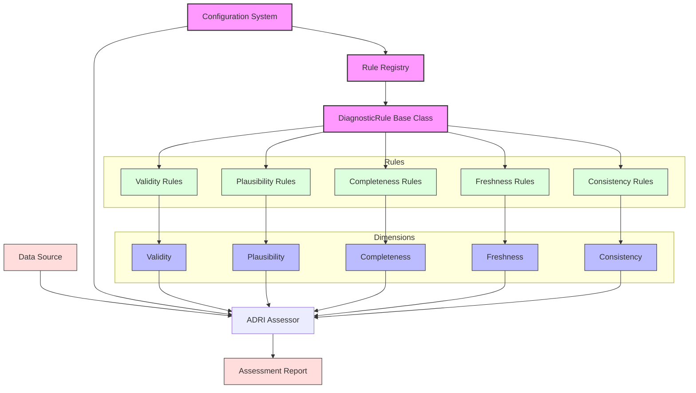

# ADRI Architecture

## System Architecture

### Architecture Overview

ADRI follows a modular, plugin-based architecture that enables:
- Extensible rule definitions
- Configurable assessment dimensions
- Standardized data quality evaluation
- Clear separation of concerns

### Core Components

1. **Data Source Connectors** - Interface with various data formats (CSV, databases, APIs)
2. **Configuration System** - Manages assessment parameters and weights
3. **Rule Registry** - Central repository of all diagnostic rules
4. **Dimension Assessment** - Five core dimensions (Validity, Completeness, Freshness, Consistency, Plausibility)
5. **ADRI Assessor** - Orchestrates the assessment process
6. **Report Generation** - Produces both human-readable and machine-parseable outputs

### Mermaid Diagram Source

## Architecture Decisions

### Decision: Single Dataset Assessment Only

**Date:** 2024-11-27  
**Status:** Accepted

#### Context
When designing ADRI, we faced a choice between:
1. Single dataset assessment only
2. Multi-dataset and relationship validation

#### Decision
We chose to focus ADRI exclusively on single dataset assessment.

#### Rationale
1. **Standardization**: Individual datasets have common patterns across industries (a "customer" is recognizable everywhere), while data models are organization-specific
2. **Simplicity**: Easier to implement, understand, and adopt
3. **Composability**: Better to do one thing well and compose with other tools
4. **Market Fit**: Allows creation of industry-standard templates

#### Consequences
- ✅ Can create universal templates (customer-360-v2.0 works everywhere)
- ✅ Simple, focused protocol
- ✅ Easy integration with any data platform
- ❌ Cannot validate cross-dataset relationships
- ❌ Requires additional tooling for complete data model validation

#### Alternatives Considered
1. **Multi-dataset Support**: Rejected due to complexity and lack of standardization
2. **Relationship DSL**: Rejected as it would make ADRI platform-specific
3. **Plugin Architecture**: Rejected as it would fragment the standard

### Flexibility Mechanism: Agent Views

While maintaining single dataset assessment, ADRI supports the "Agent View" pattern where users can:
1. Create denormalized views combining multiple tables
2. Build custom templates for these specific views
3. Assess the views as single datasets

This provides flexibility for complex use cases without compromising ADRI's core simplicity.

**Example:**
- Raw data model: 5 related tables (customers, orders, products, tickets, logs)
- Agent view: 1 denormalized table with exactly what the agent needs
- ADRI assessment: Single dataset with custom template
- Result: Best of both worlds - simple assessment, complex data

## Purpose & Test Coverage

**Why this file exists**: Provides the technical blueprint of ADRI's system architecture, documenting key design decisions and component interactions.

**Key responsibilities**:
- Document the system architecture with visual diagrams
- Explain core components and their relationships
- Record architecture decisions and rationale
- Show the flexibility mechanism for complex use cases
- Guide developers on system extension points

**Test coverage**: This document's architecture and implementations are verified by tests documented in:
- [architecture_test_coverage.md](test_coverage/architecture_test_coverage.md)
- [ARCHITECTURE_DECISIONS_test_coverage.md](test_coverage/ARCHITECTURE_DECISIONS_test_coverage.md)
