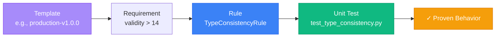

# Rule Testing Architecture in ADRI

## Overview

Yes, absolutely! ADRI has comprehensive unit tests for all rules. Here's how the testing architecture ensures rules work correctly:

## Testing Structure

```
tests/unit/rules/
├── test_validity_rules.py      # Tests for validity dimension rules
├── test_completeness_rules.py  # Tests for completeness dimension rules  
├── test_consistency_rules.py   # Tests for consistency dimension rules
├── test_freshness_rules.py     # Tests for freshness dimension rules
├── test_plausibility_rules.py  # Tests for plausibility dimension rules
└── test_expiration_rule.py     # Tests for specialized rules
```

## How Rules Are Tested

### 1. **Each Rule Has Multiple Test Scenarios**

For example, `TypeConsistencyRule` has tests for:
- Data with mixed types (should fail)
- Data with consistent types (should pass)
- Edge cases (all nulls, empty columns)
- Confidence scoring accuracy
- Narrative generation

### 2. **Test Pattern: Given-When-Then**

```python
<!-- audience: ai-builders -->
def test_evaluate_type_consistency(self):
    """Test evaluate method for type consistency check."""
    # GIVEN: Data with mixed types
    data = {
        'numeric_column': [1, 2, 3, 4, 5],           # ✓ Consistent
        'mixed_numeric': [1, 2, 3, '4', 5.0],       # ✗ Mixed types
        'date_column': ['2023-01-01', 'not-a-date'] # ✗ Inconsistent
    }
    df = pd.DataFrame(data)
    rule = TypeConsistencyRule({'threshold': 0.9})
    
    # WHEN: We evaluate the rule
    result = rule.evaluate(df)
    
    # THEN: We verify exact behavior
    self.assertFalse(result["valid"])  # Should fail
    self.assertGreater(result["inconsistent_columns"], 0)
    self.assertTrue(result["column_results"]['numeric_column']['consistent'])
```

### 3. **Testing Different Rule Types**

#### Validity Rules
- **TypeConsistencyRule**: Tests type inference, mixed types detection
- **RangeValidationRule**: Tests min/max bounds, outlier detection
- **FormatConsistencyRule**: Tests email/phone/date format validation

#### Completeness Rules
- **MissingValueRule**: Tests null detection, missing percentage calculation
- **RequiredFieldRule**: Tests presence of mandatory columns

#### Freshness Rules
- **DataAgeRule**: Tests timestamp validation, age calculations
- **UpdateFrequencyRule**: Tests update pattern detection

#### Consistency Rules
- **UniqueKeyRule**: Tests duplicate detection
- **ReferentialIntegrityRule**: Tests foreign key relationships

#### Plausibility Rules
- **OutlierDetectionRule**: Tests statistical outlier identification
- **BusinessLogicRule**: Tests custom business rule validation

## Test Coverage Examples

### Example 1: RangeValidationRule Tests
```python
<!-- audience: ai-builders -->
def test_evaluate_explicit_range(self):
    """Test with explicit min/max range."""
    data = {
        'positive_values': [1, 2, 3, 4, 5],      # All within 0-100 ✓
        'with_negatives': [10, -5, 8, -2, 15],   # Has negatives ✗
        'with_outliers': [100, 98, 102, 99, 500] # Has 500 outlier ✗
    }
    
    rule = RangeValidationRule({
        'min_value': 0,
        'max_value': 100,
        'inclusive': True
    })
    
    result = rule.evaluate(pd.DataFrame(data))
    
    # Verify exact violations
    self.assertEqual(result['column_results']['with_negatives']['violations'], 2)
    self.assertEqual(result['column_results']['with_outliers']['violations'], 2)
```

### Example 2: FormatConsistencyRule Tests
```python
<!-- audience: ai-builders -->
def test_evaluate_auto_detect_formats(self):
    """Test auto-detection of formats."""
    data = {
        'email': ['user@example.com', 'test@domain.org'],
        'phone': ['555-123-4567', '(555) 234-5678']
    }
    
    rule = FormatConsistencyRule({
        'auto_detect_formats': True,
        'minimum_confidence': 0.7
    })
    
    result = rule.evaluate(pd.DataFrame(data))
    
    # Verify formats were correctly detected
    self.assertEqual(result['column_results']['email']['expected_format'], 'email')
    self.assertEqual(result['column_results']['phone']['expected_format'], 'phone_us')
```

## Test Verification Points

Each rule test verifies:

### 1. **Correctness**
- Does the rule detect the issues it's supposed to?
- Are scores calculated correctly?
- Do edge cases work properly?

### 2. **Determinism**
- Given the same input, does it always produce the same output?
- Are thresholds and parameters respected exactly?

### 3. **Performance**
- Can it handle large datasets?
- Does it fail gracefully with bad input?

### 4. **Narrative Quality**
- Does it generate clear, actionable feedback?
- Are violation examples included?

## Running the Tests

```bash
# Run all rule tests
pytest tests/unit/rules/

# Run specific dimension tests
pytest tests/unit/rules/test_validity_rules.py

# Run with coverage report
pytest tests/unit/rules/ --cov=adri.rules --cov-report=html

# Run a specific test
pytest tests/unit/rules/test_validity_rules.py::TestTypeConsistencyRule::test_evaluate_type_consistency
```

## Test Data Patterns

Tests use carefully crafted data to verify behavior:

```python
<!-- audience: ai-builders -->
# Pattern 1: Known good data (should pass)
good_data = {
    'id': ['A001', 'A002', 'A003'],
    'amount': [100.0, 200.0, 300.0],
    'date': ['2024-01-01', '2024-01-02', '2024-01-03']
}

# Pattern 2: Known bad data (should fail in specific ways)
bad_data = {
    'id': ['A001', 'A002', None],        # Missing value
    'amount': [100.0, -50.0, 999999],    # Out of range
    'date': ['2024-01-01', 'bad-date']   # Format violation
}

# Pattern 3: Edge cases
edge_cases = {
    'empty_column': [None, None, None],  # All nulls
    'single_value': [42],                # Single row
    'huge_values': [1e100, 1e-100]       # Extreme numbers
}
```

## Why This Matters

### 1. **Reliability**
When a template says "validity score must be > 15", the TypeConsistencyRule that contributes to that score has been tested to ensure it calculates correctly.

### 2. **Predictability**
Tests prove that rules behave deterministically. A dataset that scores 85 today will score 85 tomorrow (unless the data changes).

### 3. **Trust**
When an agent uses `@adri_guarded` and data is rejected, you can trust that the rules correctly identified real issues, not false positives.

### 4. **Documentation**
Tests serve as living documentation of how rules work:
```python
<!-- audience: ai-builders -->
def test_evaluate_with_all_consistent_types(self):
    """Test evaluate method with data having consistent types."""
    # This test shows exactly what "consistent types" means
```

## Template → Rule → Test Chain



## Summary

Yes, every rule that templates rely on has comprehensive unit tests that:
- Verify correct behavior with multiple scenarios
- Test edge cases and error conditions
- Ensure deterministic results
- Validate scoring algorithms
- Check narrative generation

This testing architecture ensures that when a template specifies requirements, those requirements are enforced reliably and consistently by well-tested rules.
