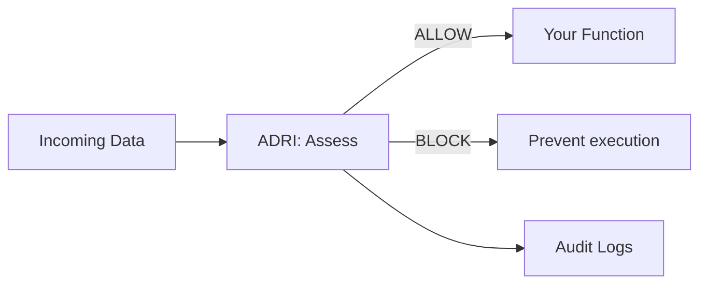

# ADRI Architecture Guide

Simple, clear explanations of how ADRI works and why each piece matters. This page is intended for maintainers and contributors; user-facing documentation lives under the Users section.

## ADRI in 30 Seconds

- The Problem: AI agents break when you feed them bad data.
- The Solution: One decorator that checks data quality before your function runs.
- The Result: Prevent failures and ship reliable agents faster.

```python
@adri_protected  # This line prevents most AI agent failures
def your_agent_function(data):
    return expensive_ai_call(data)  # Now protected from bad data
```

## How ADRI Works (The Flow)



### Five Dimensions

- Validity · Completeness · Consistency · Plausibility · Freshness

## Components Overview

### Guard Decorator (src/adri/decorator.py)
- Intercepts function calls and enforces on_failure: raise | warn | continue
- Visible, explicit configuration (standard, data_param, min_score, dimensions)

### Validator Engine (src/adri/validator/)
- Loads data, applies rules, returns AssessmentResult with dimension scores
- Multi-format loading (CSV/JSON/Parquet), detailed failure reporting

### Protection Modes (src/adri/guard/modes.py)
- FailFastMode, SelectiveMode, WarnOnlyMode orchestrated by DataProtectionEngine

### Standards System (src/adri/standards/)
- YAML rule loading via StandardsParser; schema.yaml drives structure

### Analysis (src/adri/analysis/)
- Profiling and generation of YAML standards from sample “good” datasets

### Configuration (src/adri/config/)
- Creates `ADRI/<env>` paths, loads overrides, sane defaults

### Logging (src/adri/logging/)
- Local CSV/JSON logs and Enterprise streaming (Verodat MCP)

### CLI (src/adri/cli.py)
- setup, generate-standard, assess, list/show/validate-standard, show-config, list-assessments

## Quality and Testing

We track multi-dimensional quality beyond line coverage:
- Line Coverage · Integration Tests · Error Handling · Performance

Quality gates for release ensure critical components are robust.

## Developer Notes

- Keep user-facing docs in Users section.
- Keep contributor docs in Contributors; link from README to this page.
- Prefer Mermaid diagrams for reviewable architecture visuals.
