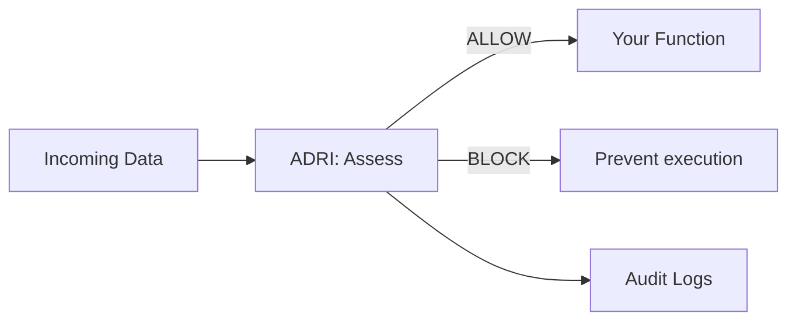

# ADRI Architecture Guide

Simple, clear explanations of how ADRI works and why each piece matters. This page is intended for maintainers and contributors; user-facing documentation lives under the Users section.

## ADRI in 30 Seconds

- The Problem: AI agents break when you feed them bad data.
- The Solution: One decorator that checks data quality before your function runs.
- The Result: Prevent failures and ship reliable agents faster.

```python
@adri_protected  # This line prevents most AI agent failures
def your_agent_function(data):
    return expensive_ai_call(data)  # Now protected from bad data
```

## How ADRI Works (The Flow)



### Five Dimensions

- Validity · Completeness · Consistency · Plausibility · Freshness

## Components Overview

### Guard Decorator (src/adri/decorator.py)
- Intercepts function calls and enforces on_failure: raise | warn | continue
- Visible, explicit configuration (standard, data_param, min_score, dimensions)

### Validator Engine (src/adri/validator/)
- Loads data, applies rules, returns AssessmentResult with dimension scores
- Multi-format loading (CSV/JSON/Parquet), detailed failure reporting
- **Pipeline Architecture**: ValidationPipeline coordinates dimension assessors

### Protection Modes (src/adri/guard/modes.py)
- FailFastMode, SelectiveMode, WarnOnlyMode orchestrated by DataProtectionEngine

### Standards System (src/adri/standards/)
- YAML rule loading via StandardsParser; schema.yaml drives structure

### Analysis (src/adri/analysis/)
- **Data Profiler**: Statistical analysis and profiling of datasets
- **Standard Generator**: Creates YAML standards from data analysis with modular architecture:
  - **Field Inference Engine** (field_inference.py): Field-level type and constraint inference
  - **Dimension Requirements Builder** (dimension_builder.py): Builds dimension scoring requirements
  - **Standard Builder** (standard_builder.py): Assembles complete ADRI standards
  - **Explanation Generator** (explanation_generator.py): Human-readable explanations
- **Rule Inference**: Advanced constraint inference with coverage strategies
- **Type Inference**: Smart data type detection with coercion handling

### Configuration (src/adri/config/)
- Creates `ADRI/<env>` paths, loads overrides, sane defaults

### Logging (src/adri/logging/)
- Local CSV/JSON logs and Enterprise streaming (Verodat MCP)

### CLI (src/adri/cli.py)
- setup, generate-standard, assess, list/show/validate-standard, show-config, list-assessments

## Quality and Testing

We implement comprehensive testing beyond basic line coverage:

### Testing Approach ✅ IMPLEMENTED
- **Unit Tests**: 21 comprehensive unit test files covering all major components
- **Integration Tests**: 4 integration test files validating component interactions
- **Performance Tests**: 2 benchmark suites for optimization and regression prevention
- **Functional Tests**: 62 total test files with end-to-end scenario validation
- **Quality Framework**: Centralized testing utilities and modern fixture patterns

### Multi-Dimensional Quality Metrics
- **Line Coverage**: Comprehensive test coverage across all modules
- **Integration Tests**: Cross-component interaction validation
- **Error Handling**: Edge case and failure path testing
- **Performance**: Benchmark baselines and regression testing

### Test Quality Validation ✅ COMPLETE
- **Helper-Level Stability Tests**: Added for refactored components (StandardGenerator, ValidationEngine)
- **No Test Redundancy**: Systematic analysis confirmed no duplicate coverage
- **Current Test Coverage**: All tests updated to match refactored code architecture
- **Edge Case Coverage**: Comprehensive error path and boundary condition testing
- **Integration Scenarios**: Cross-component interaction validation complete

Quality gates for release ensure critical components are robust and meet Business Critical classification requirements.

## Developer Notes

- Keep user-facing docs in Users section.
- Keep contributor docs in Contributors; link from README to this page.
- Prefer Mermaid diagrams for reviewable architecture visuals.
