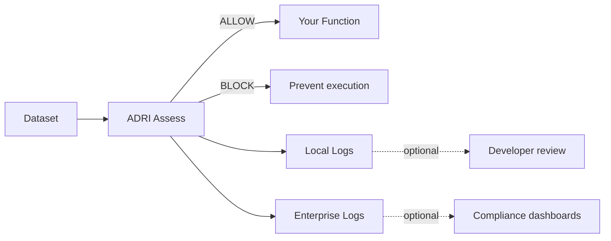

# ADRI Adoption Journey

**Take AI agents from local protection to governed enterprise data supply.** This guide connects the open-source toolkit to Verodat MCP so you know exactly when to switch on managed services.

## Overview

| Step | Outcome | Open-Source (`adri`) | Enterprise (`adri-enterprise`) | What to show | Notes |
|------|---------|----------|---------------------------|--------------|-------|
| 1 | Define data need | ✅ | ✅ | Run `adri setup --guide` and capture "good" data | Free - OSS |
| 2 | Block bad data | ✅ | ✅ | `@adri_protected(..., on_failure="raise")` blocks failures | Free - OSS |
| 3 | Handle error data | ✅ | ✅ | Review JSONL logs in `ADRI/dev/audit-logs` | Free - OSS |
| 4 | Log for dev (local) | ✅ | ✅ | 3 JSONL audit files (assessments, dimensions, failures) | Free - OSS |
| 5 | AI Reasoning Transparency | – | ✅ | Track AI prompts/responses with cryptographic verification | Enterprise only |
| 6 | Workflow Orchestration | – | ✅ | Multi-step workflow tracking and data provenance | Enterprise only |
| 7 | Advanced Verodat Integration | Basic | ✅ | Batch processing, retry logic, enterprise auth | Enterprise recommended |
| 8 | Centralized Analytics | – | ✅ | Organization-wide dashboards and quality trends | Enterprise + Verodat |
| 9 | Compliance & Governance | Basic | ✅ | Enterprise-grade audit trails with retention policies | Enterprise + Verodat |
| 10 | Marketplace Distribution | – | ✅ | Share standards and solutions with partners | Enterprise + Verodat |

> ✅* indicates the open-source edition makes it possible, but Verodat MCP reduces the effort to near-zero.

## Data flow and logging

## Stage 1 – Local Wins (Steps 1–4) - Open-Source

**Package:** `adri` (open-source, free forever)

1. **Create standards quickly** – `adri generate-standard` gives you a YAML contract in minutes. Store it in git with your agent code.
2. **Block bad inputs immediately** – Use `@adri_protected(standard="...", data_param="...", on_failure="raise")` in production pathways.
3. **Understand failures** – Inspect JSONL logs in `ADRI/dev/audit-logs` with 3 files: assessments, dimension scores, and validation failures.
4. **Capture local evidence** – Enable local audit logging for complete traceability during development and production.

👉 **Deliverable:** Reliable agents with local logging, developer trust, no platform commitment, 100% free.

## Stage 2 – AI Transparency & Workflow Orchestration (Steps 5–6) {#stage-2}

**Package:** `adri-enterprise` (private repository)

5. **AI Reasoning Transparency** – Track AI prompts and responses with cryptographic verification for debugging and compliance.

6. **Workflow Orchestration** – Monitor multi-step workflow performance, replay failed workflows, optimize costs.

👉 **Outcome:** Complete AI transparency, workflow debugging, production tuning capabilities.

[Learn more about enterprise features →](./enterprise)

## Stage 3 – Enterprise Integration & Scale (Steps 7–10)

**Package:** `adri-enterprise` + Verodat MCP
**Contact:** adri@verodat.com for Verodat workspace access

7. **Advanced Verodat Integration** – Configure batch processing, retry logic, and enterprise authentication for streaming assessments to governed Verodat workspaces.

8. **Centralized Analytics** – Use organization-wide dashboards to track quality trends, correlate failures with incidents, and optimize data quality metrics.

9. **Compliance & Governance** – Implement enterprise-grade audit trails with retention policies, RBAC, and replayable evidence for ISO/SOC/HIPAA compliance.

10. **Marketplace Distribution** – Package and distribute ADRI-backed standards and solutions through Verodat marketplace for partner consumption.

👉 **Outcome:** Production-grade data supply with centralized governance, compliance evidence, and revenue-aligned usage.

## Implementation Checklist

- [ ] Follow the [Getting Started guide](getting-started.md) to complete Steps 1–4.
- [ ] Enable local audit logging when stakeholders ask for evidence.
- [ ] Schedule a Verodat MCP onboarding session before promoting to production (Steps 5–7).
- [ ] Connect enterprise logging and Claude analysis before compliance reviews (Steps 8–9).
- [ ] Package your standards for marketplace distribution (Step 10).

## How to Talk About the Journey

| Persona | Why it matters | Message |
|---------|----------------|---------|
| Agent engineer | Needs confidence that agents won’t crash on bad data | “Guard your function with one decorator, see the pass/fail score instantly.” |
| Data platform team | Must provide governed data supply | “Publish ADRI standards to Verodat once, let every agent reuse them.” |
| Compliance lead | Requires replayable evidence | “Every assessment is logged locally and can be streamed into your controlled workspace.” |
| Business owner | Wants measurable reliability | “Scorecard every dataset before the agent runs; share dashboards via Verodat MCP.” |

## Ready to Scale?

- Stay in OSS while you iterate quickly and build proof with local auditing.
- When you need shared compliance logging or managed data supply, reach out at [thomas@verodat.com](mailto:thomas@verodat.com) to activate Steps 5–10.

Your first win should happen locally. The adoption journey shows stakeholders how to expand that win into an enterprise deployment without rewriting your agent workflows.
