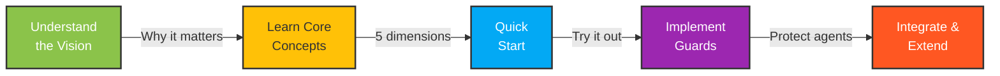

# Agent Data Readiness Index (ADRI)

**Making data reliable for AI agents**

## 🎯 First Time Here? Start with Our Vision

Before diving into code, we encourage you to understand **[why ADRI exists](./VISION.md)** and the problem we're solving. ADRI is more than a tool - it's a framework for ensuring AI agents can trust their data.

<div style="text-align: center; margin: 2em 0;">
  <a href="./VISION.md" style="display: inline-block; padding: 1em 2em; background-color: #8BC34A; color: white; text-decoration: none; border-radius: 4px; font-weight: bold;">
    📖 Read the Vision →
  </a>
</div>

---

## 🚀 Your Journey with ADRI



---

## What is ADRI?

The Agent Data Readiness Index (ADRI) helps AI Engineers ensure their agents have reliable data to work with. It provides a standardized framework for assessing, communicating, and enforcing data reliability standards specifically designed for AI agent workflows.

### The Problem We Solve

AI agents face unique challenges when working with data:

- **🙈 Agent Blindness**: Unlike humans, agents can't easily detect problems unless explicitly informed
- **🔄 Propagating Errors**: Bad data leads to cascading errors in automated workflows
- **❓ Unclear Standards**: There's no common language for "data quality" in agent applications
- **🗣️ Communication Gaps**: AI Engineers and data providers lack a shared framework

ADRI solves these problems with a standardized approach to data reliability.

## Quick Start

Once you understand the vision, getting started is easy:

```bash
pip install adri
```

```python
from adri import DataSourceAssessor

# Create an assessor
assessor = DataSourceAssessor()

# Assess your data source
report = assessor.assess_file("your_data.csv")

# View the results
print(f"Overall score: {report.overall_score}/100")
print(f"Readiness level: {report.readiness_level}")

# Save a visual report
report.save_html("data_readiness_report.html")
```

📚 **[Full Quick Start Guide →](./GET_STARTED.md)**

## Key Features

- **Multi-dimensional Assessment**: Evaluates five key aspects of data reliability
- **Quantitative Scoring**: Provides clear metrics for each dimension
- **Guard Mechanisms**: Protects agent workflows from unreliable data
- **Framework Integration**: Works with LangChain, CrewAI, DSPy, and more
- **Progressive Complexity**: Start simple, grow as your needs evolve

## Growing with ADRI

ADRI meets you where you are and grows with your needs:

### 🎯 **Start Simple**
Just assess your data quality - no complex setup required:
```python
assessor = DataSourceAssessor()
report = assessor.assess_file("data.csv")
```

### 🛡️ **Add Protection** 
Guard your agents against unreliable data:
```python
@adri_guarded(min_score=70)
def my_agent_function(data):
    # Your agent is now protected
```

### 📋 **Standardize** (Teams)
Use templates for consistent quality across teams:
```python
# Coming soon: Pre-built quality standards
assessor = DataSourceAssessor(template="production-v1.0.0")
```

### 🔗 **Decouple** (Enterprise)
Build source-agnostic workflows with ADRI contracts.
[Learn more →](./VISION.md#the-adri-contract-decoupling-data-sources-from-agent-workflows)

## Documentation

### Getting Started
- [Quick Start Guide](./GET_STARTED.md) - Get up and running in 5 minutes
- [Understanding ADRI's Vision](./VISION.md) - Learn about our goals and principles
- [Project Roadmap](./ROADMAP.md) - See our development plan and contribute

### Core Concepts
- [Understanding Dimensions](./UNDERSTANDING_DIMENSIONS.md) - Deep dive into the five dimensions of reliability
- [Implementing Guards](./IMPLEMENTING_GUARDS.md) - Protect your agent workflows
- [Enhancing Data Sources](./ENHANCING_DATA_SOURCES.md) - Improve your data with explicit metadata

### Dimension Details
- [Validity Dimension](./ValidityDimension.md) - Ensuring data formats and ranges
- [Completeness Dimension](./CompletenessDimension.md) - Managing missing data
- [Freshness Dimension](./FreshnessDimension.md) - Handling data recency
- [Consistency Dimension](./consistency_rules.md) - Maintaining logical coherence
- [Plausibility Dimension](./PlausibilityDimension.md) - Detecting unreasonable values

### Advanced Topics
- [Framework Integrations](./INTEGRATIONS.md) - Using ADRI with popular agent frameworks
- [Extending ADRI](./EXTENDING.md) - Creating custom dimensions and connectors
- [API Reference](./API_REFERENCE.md) - Complete API documentation

## The Five Dimensions of Data Reliability

ADRI evaluates data across five key dimensions:

| Dimension | Key Question | Why It Matters |
|-----------|-------------|----------------|
| **Validity** | Is the data correctly formatted? | Prevents parsing errors and misinterpretation |
| **Completeness** | Is all required data present? | Avoids missing information for decisions |
| **Freshness** | Is the data sufficiently recent? | Ensures decisions aren't based on outdated information |
| **Consistency** | Is the data logically coherent? | Prevents confusing contradictions |
| **Plausibility** | Are values reasonable in context? | Catches technically valid but nonsensical data |

## Getting Help

- [FAQ](./FAQ.md) - Common questions and answers
- [GitHub Issues](https://github.com/ThinkEvolveSolve/agent-data-readiness-index/issues) - Report bugs or request features
- [Contributing Guide](./CONTRIBUTING.md) - Join the community and contribute
- [Documentation Style Guide](./STYLE_GUIDE.md) - Writing consistent documentation

## License

ADRI is available under the [MIT License](../LICENSE).

<!-- Last updated: 2025-05-23 -->
