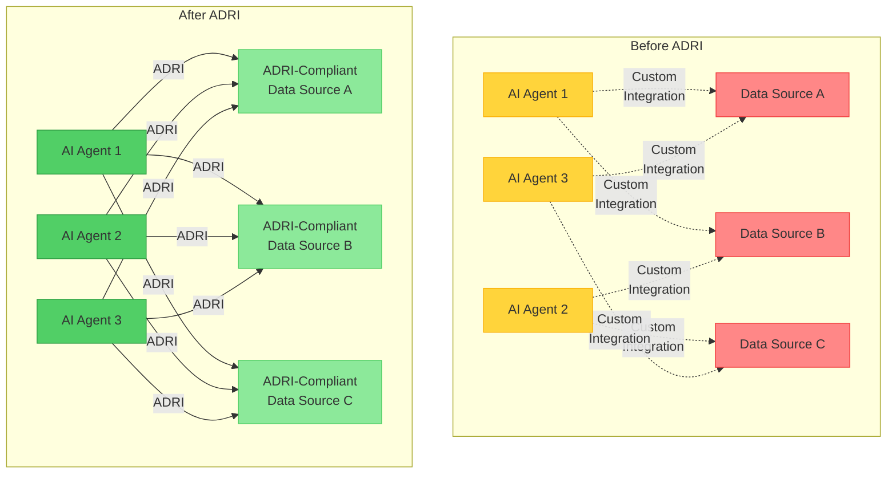

# ADRI Documentation

> **Agent Data Readiness Index**: The universal standard for AI agent data interoperability

## Choose Your Journey

ADRI serves three distinct audiences, each with specific needs and workflows. Select your path to get started quickly:

### 🤖 AI Builders
**"Protect Your Agents"**

You're building AI applications and agents that need reliable, consistent data to function correctly.

**Your challenges:**
- Agents crash on bad data
- Inconsistent data quality across sources
- No clear standards for "agent-ready" data
- Time-consuming debugging of data issues

**Your solution path:**
- [Get Started: 5-Minute Agent Protection →](ai-builders/getting-started.md)
- [Understand Quality Requirements →](ai-builders/understanding-requirements.md)
- [Implement Guard Mechanisms →](ai-builders/implementing-guards.md)
- [Framework Integration Guides →](ai-builders/framework-integration.md)

[**Start Your AI Builder Journey →**](ai-builders/index.md)

---

### 📊 Data Providers
**"Make Data AI-Ready"**

You manage, prepare, and deliver data that AI systems need to consume reliably.

**Your challenges:**
- Unclear what "AI-ready" means
- No standard way to communicate data quality
- Agents won't work with your data
- Difficulty proving data reliability

**Your solution path:**
- [Get Started: 5-Minute Data Assessment →](data-providers/getting-started.md)
- [Understand Agent Requirements →](data-providers/understanding-quality.md)
- [Assess Your Data Quality →](data-providers/assessment-guide.md)
- [Improve Data Standards →](data-providers/improvement-strategies.md)

[**Start Your Data Provider Journey →**](data-providers/index.md)

---

### 🛠️ Standard Contributors
**"Extend ADRI"**

You want to improve the ADRI standard itself, contributing rules, templates, or enhancements.

**Your challenges:**
- Understanding ADRI's architecture
- Contributing new validation logic
- Building industry-specific templates
- Following contribution workflows

**Your solution path:**
- [Get Started: 5-Minute Contribution Setup →](standard-contributors/getting-started.md)
- [Understand ADRI Architecture →](standard-contributors/architecture-overview.md)
- [Extend Rules and Logic →](standard-contributors/extending-rules.md)
- [Create Templates →](standard-contributors/creating-templates.md)

[**Start Your Contributor Journey →**](standard-contributors/index.md)

---

## Quick Access

### 🚀 Get Started Immediately
- **New to ADRI?** → [5-Minute Quickstart](ai-builders/getting-started.md)
- **Need examples?** → [See ADRI in Action](examples/index.md)
- **Want to try it?** → [Interactive Demo](https://demo.adri-standard.org)

### 📚 Reference Materials
- **API Documentation** → [Technical Reference](reference/api/index.md)
- **Dimension Specifications** → [Quality Dimensions](reference/dimensions/index.md)
- **Template Library** → [Available Templates](reference/templates/index.md)
- **Frequently Asked Questions** → [FAQ](frequently-asked-questions.md)
- **Project Governance** → [Vision & Roadmap](reference/governance/index.md)

### 🌟 Popular Resources
- [Understanding Data Quality Dimensions](reference/dimensions/index.md)
- [Framework Integration Examples](ai-builders/index.md)
- [Industry-Specific Templates](by-industry/index.md)
- [Community Discussions](https://github.com/adri-ai/adri/discussions)

---

## What is ADRI?

ADRI (Agent Data Readiness Index) is an **open standard** that creates a common language between data suppliers and AI agents, enabling:

### 🔄 Universal Interoperability
- Any ADRI-compliant data works with any ADRI-aware agent
- No more custom integrations for each data source
- Standardized quality communication

### 📊 Quantified Quality
- 0-100 scores across five quality dimensions
- Clear thresholds for agent requirements
- Verifiable quality claims

### 🛡️ Reliable Operations
- Guard mechanisms prevent agent failures
- Quality gates ensure data meets requirements
- Predictable agent behavior

### 🌐 Ecosystem Growth
- Shared templates and standards
- Quality-based data marketplace
- Innovation acceleration

---

## The Problem ADRI Solves

**The Result**: From 50% agent reliability to 99% reliability through standardized data quality communication.

---

## Community & Support

### 🤝 Get Involved
- **GitHub**: [adri-standard/agent-data-readiness-index](https://github.com/adri-ai/adri)
- **Discussions**: [Community Forum](https://github.com/adri-ai/adri/discussions)
- **Discord**: [Join the conversation](https://discord.gg/adri)
- **Twitter**: [@adri_standard](https://github.com/adri-ai/adri/discussions)

### 📧 Contact
- **General Questions**: hello@adri.dev
- **Technical Support**: support@adri.dev
- **Governance**: governance@adri.dev
- **Security**: security@adri.dev

---

  <strong>Ready to make your AI agents work everywhere, with any data?</strong> 
  <a href="ai-builders/getting-started.md">Start your journey →</a>

---

## Purpose & Test Coverage

**Why this file exists**: Serves as the main entry point for all ADRI documentation, providing audience-based navigation to help users quickly find content relevant to their role and needs.

**Key responsibilities**:
- Present clear audience selection with distinct value propositions
- Provide quick access to getting started guides for each audience
- Explain ADRI's core value proposition and problem-solving approach
- Offer easy navigation to reference materials and community resources

**Test coverage**: All links and code examples tested according to audience-specific validation rules documented in the testing framework.
