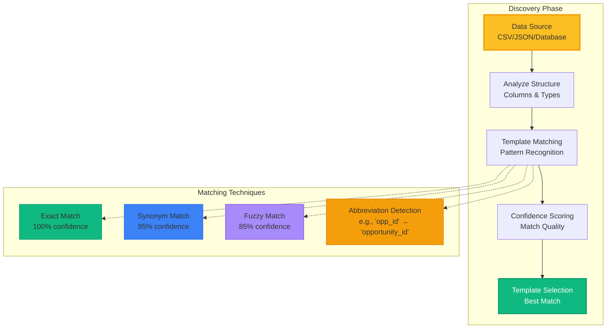
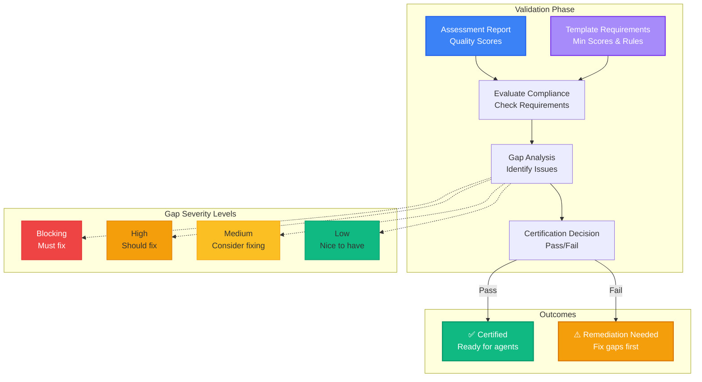
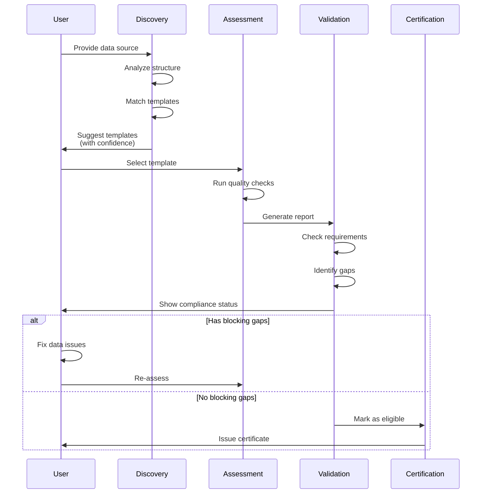

# Discovery and Validation in ADRI

## Overview

ADRI provides sophisticated discovery and validation capabilities that help organizations automatically identify appropriate data quality standards and validate compliance. This document explains how these processes work together to create a seamless workflow from raw data to certified, agent-ready datasets.

## The Discovery Process

Discovery helps you automatically find the right template for your data by analyzing its structure, content, and patterns.

### How Discovery Works



### Discovery Example

```python
<!-- audience: ai-builders -->
from adri.templates.matcher import TemplateMatcher
from adri.templates.registry import TemplateRegistry
import pandas as pd

# Your data with abbreviated column names
df = pd.DataFrame({
    'opp_id': ['OPP-001', 'OPP-002'],
    'deal_value': [50000, 75000],
    'phase': ['qualified', 'proposal'],
    'close_dt': ['2025-03-15', '2025-04-01']
})

# Initialize discovery
matcher = TemplateMatcher()
registry = TemplateRegistry()

# Find matching templates
results = matcher.find_matching_templates(df, registry.list_all(), top_n=3)

# Review matches
for result in results:
    print(f"Template: {result.template_id}")
    print(f"Confidence: {result.confidence:.1%}")
    print(f"Column Mappings:")
    for template_col, data_col in result.column_match.matched_columns.items():
        print(f"  {template_col} → {data_col}")
```

### Column Matching Intelligence

The discovery system uses multiple techniques to match your data columns to template requirements:

1. **Exact Matching**: Direct name matches (case-insensitive)
2. **Synonym Recognition**: Common alternatives (e.g., 'amount' ↔ 'value')
3. **Fuzzy Matching**: Similar names (e.g., 'customer' ↔ 'custmer')
4. **Abbreviation Detection**: Common short forms (e.g., 'dt' → 'date')

## The Validation Process

Validation evaluates your data against template requirements to identify gaps and determine certification eligibility.

### How Validation Works



### Validation Example

```python
<!-- audience: ai-builders -->
from adri import DataSourceAssessor
from adri.templates.loader import TemplateLoader

# Load a template
template = TemplateLoader().load("financial/basel-iii-v1.0.0")

# Assess with template validation
assessor = DataSourceAssessor()
report, evaluation = assessor.assess_file_with_template(
    "transaction_data.csv",
    template
)

# Check validation results
if evaluation.compliant:
    print(f"✅ Data is compliant with {template.name}")
else:
    print(f"❌ {len(evaluation.gaps)} gaps found:")
    
    # Review gaps by severity
    for gap in evaluation.gaps:
        icon = {
            'blocking': '🚫',
            'high': '⚠️',
            'medium': '⚡',
            'low': '💡'
        }[gap.gap_severity]
        
        print(f"{icon} {gap.requirement_description}")
        print(f"   Expected: {gap.expected_value}")
        print(f"   Actual: {gap.actual_value}")
        if gap.remediation_hint:
            print(f"   Fix: {gap.remediation_hint}")
```

## Complete End-to-End Flow

The full journey from raw data to certified dataset:



## Template Requirements

Templates define the quality standards your data must meet. Here's how they specify requirements:

### Template Structure

```yaml
# financial/transaction-processor-v1.0.0.yaml
template:
  id: "transaction-processor-v1.0.0"
  name: "Transaction Processor Requirements"
  version: "1.0.0"
  
requirements:
  # Overall quality threshold
  overall_score: 75
  
  # Dimension-specific requirements
  dimensions:
    validity:
      min_score: 16
      description: "Transaction formats must be well-defined"
    completeness:
      min_score: 14
      description: "Critical fields cannot be missing"
    freshness:
      min_score: 15
      description: "Transactions must be recent"
    consistency:
      min_score: 14
      description: "Amounts must balance"
    plausibility:
      min_score: 12
      description: "Values must be reasonable"
  
  # Custom validation rules
  custom_rules:
    - id: "TRANS-001"
      description: "Transaction amount must be positive"
      severity: "blocking"
      condition: "amount > 0"
    
    - id: "TRANS-002"
      description: "Transaction date cannot be future"
      severity: "high"
      condition: "transaction_date <= today()"

# Column matching hints for discovery
pattern_matching:
  required_columns:
    - transaction_id
    - amount
    - transaction_date
    - account_number
  
  column_synonyms:
    amount: ["value", "transaction_amount", "amt"]
    transaction_date: ["date", "trans_date", "dt"]
```

### Requirement Types

1. **Score Requirements**
   - Overall minimum score
   - Per-dimension minimum scores
   - Both must be satisfied

2. **Rule Requirements**
   - Custom validation logic
   - Business-specific checks
   - Can be blocking or advisory

3. **Field Requirements**
   - Required columns
   - Optional columns
   - Expected formats

### Gap Severity Levels

- **Blocking**: Must be fixed before certification
- **High**: Should be fixed for production use
- **Medium**: Recommended improvements
- **Low**: Nice-to-have enhancements

## Practical Workflows

### Workflow 1: New Data Source Onboarding

```python
<!-- audience: ai-builders -->
# Step 1: Discover appropriate template
from adri.templates.matcher import TemplateMatcher
import pandas as pd

df = pd.read_csv("new_customer_data.csv")
matcher = TemplateMatcher()

# Find best matches from registry
matches = matcher.find_matching_templates(df, templates, top_n=3)
best_match = matches[0]

print(f"Recommended: {best_match.template_id} ({best_match.confidence:.0%} match)")

# Step 2: Assess with discovered template
from adri import DataSourceAssessor

assessor = DataSourceAssessor()
report, evaluation = assessor.assess_file_with_template(
    "new_customer_data.csv",
    best_match.template_id
)

# Step 3: Address gaps
if not evaluation.compliant:
    remediation_plan = evaluation.get_remediation_plan()
    for action in remediation_plan[:5]:  # Top 5 priorities
        print(f"Priority {action['priority']}: {action['requirement']}")
        print(f"  Current: {action['current_state']}")
        print(f"  Target: {action['target_state']}")
        print(f"  Action: {action['remediation']}")
```

### Workflow 2: Continuous Validation in CI/CD

```python
<!-- audience: ai-builders -->
# In your CI/CD pipeline
def validate_data_quality(data_file, template_id, min_score=70):
    """Validate data meets quality standards before deployment."""
    assessor = DataSourceAssessor()
    
    # Run assessment
    report, evaluation = assessor.assess_file_with_template(
        data_file,
        template_id
    )
    
    # Check compliance
    if not evaluation.compliant:
        print(f"❌ Data quality check failed!")
        print(f"   Compliance: {evaluation.compliance_score:.1f}%")
        
        # Show blocking issues
        blocking = [g for g in evaluation.gaps if g.gap_severity == 'blocking']
        if blocking:
            print(f"\n🚫 {len(blocking)} blocking issues:")
            for gap in blocking:
                print(f"   - {gap.requirement_description}")
        
        sys.exit(1)  # Fail the build
    
    print(f"✅ Data quality check passed!")
    print(f"   Score: {report.overall_score}/100")
    return True
```

### Workflow 3: Data Provider Certification

```python
<!-- audience: ai-builders -->
# Data provider prepares certified dataset
from adri import DataSourceAssessor

def certify_dataset(data_file, template_id, output_dir):
    """Certify a dataset meets quality standards."""
    assessor = DataSourceAssessor()
    
    # Assess against template
    report, evaluation = assessor.assess_file_with_template(
        data_file,
        template_id
    )
    
    if evaluation.certification_eligible:
        # Save certification
        report.save_json(f"{output_dir}/{data_file}.report.json")
        
        # Create certificate
        certificate = {
            'dataset': data_file,
            'template': template_id,
            'score': report.overall_score,
            'certified_at': datetime.now().isoformat(),
            'expires_at': (datetime.now() + timedelta(days=30)).isoformat(),
            'gaps': len(evaluation.gaps),
            'compliance': evaluation.compliance_score
        }
        
        with open(f"{output_dir}/{data_file}.certificate.json", 'w') as f:
            json.dump(certificate, f, indent=2)
        
        print(f"✅ Dataset certified!")
        return True
    else:
        print(f"❌ Dataset not eligible for certification")
        print(f"   Fix {len(evaluation.certification_blockers)} blocking issues first")
        return False
```

## Best Practices

### For Discovery

1. **Start with Auto-Discovery**: Let ADRI suggest templates based on your data
2. **Review Low-Confidence Matches**: Matches below 70% may need manual verification
3. **Customize Templates**: Use discovered templates as starting points, then customize
4. **Document Mappings**: Save column mappings for future reference

### For Validation

1. **Fix Blocking Issues First**: These prevent certification
2. **Batch Similar Fixes**: Group similar gaps for efficient remediation
3. **Automate Validation**: Include in CI/CD pipelines
4. **Track Progress**: Monitor compliance scores over time

### For Templates

1. **Start Simple**: Begin with basic requirements, add complexity gradually
2. **Use Severity Wisely**: Reserve "blocking" for true show-stoppers
3. **Provide Remediation Hints**: Help users fix issues quickly
4. **Version Templates**: Track changes and maintain compatibility

## Troubleshooting

### Low Discovery Confidence

If discovery confidence is low:

```python
<!-- audience: ai-builders -->
# Check why columns didn't match
for missing in result.column_match.missing_columns:
    print(f"Missing: {missing}")
    # Look for similar columns in your data
    similar = [col for col in df.columns 
               if missing.lower() in col.lower()]
    if similar:
        print(f"  Possible matches: {similar}")

# Add custom synonyms
custom_synonyms = {
    'customer_id': ['cust_id', 'client_id', 'account_id'],
    'amount': ['value', 'price', 'total']
}
```

### Validation Failures

When validation fails:

```python
<!-- audience: ai-builders -->
# Group gaps by severity
from collections import defaultdict
gaps_by_severity = defaultdict(list)
for gap in evaluation.gaps:
    gaps_by_severity[gap.gap_severity].append(gap)

# Focus on blockers
if gaps_by_severity['blocking']:
    print("Must fix these blocking issues:")
    for gap in gaps_by_severity['blocking']:
        print(f"- {gap.requirement_description}")
        print(f"  Hint: {gap.remediation_hint}")
```

## Next Steps

- Learn about [Creating Custom Templates](../development/extending.md#creating-custom-templates)
- Explore [Template Catalog](../../adri/templates/catalog/)
- See [Integration Examples](./examples/08_template_compliance.py)
- Read about [Implementing Guards](IMPLEMENTING_GUARDS.md) for automated protection

## Summary

ADRI's discovery and validation capabilities work together to:

1. **Automatically identify** the right quality standards for your data
2. **Evaluate compliance** against those standards
3. **Guide remediation** with clear, prioritized actions
4. **Enable certification** for agent-ready data

This creates a smooth path from raw data to certified, reliable datasets that agents can trust.
