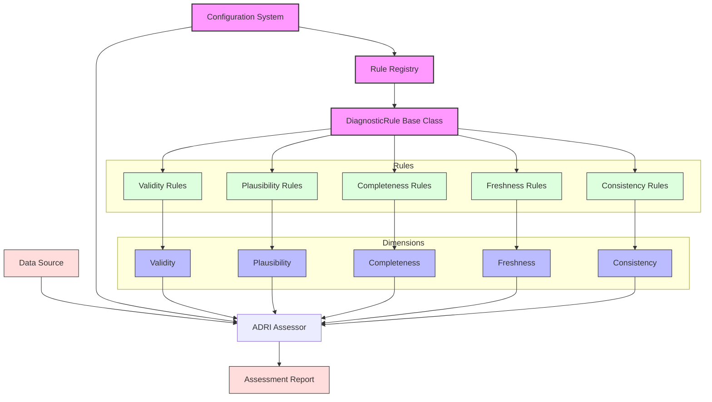
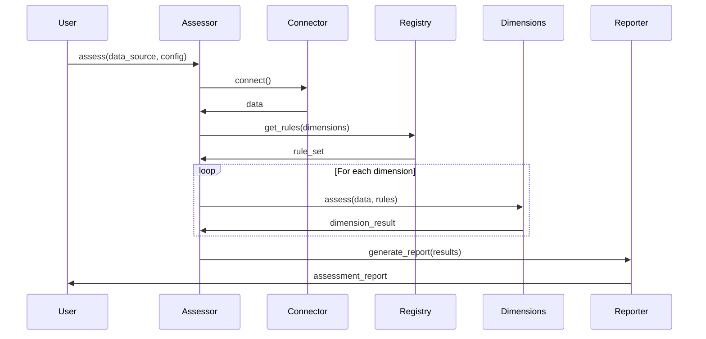
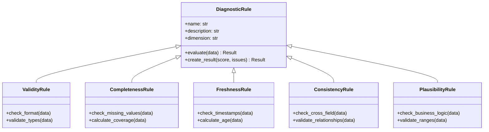
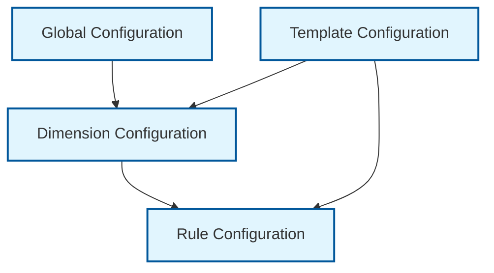

# ADRI Architecture Overview

> **Standard Contributors**: Understanding ADRI's internal architecture for extending and improving the standard

## Overview

ADRI follows a modular, plugin-based architecture designed for extensibility and standardization. This guide helps you understand how ADRI works internally so you can contribute rules, dimensions, connectors, and other enhancements effectively.

## Quick Navigation

### 🏗️ **Core Architecture**
- [System Components](#system-components) - How ADRI is structured
- [Data Flow](#data-flow) - How assessments work
- [Extension Points](#extension-points) - Where you can add functionality

### 🔧 **Implementation Details**
- [Rule System](#rule-system) - How validation rules work
- [Dimension Framework](#dimension-framework) - Quality assessment structure
- [Configuration System](#configuration-system) - How settings are managed

### 📋 **Design Decisions**
- [Architecture Decisions](#architecture-decisions) - Key design choices and rationale
- [Extension Patterns](#extension-patterns) - Best practices for contributions

---

## System Components

### High-Level Architecture



### Core Components

#### 1. **Data Source Connectors**
**Purpose**: Interface with various data formats and sources

**Key Classes**:
- `BaseConnector`: Abstract base for all connectors
- `FileConnector`: CSV, JSON, Excel files
- `DatabaseConnector`: SQL databases
- `APIConnector`: REST APIs and web services

**Extension Point**: Add new connector types for different data sources

```python
<!-- audience: ai-builders -->
# [STANDARD_CONTRIBUTOR]
from adri.connectors.base import BaseConnector

class CustomConnector(BaseConnector):
    def connect(self):
        # Your connection logic
        pass
    
    def get_data(self):
        # Your data retrieval logic
        pass
```

#### 2. **Configuration System**
**Purpose**: Manages assessment parameters, weights, and templates

**Key Classes**:
- `Config`: Main configuration management
- `DimensionConfig`: Dimension-specific settings
- `TemplateLoader`: Load and validate templates

**Extension Point**: Add new configuration options and template formats

```python
<!-- audience: ai-builders -->
# [STANDARD_CONTRIBUTOR]
from adri.config import Config

# Extend configuration with custom settings
config = Config()
config.add_custom_dimension_weight("my_dimension", 0.15)
```

#### 3. **Rule Registry**
**Purpose**: Central repository of all diagnostic rules

**Key Classes**:
- `RuleRegistry`: Manages rule discovery and loading
- `RuleMetadata`: Rule documentation and categorization
- `RuleValidator`: Ensures rule compliance

**Extension Point**: Register new rules and rule categories

```python
<!-- audience: ai-builders -->
# [STANDARD_CONTRIBUTOR]
from adri.rules.registry import RuleRegistry
from adri.rules.base import DiagnosticRule

@RuleRegistry.register("validity", "custom_format_check")
class CustomFormatRule(DiagnosticRule):
    def evaluate(self, data):
        # Your validation logic
        pass
```

#### 4. **Dimension Assessment Framework**
**Purpose**: Implements the five core quality dimensions

**Key Classes**:
- `BaseDimension`: Abstract base for all dimensions
- `ValidityDimension`: Data type and format validation
- `CompletenessDimension`: Missing data assessment
- `FreshnessDimension`: Data currency evaluation
- `ConsistencyDimension`: Internal coherence checking
- `PlausibilityDimension`: Real-world reasonableness

**Extension Point**: Add new dimensions or enhance existing ones

```python
<!-- audience: ai-builders -->
# [STANDARD_CONTRIBUTOR]
from adri.dimensions.base import BaseDimension

class CustomDimension(BaseDimension):
    name = "custom_quality"
    max_score = 20
    
    def assess(self, data, config):
        # Your assessment logic
        return self.create_result(score, issues)
```

#### 5. **ADRI Assessor**
**Purpose**: Orchestrates the complete assessment process

**Key Classes**:
- `DataSourceAssessor`: Main assessment coordinator
- `AssessmentResult`: Structured assessment output
- `IssueTracker`: Collects and categorizes quality issues

**Extension Point**: Add new assessment modes and result formats

#### 6. **Report Generation**
**Purpose**: Produces human-readable and machine-parseable outputs

**Key Classes**:
- `ReportGenerator`: Creates assessment reports
- `HTMLReporter`: Web-friendly reports
- `JSONReporter`: Machine-readable output
- `MarkdownReporter`: Documentation-friendly format

**Extension Point**: Add new report formats and visualization options

---

## Data Flow

### Assessment Process



### Key Processing Steps

1. **Data Connection**: Connector establishes connection to data source
2. **Rule Loading**: Registry provides applicable rules for assessment
3. **Dimension Assessment**: Each dimension evaluates data quality
4. **Score Calculation**: Individual scores combined into overall ADRI score
5. **Issue Collection**: Quality issues identified and categorized
6. **Report Generation**: Results formatted for consumption

---

## Extension Points

### 1. **Adding New Rules**

Rules are the core logic for quality assessment. Add rules to extend ADRI's capabilities:

```python
<!-- audience: ai-builders -->
# [STANDARD_CONTRIBUTOR]
from adri.rules.base import DiagnosticRule
from adri.rules.registry import RuleRegistry

@RuleRegistry.register("validity", "email_format")
class EmailFormatRule(DiagnosticRule):
    """Validates email address formats"""
    
    def evaluate(self, data):
        issues = []
        for idx, email in enumerate(data['email']):
            if not self._is_valid_email(email):
                issues.append({
                    'row': idx,
                    'field': 'email',
                    'issue': 'Invalid email format',
                    'value': email
                })
        
        return self.create_result(
            score=self._calculate_score(issues, len(data)),
            issues=issues
        )
    
    def _is_valid_email(self, email):
        # Your validation logic
        import re
        pattern = r'^[a-zA-Z0-9._%+-]+@[a-zA-Z0-9.-]+\.[a-zA-Z]{2,}$'
        return re.match(pattern, email) is not None
```

### 2. **Creating New Dimensions**

Dimensions represent different aspects of data quality:

```python
<!-- audience: ai-builders -->
# [STANDARD_CONTRIBUTOR]
from adri.dimensions.base import BaseDimension

class SecurityDimension(BaseDimension):
    """Assesses data security and privacy compliance"""
    
    name = "security"
    max_score = 20
    description = "Evaluates data security and privacy compliance"
    
    def assess(self, data, config):
        security_rules = self.get_rules("security")
        total_score = 0
        all_issues = []
        
        for rule in security_rules:
            result = rule.evaluate(data)
            total_score += result.score
            all_issues.extend(result.issues)
        
        return self.create_result(
            score=min(total_score, self.max_score),
            issues=all_issues,
            metadata={
                'rules_evaluated': len(security_rules),
                'compliance_level': self._determine_compliance(total_score)
            }
        )
```

### 3. **Building New Connectors**

Connectors enable ADRI to work with different data sources:

```python
<!-- audience: ai-builders -->
# [STANDARD_CONTRIBUTOR]
from adri.connectors.base import BaseConnector

class MongoDBConnector(BaseConnector):
    """Connector for MongoDB collections"""
    
    def __init__(self, connection_string, database, collection):
        self.connection_string = connection_string
        self.database = database
        self.collection = collection
        self.client = None
    
    def connect(self):
        import pymongo
        self.client = pymongo.MongoClient(self.connection_string)
        return self.client[self.database][self.collection]
    
    def get_data(self):
        collection = self.connect()
        return list(collection.find())
    
    def get_metadata(self):
        collection = self.connect()
        return {
            'document_count': collection.count_documents({}),
            'indexes': list(collection.list_indexes()),
            'schema_sample': self._infer_schema()
        }
```

### 4. **Custom Templates**

Templates define industry-specific quality requirements:

```yaml
# [STANDARD_CONTRIBUTOR]
# healthcare-patient-v1.yaml
name: "Healthcare Patient Data v1.0"
description: "Quality requirements for patient data in healthcare systems"
version: "1.0.0"
industry: "healthcare"

dimensions:
  validity:
    weight: 0.25
    rules:
      - rule: "patient_id_format"
        weight: 0.30
        config:
          pattern: "^P[0-9]{8}$"
      - rule: "date_of_birth_format"
        weight: 0.25
        config:
          format: "YYYY-MM-DD"
      - rule: "medical_record_number"
        weight: 0.25
        config:
          pattern: "^MRN[0-9]{10}$"
  
  completeness:
    weight: 0.30
    required_fields:
      - patient_id
      - first_name
      - last_name
      - date_of_birth
      - medical_record_number
    
  freshness:
    weight: 0.15
    max_age_days: 30
    
  consistency:
    weight: 0.15
    rules:
      - rule: "age_dob_consistency"
        description: "Age must match date of birth"
  
  plausibility:
    weight: 0.15
    rules:
      - rule: "reasonable_age"
        config:
          min_age: 0
          max_age: 150
```

---

## Rule System

### Rule Hierarchy



### Rule Implementation Pattern

```python
<!-- audience: ai-builders -->
# [STANDARD_CONTRIBUTOR]
from adri.rules.base import DiagnosticRule

class ExampleRule(DiagnosticRule):
    """Template for implementing new rules"""
    
    # Required metadata
    name = "example_rule"
    description = "Example rule implementation"
    dimension = "validity"  # or completeness, freshness, consistency, plausibility
    
    def __init__(self, config=None):
        super().__init__(config)
        # Initialize rule-specific configuration
        self.threshold = config.get('threshold', 0.95) if config else 0.95
    
    def evaluate(self, data):
        """Main evaluation logic"""
        issues = []
        
        # Your assessment logic here
        for idx, row in data.iterrows():
            if not self._meets_criteria(row):
                issues.append({
                    'row': idx,
                    'field': 'field_name',
                    'issue': 'Description of the issue',
                    'value': row['field_name'],
                    'severity': 'high'  # high, medium, low
                })
        
        # Calculate score based on issues
        score = self._calculate_score(issues, len(data))
        
        return self.create_result(
            score=score,
            issues=issues,
            metadata={
                'threshold_used': self.threshold,
                'total_records': len(data),
                'failed_records': len(issues)
            }
        )
    
    def _meets_criteria(self, row):
        """Rule-specific validation logic"""
        # Implement your validation here
        return True
    
    def _calculate_score(self, issues, total_records):
        """Convert issues to score (0-20 for most dimensions)"""
        if total_records == 0:
            return 0
        
        failure_rate = len(issues) / total_records
        success_rate = 1 - failure_rate
        
        # Scale to dimension's max score (usually 20)
        return success_rate * 20
```

---

## Dimension Framework

### Dimension Implementation Pattern

```python
<!-- audience: ai-builders -->
# [STANDARD_CONTRIBUTOR]
from adri.dimensions.base import BaseDimension

class ExampleDimension(BaseDimension):
    """Template for implementing new dimensions"""
    
    # Required metadata
    name = "example"
    max_score = 20
    description = "Example dimension for template purposes"
    
    def assess(self, data, config):
        """Main assessment logic for the dimension"""
        
        # Get rules for this dimension
        rules = self.get_rules(self.name)
        
        total_score = 0
        all_issues = []
        rule_results = {}
        
        # Evaluate each rule
        for rule in rules:
            result = rule.evaluate(data)
            total_score += result.score
            all_issues.extend(result.issues)
            rule_results[rule.name] = result
        
        # Normalize score to max_score
        final_score = min(total_score, self.max_score)
        
        return self.create_result(
            score=final_score,
            issues=all_issues,
            metadata={
                'rules_evaluated': len(rules),
                'rule_results': rule_results,
                'dimension_specific_metric': self._calculate_custom_metric(data)
            }
        )
    
    def _calculate_custom_metric(self, data):
        """Dimension-specific calculations"""
        # Add any dimension-specific logic here
        return {}
```

---

## Configuration System

### Configuration Hierarchy



### Configuration Sources

1. **Default Configuration**: Built-in defaults
2. **Environment Variables**: Runtime overrides
3. **Configuration Files**: YAML/JSON configuration
4. **Template Configuration**: Industry-specific settings
5. **Runtime Parameters**: API/CLI overrides

```python
<!-- audience: ai-builders -->
# [STANDARD_CONTRIBUTOR]
from adri.config import Config

# Configuration precedence (highest to lowest):
config = Config()
config.load_defaults()                    # 1. Built-in defaults
config.load_from_environment()            # 2. Environment variables
config.load_from_file("config.yaml")     # 3. Configuration file
config.load_template("healthcare-v1")    # 4. Template configuration
config.override({"validity.weight": 0.3}) # 5. Runtime overrides
```

---

## Architecture Decisions

### Decision: Single Dataset Assessment Only

**Date**: 2024-11-27  
**Status**: Accepted

#### Context
When designing ADRI, we faced a choice between:
1. Single dataset assessment only
2. Multi-dataset and relationship validation

#### Decision
We chose to focus ADRI exclusively on single dataset assessment.

#### Rationale
1. **Standardization**: Individual datasets have common patterns across industries (a "customer" is recognizable everywhere), while data models are organization-specific
2. **Simplicity**: Easier to implement, understand, and adopt
3. **Composability**: Better to do one thing well and compose with other tools
4. **Market Fit**: Allows creation of industry-standard templates

#### Consequences
- ✅ Can create universal templates (customer-360-v2.0 works everywhere)
- ✅ Simple, focused protocol
- ✅ Easy integration with any data platform
- ❌ Cannot validate cross-dataset relationships
- ❌ Requires additional tooling for complete data model validation

#### Alternatives Considered
1. **Multi-dataset Support**: Rejected due to complexity and lack of standardization
2. **Relationship DSL**: Rejected as it would make ADRI platform-specific
3. **Plugin Architecture**: Rejected as it would fragment the standard

### Flexibility Mechanism: Agent Views

While maintaining single dataset assessment, ADRI supports the "Agent View" pattern where users can:
1. Create denormalized views combining multiple tables
2. Build custom templates for these specific views
3. Assess the views as single datasets

This provides flexibility for complex use cases without compromising ADRI's core simplicity.

**Example**:
- Raw data model: 5 related tables (customers, orders, products, tickets, logs)
- Agent view: 1 denormalized table with exactly what the agent needs
- ADRI assessment: Single dataset with custom template
- Result: Best of both worlds - simple assessment, complex data

---

## Extension Patterns

### 1. **Rule Development Pattern**

```python
<!-- audience: ai-builders -->
# [STANDARD_CONTRIBUTOR]
# 1. Define the rule class
class MyCustomRule(DiagnosticRule):
    name = "my_custom_rule"
    dimension = "validity"
    
    def evaluate(self, data):
        # Implementation
        pass

# 2. Register the rule
RuleRegistry.register("validity", "my_custom_rule")(MyCustomRule)

# 3. Add tests
class TestMyCustomRule(unittest.TestCase):
    def test_valid_data(self):
        # Test implementation
        pass

# 4. Document the rule
# Add to docs/reference/rules/my_custom_rule.md
```

### 2. **Dimension Development Pattern**

```python
<!-- audience: ai-builders -->
# [STANDARD_CONTRIBUTOR]
# 1. Define the dimension class
class MyCustomDimension(BaseDimension):
    name = "my_dimension"
    max_score = 20
    
    def assess(self, data, config):
        # Implementation
        pass

# 2. Register the dimension
DimensionRegistry.register("my_dimension")(MyCustomDimension)

# 3. Create dimension-specific rules
# Follow rule development pattern

# 4. Add configuration support
# Update config schema and defaults

# 5. Add tests and documentation
```

### 3. **Connector Development Pattern**

```python
<!-- audience: ai-builders -->
# [STANDARD_CONTRIBUTOR]
# 1. Define the connector class
class MyCustomConnector(BaseConnector):
    def connect(self):
        # Implementation
        pass
    
    def get_data(self):
        # Implementation
        pass

# 2. Register the connector
ConnectorRegistry.register("my_source")(MyCustomConnector)

# 3. Add configuration support
# Update connector configuration schema

# 4. Add tests and documentation
```

### 4. **Template Development Pattern**

```yaml
# [STANDARD_CONTRIBUTOR]
# 1. Create template YAML file
# templates/my-industry-v1.yaml

# 2. Define template metadata
name: "My Industry Standard v1.0"
version: "1.0.0"
industry: "my_industry"

# 3. Configure dimensions and rules
dimensions:
  validity:
    weight: 0.25
    rules:
      - rule: "my_custom_rule"
        weight: 0.5

# 4. Add validation and tests
# 5. Submit for community review
```

---

## Testing Architecture

### Test Structure

```
tests/
├── unit/                    # Unit tests for individual components
│   ├── rules/              # Rule-specific tests
│   ├── dimensions/         # Dimension-specific tests
│   ├── connectors/         # Connector-specific tests
│   └── config/             # Configuration tests
├── integration/            # Integration tests
│   ├── end_to_end/        # Complete assessment workflows
│   ├── template/          # Template validation tests
│   └── performance/       # Performance benchmarks
└── fixtures/              # Test data and configurations
    ├── data/              # Sample datasets
    ├── templates/         # Test templates
    └── configs/           # Test configurations
```

### Testing Guidelines

```python
<!-- audience: ai-builders -->
# [STANDARD_CONTRIBUTOR]
import unittest
from adri.rules.base import DiagnosticRule

class TestCustomRule(unittest.TestCase):
    """Test template for custom rules"""
    
    def setUp(self):
        self.rule = CustomRule()
        self.valid_data = self._load_test_data("valid_sample.csv")
        self.invalid_data = self._load_test_data("invalid_sample.csv")
    
    def test_valid_data_passes(self):
        """Test that valid data receives high scores"""
        result = self.rule.evaluate(self.valid_data)
        self.assertGreaterEqual(result.score, 18)  # 90% of max score
        self.assertEqual(len(result.issues), 0)
    
    def test_invalid_data_fails(self):
        """Test that invalid data receives low scores and issues"""
        result = self.rule.evaluate(self.invalid_data)
        self.assertLess(result.score, 10)  # Less than 50% of max score
        self.assertGreater(len(result.issues), 0)
    
    def test_edge_cases(self):
        """Test edge cases and boundary conditions"""
        # Test empty data
        empty_result = self.rule.evaluate(pd.DataFrame())
        self.assertEqual(empty_result.score, 0)
        
        # Test single row
        single_row = self.valid_data.head(1)
        single_result = self.rule.evaluate(single_row)
        self.assertGreaterEqual(single_result.score, 18)
    
    def _load_test_data(self, filename):
        """Helper to load test data"""
        import pandas as pd
        return pd.read_csv(f"tests/fixtures/data/{filename}")
```

---

## Performance Considerations

### Optimization Guidelines

1. **Lazy Loading**: Load rules and configurations only when needed
2. **Vectorization**: Use pandas/numpy operations for data processing
3. **Caching**: Cache expensive computations and rule results
4. **Parallel Processing**: Evaluate independent rules in parallel
5. **Memory Management**: Process large datasets in chunks

```python
<!-- audience: ai-builders -->
# [STANDARD_CONTRIBUTOR]
# Example: Optimized rule implementation
class OptimizedRule(DiagnosticRule):
    def evaluate(self, data):
        # Use vectorized operations
        mask = data['column'].str.match(self.pattern)
        invalid_indices = data[~mask].index.tolist()
        
        # Batch create issues
        issues = [
            {
                'row': idx,
                'field': 'column',
                'issue': 'Pattern mismatch',
                'value': data.loc[idx, 'column']
            }
            for idx in invalid_indices
        ]
        
        # Vectorized score calculation
        score = (mask.sum() / len(data)) * 20
        
        return self.create_result(score=score, issues=issues)
```

---

## Next Steps

### 📚 **Learn More**
- **[Extending Rules →](extending-rules.md)** - Add custom validation logic
- **[Creating Templates →](creating-templates.md)** - Build industry standards
- **[Testing Guide →](testing-guide.md)** - Test your contributions

### 🛠️ **Start Contributing**
- **[Getting Started →](getting-started/index.md)** - Set up development environment
- **[Contribution Workflow →](contribution-workflow.md)** - Submit your changes
- **[Code Style Guide →](code-style-guide.md)** - Follow project conventions

### 🤝 **Get Help**
- **[Community Forum →](https://github.com/adri-ai/adri/discussions)** - Ask questions
- **[Discord Chat →](https://discord.gg/adri)** - Real-time help
- **[Issue Tracker →](https://github.com/adri-ai/adri/issues)** - Report bugs

---

## Purpose & Test Coverage

**Why this file exists**: Provides the technical blueprint of ADRI's system architecture for standard contributors who need to understand internal structure to make meaningful contributions.

**Key responsibilities**:
- Document system architecture with visual diagrams
- Explain core components and their relationships
- Record architecture decisions and rationale
- Show extension points and development patterns
- Guide contributors on system design principles

**Test coverage**: Architecture and implementation patterns tested with STANDARD_CONTRIBUTOR audience validation rules, ensuring accurate representation of ADRI's extensible design.
