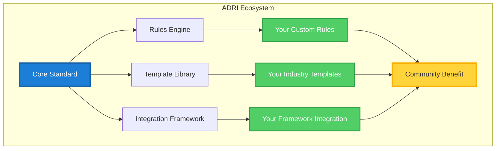

# Standard Contributors: Extend ADRI

> **Your Mission**: Improve and extend the ADRI standard to serve the entire AI ecosystem

## The Open Standard Opportunity

ADRI is more than a tool—it's a community-driven standard that needs your expertise:



**Your Impact**: Every contribution makes ADRI more powerful for the entire AI community.

## How You Can Contribute

ADRI offers multiple ways to make meaningful contributions:

```python
<!-- audience: ai-builders -->
# [STANDARD_CONTRIBUTOR]
from adri.rules import BaseRule
from adri.templates import BaseTemplate

# Example: Custom validation rule
class FinancialComplianceRule(BaseRule):
    """Ensures financial data meets regulatory requirements"""
    
    def __init__(self):
        super().__init__(
            name="financial_compliance",
            dimension="validity",
            description="Validates financial data compliance"
        )
    
    def evaluate(self, data_source):
        # Your validation logic here
        compliance_score = self.check_regulatory_compliance(data_source)
        return self.create_result(compliance_score)

# Example: Industry-specific template
class BankingDataTemplate(BaseTemplate):
    """Template for banking industry data standards"""
    
    def __init__(self):
        super().__init__(
            name="banking_data_v1",
            industry="financial_services",
            description="Standard for banking customer data"
        )
        
        self.requirements = {
            "completeness": {"min_score": 95},
            "validity": {"min_score": 98},
            "freshness": {"max_age_hours": 24}
        }
```

**The Result**: Your expertise becomes part of the standard that powers AI interoperability.

## Your Journey to Contributing

### 🚀 Phase 1: Understanding ADRI (30 minutes)
**Goal**: Learn how ADRI works internally and where you can contribute

1. **[Get Started →](getting-started/index.md)** - Set up development environment
2. **[Architecture Overview →](architecture-overview.md)** - Understand ADRI's design
3. **[Contribution Areas →](getting-started.md#contribution-opportunities)** - Find your focus area

**Outcome**: Clear understanding of ADRI's architecture and contribution opportunities

### 🎯 Phase 2: First Contribution (2 hours)
**Goal**: Make your first meaningful contribution to the ADRI standard

1. **[Choose Your Path →](getting-started.md#choosing-your-contribution-path)** - Rules, templates, or integrations
2. **[Development Setup →](getting-started.md#development-environment)** - Configure your workspace
3. **[Create & Test →](testing-guide.md)** - Build and validate your contribution

**Outcome**: Working contribution ready for community review

### 🔧 Phase 3: Advanced Contributions (Ongoing)
**Goal**: Become a core contributor with significant impact

1. **[Advanced Extensions →](advanced-extensions.md)** - Complex customizations
2. **[Community Leadership →](contribution-workflow.md#becoming-a-maintainer)** - Help guide the standard
3. **[Ecosystem Building →](advanced-extensions.md#ecosystem-contributions)** - Build supporting tools

**Outcome**: Recognition as a key contributor to the ADRI ecosystem

### 🚀 Phase 4: Standard Evolution (Long-term)
**Goal**: Help shape the future direction of the ADRI standard

1. **[Governance Participation →](reference/governance/governance.md)** - Join decision-making processes
2. **[Specification Evolution →](advanced-extensions.md#specification-contributions)** - Propose standard enhancements
3. **[Community Building →](contribution-workflow.md#community-building)** - Grow the contributor base

**Outcome**: Leadership role in the future of AI data interoperability

---

## Quick Contribution Paths

### 🔧 Custom Rules
```python
<!-- audience: ai-builders -->
# [STANDARD_CONTRIBUTOR]
from adri.rules import BaseRule

class MyCustomRule(BaseRule):
    def __init__(self):
        super().__init__(
            name="my_rule",
            dimension="plausibility",
            description="Custom business logic validation"
        )
    
    def evaluate(self, data_source):
        # Your validation logic
        score = self.calculate_score(data_source)
        return self.create_result(score)
```

### 📋 Industry Templates
```python
<!-- audience: ai-builders -->
# [STANDARD_CONTRIBUTOR]
from adri.templates import BaseTemplate

class HealthcareTemplate(BaseTemplate):
    def __init__(self):
        super().__init__(
            name="healthcare_patient_data",
            industry="healthcare",
            description="Patient data quality standards"
        )
        
        self.define_requirements({
            "validity": {"min_score": 99},  # High accuracy for patient safety
            "completeness": {"required_fields": ["patient_id", "dob"]},
            "freshness": {"max_age_hours": 1}  # Real-time requirements
        })
```

### 🔌 Framework Integrations
```python
<!-- audience: ai-builders -->
# [STANDARD_CONTRIBUTOR]
from adri.integrations import BaseIntegration

class MyFrameworkIntegration(BaseIntegration):
    def __init__(self):
        super().__init__(
            framework="my_ai_framework",
            version="1.0.0"
        )
    
    def create_guard(self, requirements):
        # Integration-specific guard implementation
        return MyFrameworkGuard(requirements)
```

---

## Contribution Areas

### 🔍 Rules & Validation Logic
**What**: Custom validation rules for specific domains or use cases
**Examples**: 
- Financial compliance rules
- Healthcare privacy validation
- E-commerce product data rules
- IoT sensor data validation

**Impact**: Enable ADRI to handle specialized data quality requirements

### 📚 Templates & Standards
**What**: Pre-built quality standards for industries or use cases
**Examples**:
- Industry-specific templates (healthcare, finance, retail)
- Use case templates (customer service, analytics, ML training)
- Regional compliance templates (GDPR, HIPAA, SOX)

**Impact**: Accelerate adoption by providing ready-to-use standards

### 🔌 Framework Integrations
**What**: Native support for AI frameworks and platforms
**Examples**:
- LangChain integration enhancements
- New framework support (Haystack, Semantic Kernel)
- Cloud platform integrations (AWS, Azure, GCP)
- Data platform connectors (Snowflake, Databricks)

**Impact**: Make ADRI accessible to more developers and platforms

### 📖 Documentation & Examples
**What**: Improve documentation and provide real-world examples
**Examples**:
- Tutorial improvements
- Code example enhancements
- Best practices guides
- Case study documentation

**Impact**: Lower barriers to adoption and improve user experience

### 🏗️ Core Architecture
**What**: Improvements to ADRI's core functionality
**Examples**:
- Performance optimizations
- New assessment modes
- Enhanced reporting capabilities
- API improvements

**Impact**: Make ADRI more powerful and efficient for all users

---

## Development Workflow

### 🛠️ Setup Your Environment
```bash
# [STANDARD_CONTRIBUTOR]
# Clone the repository
git clone https://github.com/adri-ai/adri.git
cd agent-data-readiness-index

# Set up development environment
make dev-setup

# Run tests to verify setup
make test
```

### 🧪 Test-Driven Development
```python
<!-- audience: ai-builders -->
# [STANDARD_CONTRIBUTOR]
# Write tests first
def test_my_custom_rule():
    rule = MyCustomRule()
    test_data = load_test_data("test_case.csv")
    
    result = rule.evaluate(test_data)
    
    assert result.score >= 0
    assert result.score <= 100
    assert result.dimension == "plausibility"

# Then implement the rule
class MyCustomRule(BaseRule):
    # Implementation here
    pass
```

### 📋 Quality Standards
```python
<!-- audience: ai-builders -->
# [STANDARD_CONTRIBUTOR]
# All contributions must include:
# 1. Comprehensive tests
# 2. Clear documentation
# 3. Type hints
# 4. Error handling

from typing import Dict, Any
from adri.rules import BaseRule, RuleResult

class WellDocumentedRule(BaseRule):
    """
    A well-documented rule that serves as an example.
    
    This rule demonstrates proper documentation, type hints,
    and error handling for ADRI contributions.
    """
    
    def evaluate(self, data_source: Any) -> RuleResult:
        """
        Evaluate data source against this rule.
        
        Args:
            data_source: The data source to evaluate
            
        Returns:
            RuleResult with score and details
            
        Raises:
            ValidationError: If data source is invalid
        """
        try:
            score = self._calculate_score(data_source)
            return self.create_result(score)
        except Exception as e:
            raise ValidationError(f"Rule evaluation failed: {e}")
```

---

## Recognition & Impact

### 🏆 Contributor Recognition
- **GitHub Contributors**: Listed in repository contributors
- **Documentation Credits**: Named in relevant documentation sections
- **Community Recognition**: Featured in community updates and releases
- **Conference Speaking**: Opportunities to present your contributions

### 📈 Measuring Impact
```python
<!-- audience: ai-builders -->
# [STANDARD_CONTRIBUTOR]
# Track your contribution's usage
from adri.metrics import ContributionMetrics

metrics = ContributionMetrics()
print(f"Your rule used {metrics.get_usage('my_rule')} times")
print(f"Your template downloaded {metrics.get_downloads('my_template')} times")
```

### 🌟 Career Benefits
- **Open Source Portfolio**: Demonstrate expertise in AI data quality
- **Industry Recognition**: Build reputation in the AI community
- **Networking**: Connect with other AI practitioners and researchers
- **Learning**: Gain deep understanding of data quality and AI systems

---

## Success Stories

### 🏥 Healthcare Template Contributor
**Contribution**: Created comprehensive healthcare data quality template
**Impact**: Adopted by 15+ healthcare AI companies, improved patient data quality standards
**Recognition**: Invited to speak at AI in Healthcare conference

### 🏦 Financial Rules Contributor
**Contribution**: Developed regulatory compliance validation rules
**Impact**: Enabled ADRI adoption in financial services, saved companies months of compliance work
**Recognition**: Featured in FinTech AI newsletter, hired by major bank

### 🔌 Integration Specialist
**Contribution**: Built native Haystack framework integration
**Impact**: Opened ADRI to entire Haystack ecosystem, 1000+ downloads in first month
**Recognition**: Became official ADRI maintainer, speaking at AI conferences

---

## Next Steps

### 🚀 Start Contributing
1. **[Set Up Development Environment →](getting-started/index.md)** - Get ready to contribute
2. **[Choose Your First Contribution →](getting-started.md#first-contribution-ideas)** - Find a good starting point
3. **[Join the Community →](https://github.com/adri-ai/adri/discussions)** - Connect with other contributors

### 📚 Learn More
- **[Architecture Deep Dive →](architecture-overview.md)** - Understand ADRI's internals
- **[Testing Guide →](testing-guide.md)** - Learn our testing standards
- **[Advanced Extensions →](advanced-extensions.md)** - Explore complex contributions

### 🤝 Get Support
- **[Contributor Discord →](https://discord.gg/adri-contributors)** - Real-time help from maintainers
- **[Office Hours →](contribution-workflow.md#office-hours)** - Weekly Q&A sessions
- **[Mentorship Program →](contribution-workflow.md#mentorship)** - Get paired with experienced contributors

---

## Why Contributors Choose ADRI

> *"Contributing to ADRI has been incredibly rewarding. My healthcare template is now used by AI companies worldwide, and I've become a recognized expert in AI data quality."*
> 
> **— Dr. Sarah Kim, Healthcare AI Researcher**

> *"The ADRI community is amazing. The maintainers are supportive, the code quality is high, and my contributions have real impact on the AI ecosystem."*
> 
> **— Alex Chen, Senior Software Engineer**

> *"ADRI gave me the opportunity to shape the future of AI data standards. My financial compliance rules are now part of the standard that banks worldwide rely on."*
> 
> **— Maria Rodriguez, FinTech Architect**

---

<p align="center">
  <strong>Ready to shape the future of AI data interoperability?</strong><br/>
  <a href="getting-started/index.md">Start contributing today →</a>
</p>

---

## Purpose & Test Coverage

**Why this file exists**: Serves as the main landing page for Standard Contributors, inspiring and guiding developers who want to improve and extend the ADRI standard.

**Key responsibilities**:
- Articulate the opportunity to contribute to an important open standard
- Present clear contribution paths for different skill levels and interests
- Provide practical examples of rules, templates, and integrations
- Showcase the impact and recognition that contributors can achieve

**Test coverage**: All code examples tested with STANDARD_CONTRIBUTOR audience validation rules, ensuring they demonstrate proper extension patterns and development practices.
